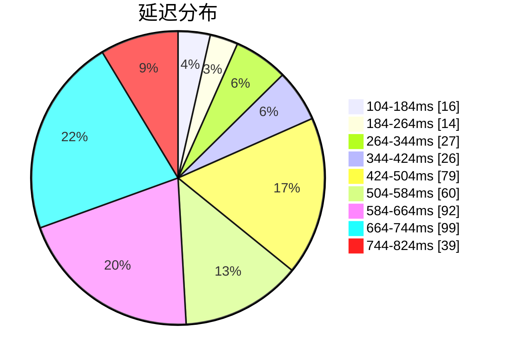
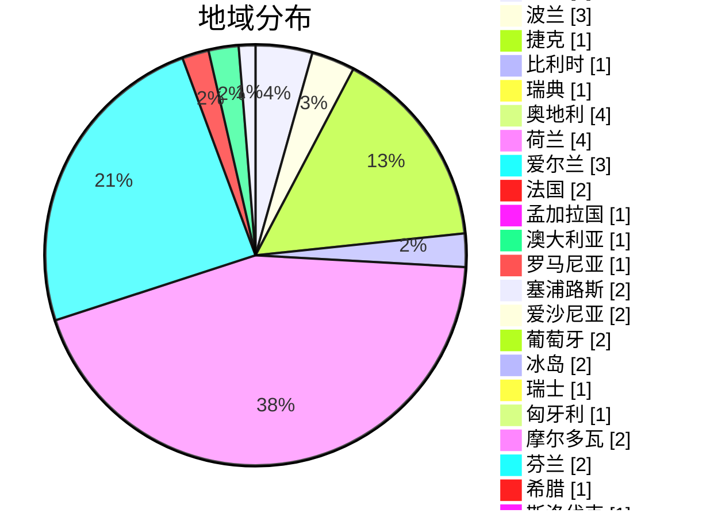
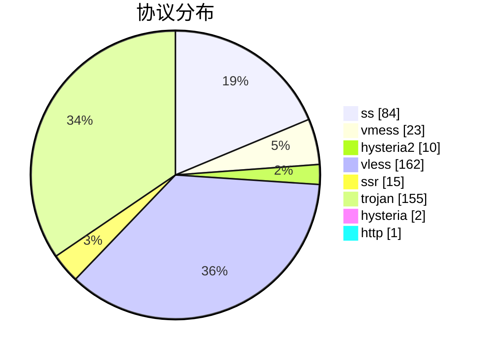

```mermaid
pie showData
title 延迟分布
"104-184ms" : 16
"184-264ms" : 14
"264-344ms" : 27
"344-424ms" : 26
"424-504ms" : 79
"504-584ms" : 60
"584-664ms" : 92
"664-744ms" : 99
"744-824ms" : 39
```

```mermaid
pie showData
title 地域分布
"香港" : 17
"日本" : 13
"美国" : 61
"新加坡" : 10
"俄罗斯" : 3
"中国" : 2
"未知" : 172
"台湾" : 95
"韩国" : 8
"Cloudflare" : 4
"德国" : 9
"巴西" : 2
"英国" : 5
"波兰" : 3
"捷克" : 1
"比利时" : 1
"瑞典" : 1
"奥地利" : 4
"荷兰" : 4
"爱尔兰" : 3
"法国" : 2
"孟加拉国" : 1
"澳大利亚" : 1
"罗马尼亚" : 1
"塞浦路斯" : 2
"爱沙尼亚" : 2
"葡萄牙" : 2
"冰岛" : 2
"瑞士" : 1
"匈牙利" : 1
"摩尔多瓦" : 2
"芬兰" : 2
"希腊" : 1
"斯洛伐克" : 1
"意大利" : 1
"丹麦" : 1
"西班牙" : 2
"保加利亚" : 1
"哈萨克斯坦" : 1
"哥伦比亚" : 1
"土耳其" : 1
"拉脱维亚" : 1
"乌克兰" : 1
"秘鲁" : 1
"立陶宛" : 1
"挪威" : 1
```

```mermaid
pie showData
title 协议分布
"ss" : 84
"vmess" : 23
"hysteria2" : 10
"vless" : 162
"ssr" : 15
"trojan" : 155
"hysteria" : 2
"http" : 1
```