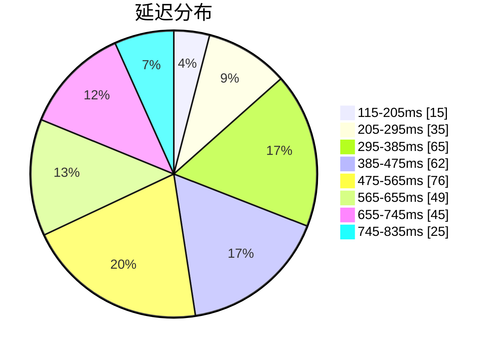
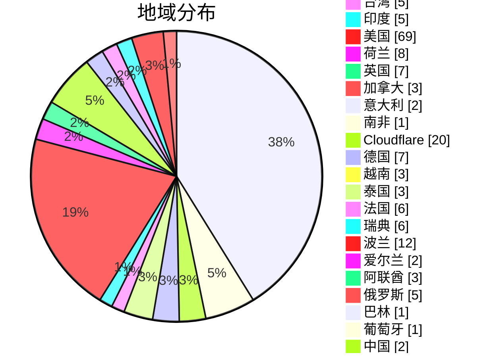
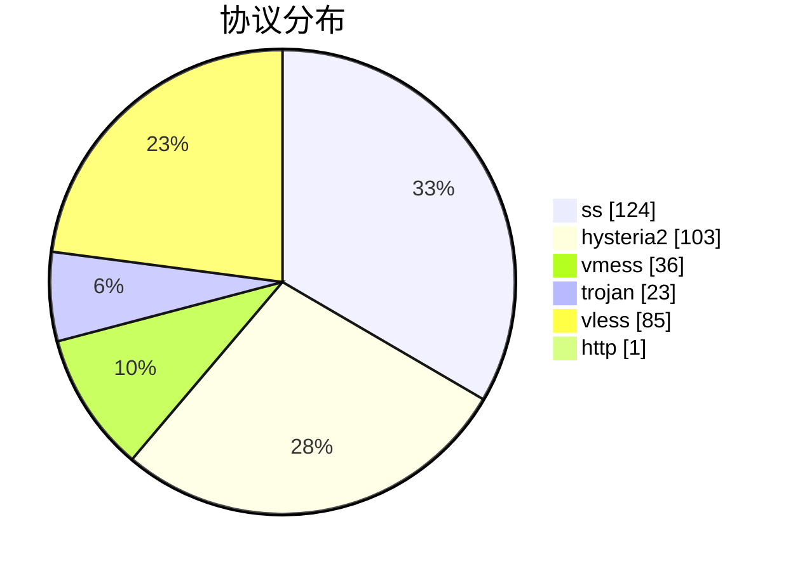

```mermaid
pie showData
title 延迟分布
"115-205ms" : 15
"205-295ms" : 35
"295-385ms" : 65
"385-475ms" : 62
"475-565ms" : 76
"565-655ms" : 49
"655-745ms" : 45
"745-835ms" : 25
```

```mermaid
pie showData
title 地域分布
"未知" : 140
"香港" : 19
"新加坡" : 10
"日本" : 10
"印度尼西亚" : 3
"韩国" : 11
"台湾" : 5
"印度" : 5
"美国" : 69
"荷兰" : 8
"英国" : 7
"加拿大" : 3
"意大利" : 2
"南非" : 1
"Cloudflare" : 20
"德国" : 7
"越南" : 3
"泰国" : 3
"法国" : 6
"瑞典" : 6
"波兰" : 12
"爱尔兰" : 2
"阿联酋" : 3
"俄罗斯" : 5
"巴林" : 1
"葡萄牙" : 1
"中国" : 2
"伊朗" : 1
"卢森堡" : 3
"瑞士" : 1
"巴西" : 1
"丹麦" : 1
"以色列" : 1
```

```mermaid
pie showData
title 协议分布
"ss" : 124
"hysteria2" : 103
"vmess" : 36
"trojan" : 23
"vless" : 85
"http" : 1
```