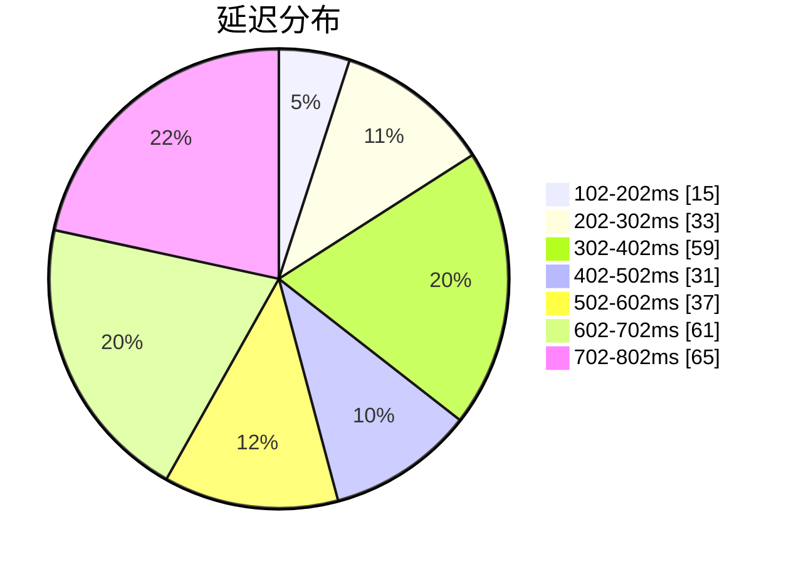
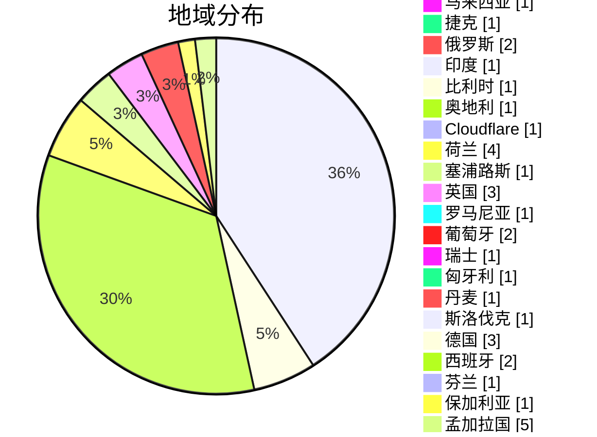
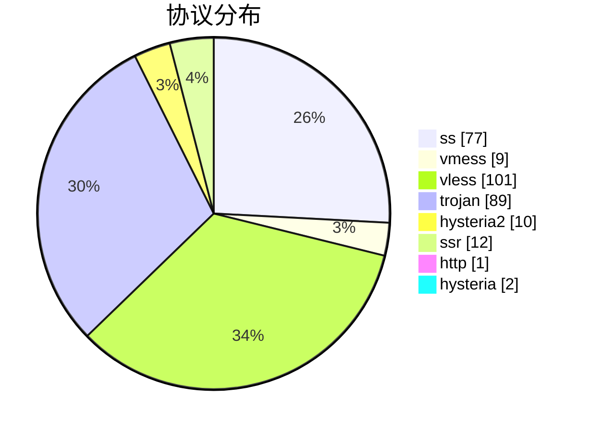

```mermaid
pie showData
title 延迟分布
"102-202ms" : 15
"202-302ms" : 33
"302-402ms" : 59
"402-502ms" : 31
"502-602ms" : 37
"602-702ms" : 61
"702-802ms" : 65
```

```mermaid
pie showData
title 地域分布
"未知" : 107
"美国" : 15
"台湾" : 89
"中国" : 1
"波兰" : 15
"香港" : 9
"韩国" : 9
"新加坡" : 3
"日本" : 9
"马来西亚" : 1
"捷克" : 1
"俄罗斯" : 2
"印度" : 1
"比利时" : 1
"奥地利" : 1
"Cloudflare" : 1
"荷兰" : 4
"塞浦路斯" : 1
"英国" : 3
"罗马尼亚" : 1
"葡萄牙" : 2
"瑞士" : 1
"匈牙利" : 1
"丹麦" : 1
"斯洛伐克" : 1
"德国" : 3
"西班牙" : 2
"芬兰" : 1
"保加利亚" : 1
"孟加拉国" : 5
"法国" : 1
"摩尔多瓦" : 1
"爱尔兰" : 1
"瑞典" : 1
"冰岛" : 1
"乌克兰" : 1
"挪威" : 1
"爱沙尼亚" : 1
"哥伦比亚" : 1
```

```mermaid
pie showData
title 协议分布
"ss" : 77
"vmess" : 9
"vless" : 101
"trojan" : 89
"hysteria2" : 10
"ssr" : 12
"http" : 1
"hysteria" : 2
```