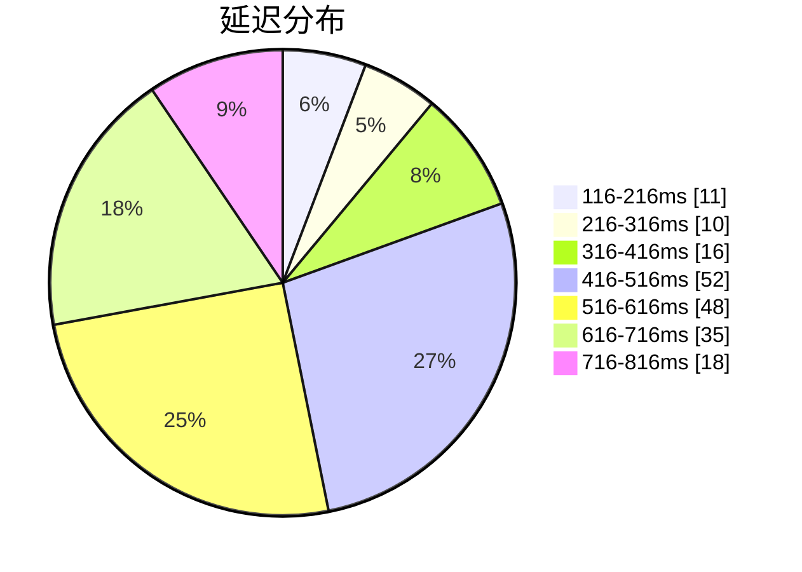
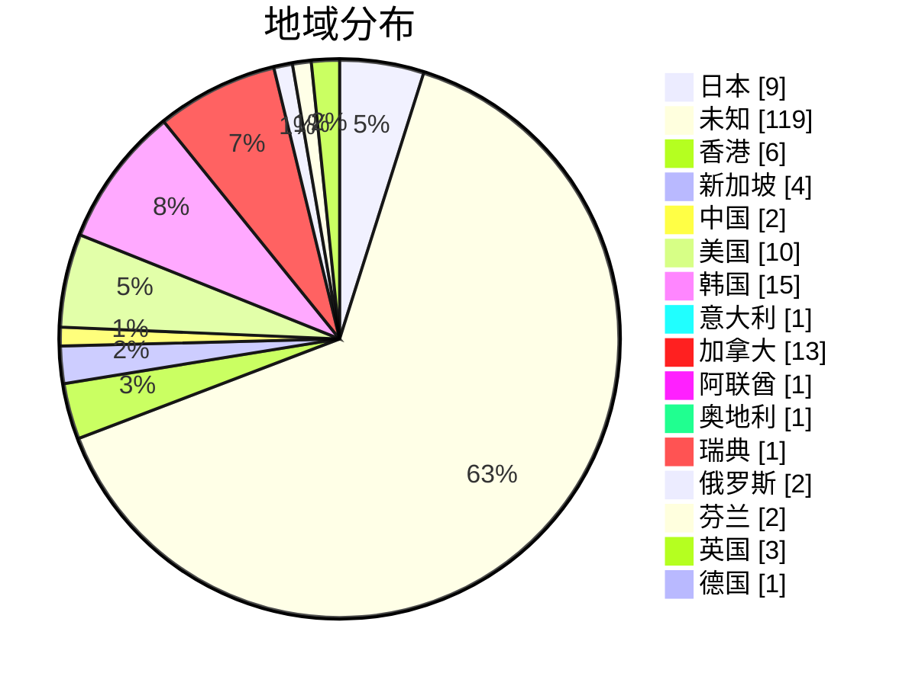
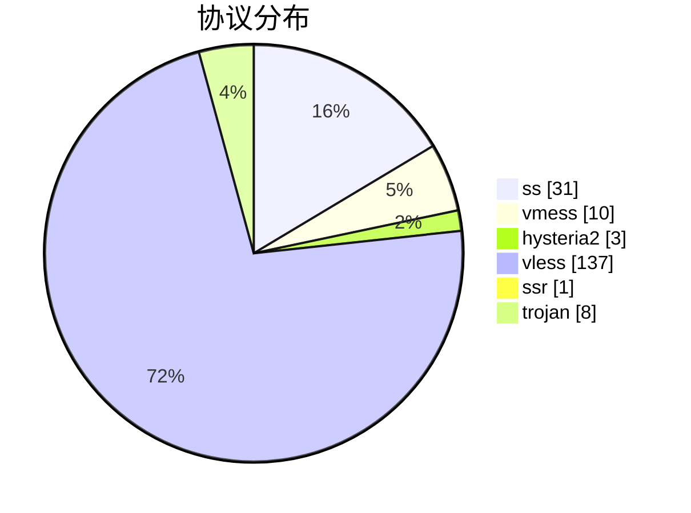

```mermaid
pie showData
title 延迟分布
"116-216ms" : 11
"216-316ms" : 10
"316-416ms" : 16
"416-516ms" : 52
"516-616ms" : 48
"616-716ms" : 35
"716-816ms" : 18
```

```mermaid
pie showData
title 地域分布
"日本" : 9
"未知" : 119
"香港" : 6
"新加坡" : 4
"中国" : 2
"美国" : 10
"韩国" : 15
"意大利" : 1
"加拿大" : 13
"阿联酋" : 1
"奥地利" : 1
"瑞典" : 1
"俄罗斯" : 2
"芬兰" : 2
"英国" : 3
"德国" : 1
```

```mermaid
pie showData
title 协议分布
"ss" : 31
"vmess" : 10
"hysteria2" : 3
"vless" : 137
"ssr" : 1
"trojan" : 8
```