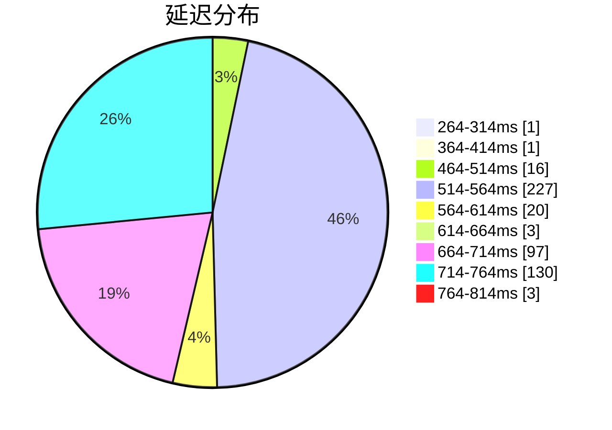
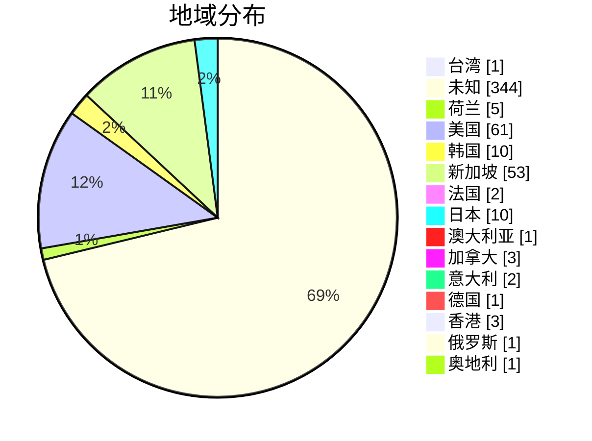
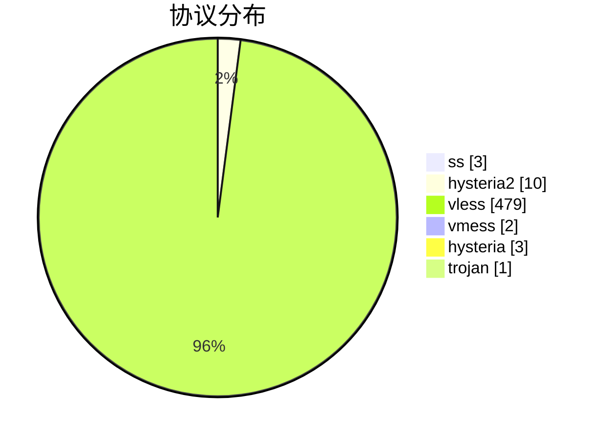

```mermaid
pie showData
title 延迟分布
"264-314ms" : 1
"364-414ms" : 1
"464-514ms" : 16
"514-564ms" : 227
"564-614ms" : 20
"614-664ms" : 3
"664-714ms" : 97
"714-764ms" : 130
"764-814ms" : 3
```

```mermaid
pie showData
title 地域分布
"台湾" : 1
"未知" : 344
"荷兰" : 5
"美国" : 61
"韩国" : 10
"新加坡" : 53
"法国" : 2
"日本" : 10
"澳大利亚" : 1
"加拿大" : 3
"意大利" : 2
"德国" : 1
"香港" : 3
"俄罗斯" : 1
"奥地利" : 1
```

```mermaid
pie showData
title 协议分布
"ss" : 3
"hysteria2" : 10
"vless" : 479
"vmess" : 2
"hysteria" : 3
"trojan" : 1
```