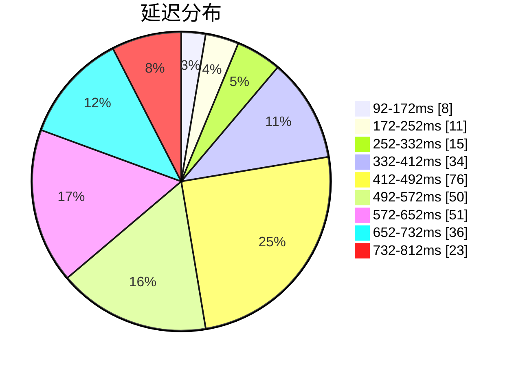
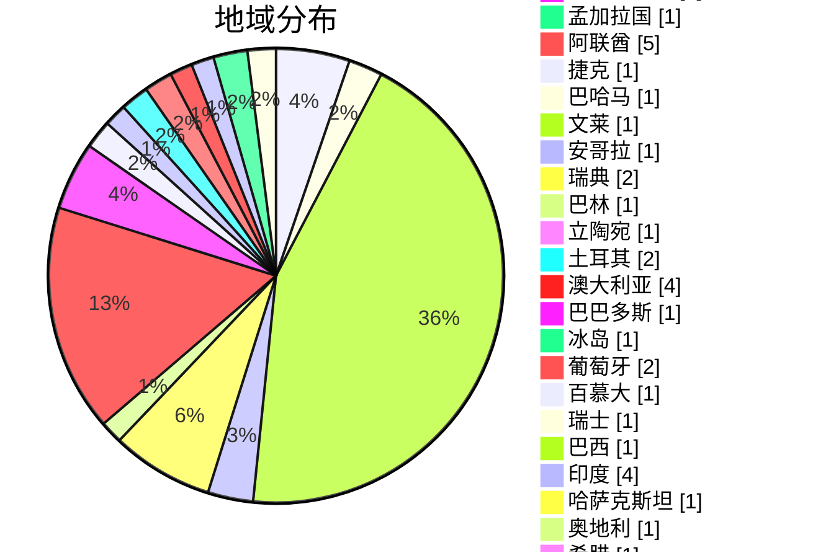
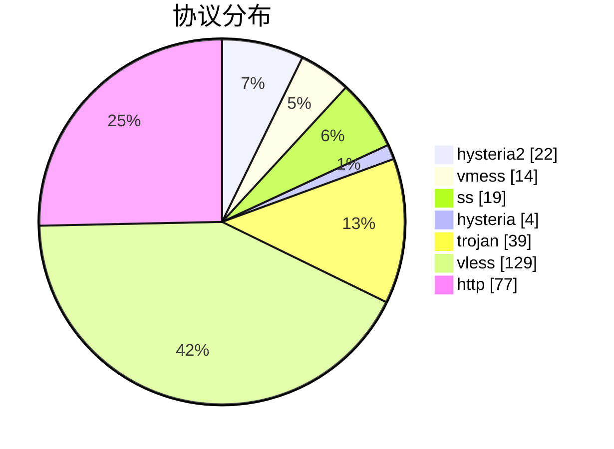

```mermaid
pie showData
title 延迟分布
"92-172ms" : 8
"172-252ms" : 11
"252-332ms" : 15
"332-412ms" : 34
"412-492ms" : 76
"492-572ms" : 50
"572-652ms" : 51
"652-732ms" : 36
"732-812ms" : 23
```

```mermaid
pie showData
title 地域分布
"台湾" : 13
"中国" : 6
"未知" : 109
"日本" : 8
"香港" : 18
"俄罗斯" : 4
"新加坡" : 2
"韩国" : 2
"美国" : 40
"德国" : 12
"柬埔寨" : 1
"波兰" : 1
"芬兰" : 5
"Cloudflare" : 1
"卢森堡" : 1
"爱尔兰" : 4
"乌克兰" : 1
"罗马尼亚" : 1
"塞尔维亚" : 1
"法国" : 5
"阿尔及利亚" : 1
"阿尔巴尼亚" : 1
"孟加拉国" : 1
"阿联酋" : 5
"捷克" : 1
"巴哈马" : 1
"文莱" : 1
"安哥拉" : 1
"瑞典" : 2
"巴林" : 1
"立陶宛" : 1
"土耳其" : 2
"澳大利亚" : 4
"巴巴多斯" : 1
"冰岛" : 1
"葡萄牙" : 2
"百慕大" : 1
"瑞士" : 1
"巴西" : 1
"印度" : 4
"哈萨克斯坦" : 1
"奥地利" : 1
"希腊" : 1
"斯洛伐克" : 1
"西班牙" : 1
"爱沙尼亚" : 1
"英国" : 6
"阿曼" : 1
"保加利亚" : 1
"荷兰" : 5
"摩尔多瓦" : 1
"埃及" : 1
"加拿大" : 3
"巴拿马" : 1
"英属维尔京群岛" : 1
"匈牙利" : 1
"阿根廷" : 2
"越南" : 1
"阿鲁巴" : 1
"智利" : 1
"波多黎各" : 1
"尼日利亚" : 1
"摩纳哥" : 1
"意大利" : 1
```

```mermaid
pie showData
title 协议分布
"hysteria2" : 22
"vmess" : 14
"ss" : 19
"hysteria" : 4
"trojan" : 39
"vless" : 129
"http" : 77
```