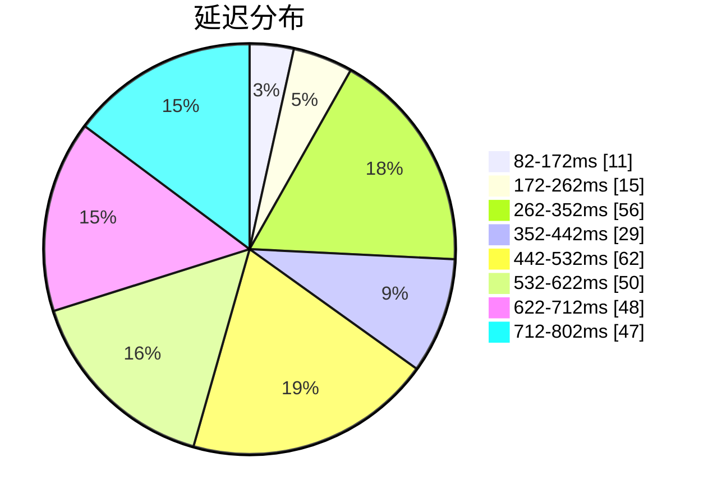
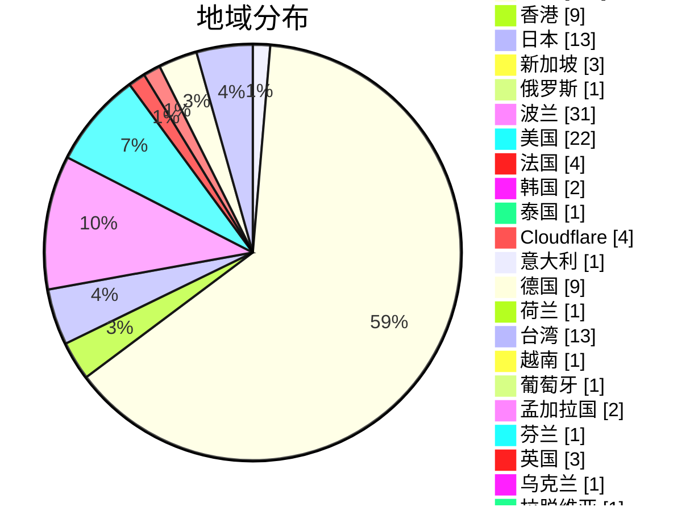
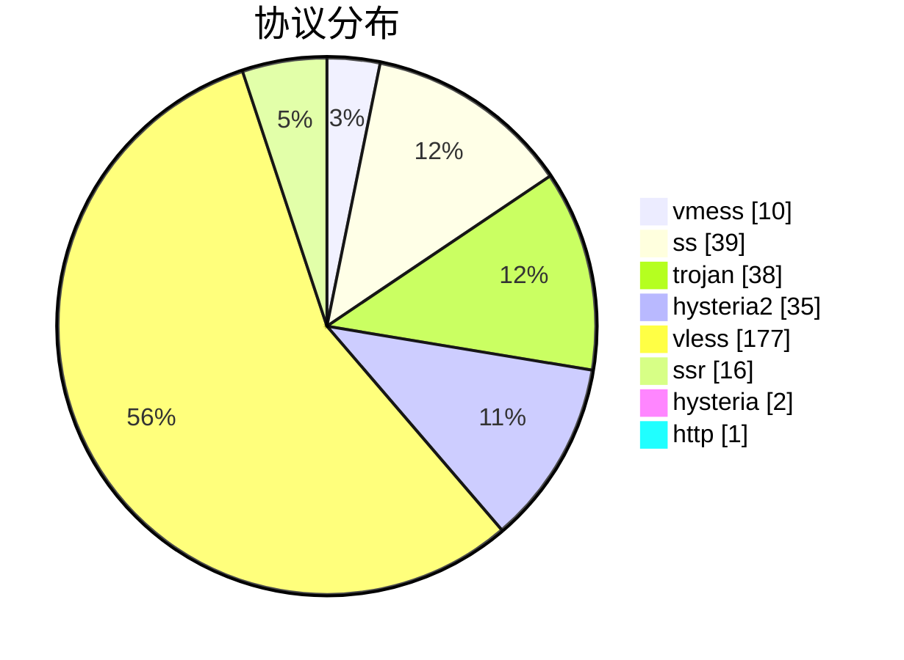

```mermaid
pie showData
title 延迟分布
"82-172ms" : 11
"172-262ms" : 15
"262-352ms" : 56
"352-442ms" : 29
"442-532ms" : 62
"532-622ms" : 50
"622-712ms" : 48
"712-802ms" : 47
```

```mermaid
pie showData
title 地域分布
"中国" : 4
"未知" : 189
"香港" : 9
"日本" : 13
"新加坡" : 3
"俄罗斯" : 1
"波兰" : 31
"美国" : 22
"法国" : 4
"韩国" : 2
"泰国" : 1
"Cloudflare" : 4
"意大利" : 1
"德国" : 9
"荷兰" : 1
"台湾" : 13
"越南" : 1
"葡萄牙" : 1
"孟加拉国" : 2
"芬兰" : 1
"英国" : 3
"乌克兰" : 1
"拉脱维亚" : 1
"爱沙尼亚" : 1
```

```mermaid
pie showData
title 协议分布
"vmess" : 10
"ss" : 39
"trojan" : 38
"hysteria2" : 35
"vless" : 177
"ssr" : 16
"hysteria" : 2
"http" : 1
```