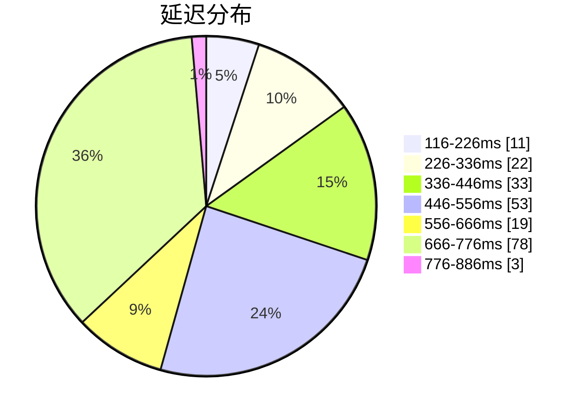
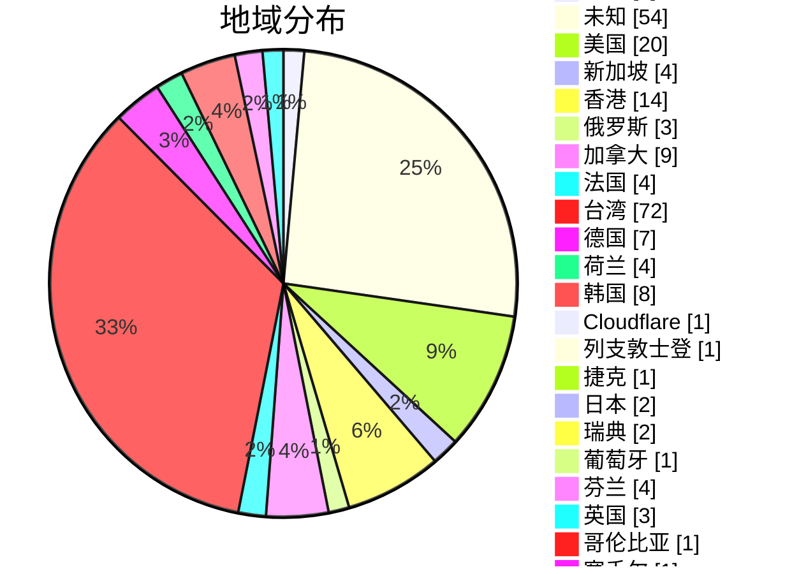
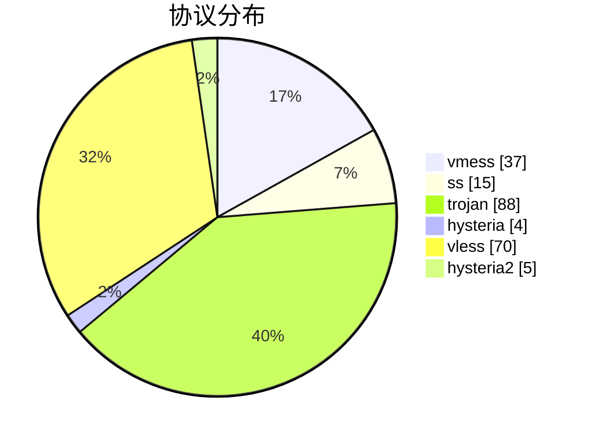

```mermaid
pie showData
title 延迟分布
"116-226ms" : 11
"226-336ms" : 22
"336-446ms" : 33
"446-556ms" : 53
"556-666ms" : 19
"666-776ms" : 78
"776-886ms" : 3
```

```mermaid
pie showData
title 地域分布
"中国" : 3
"未知" : 54
"美国" : 20
"新加坡" : 4
"香港" : 14
"俄罗斯" : 3
"加拿大" : 9
"法国" : 4
"台湾" : 72
"德国" : 7
"荷兰" : 4
"韩国" : 8
"Cloudflare" : 1
"列支敦士登" : 1
"捷克" : 1
"日本" : 2
"瑞典" : 2
"葡萄牙" : 1
"芬兰" : 4
"英国" : 3
"哥伦比亚" : 1
"塞舌尔" : 1
```

```mermaid
pie showData
title 协议分布
"vmess" : 37
"ss" : 15
"trojan" : 88
"hysteria" : 4
"vless" : 70
"hysteria2" : 5
```