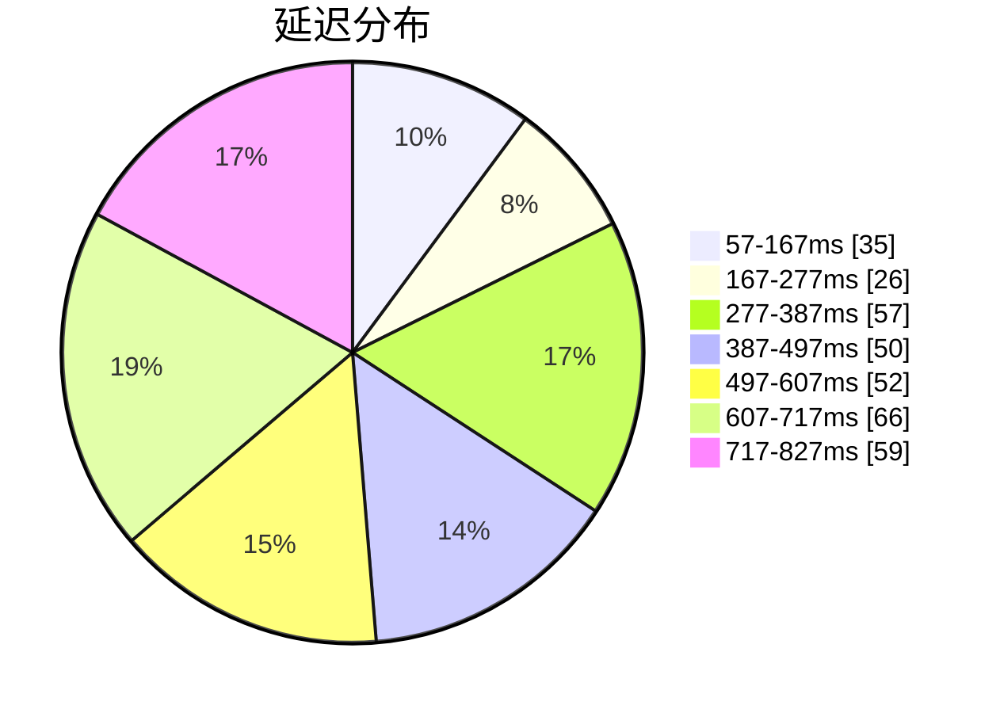
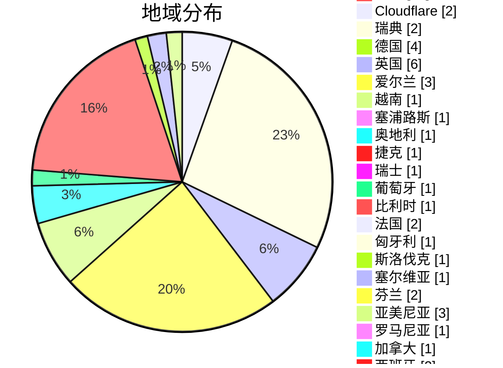
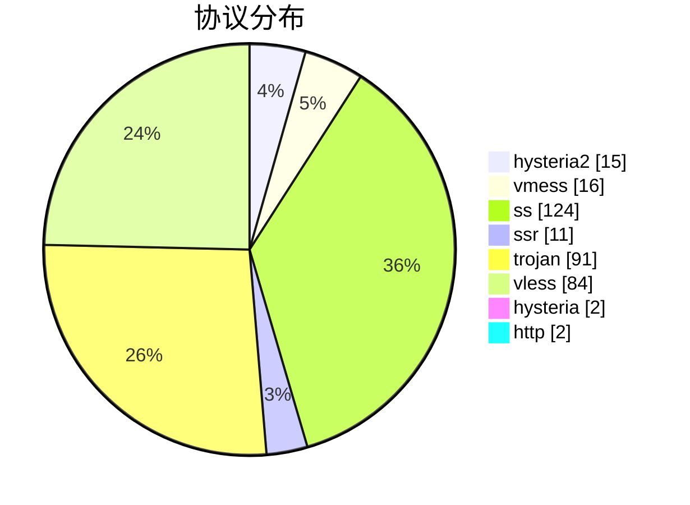

```mermaid
pie showData
title 延迟分布
"57-167ms" : 35
"167-277ms" : 26
"277-387ms" : 57
"387-497ms" : 50
"497-607ms" : 52
"607-717ms" : 66
"717-827ms" : 59
```

```mermaid
pie showData
title 地域分布
"香港" : 16
"未知" : 79
"中国" : 3
"日本" : 22
"台湾" : 70
"新加坡" : 21
"俄罗斯" : 3
"韩国" : 12
"印度" : 3
"波兰" : 3
"荷兰" : 5
"美国" : 55
"Cloudflare" : 2
"瑞典" : 2
"德国" : 4
"英国" : 6
"爱尔兰" : 3
"越南" : 1
"塞浦路斯" : 1
"奥地利" : 1
"捷克" : 1
"瑞士" : 1
"葡萄牙" : 1
"比利时" : 1
"法国" : 2
"匈牙利" : 1
"斯洛伐克" : 1
"塞尔维亚" : 1
"芬兰" : 2
"亚美尼亚" : 3
"罗马尼亚" : 1
"加拿大" : 1
"西班牙" : 2
"丹麦" : 1
"挪威" : 1
"乌克兰" : 1
"冰岛" : 1
"爱沙尼亚" : 1
"摩尔多瓦" : 1
"保加利亚" : 1
"希腊" : 1
"孟加拉国" : 5
"立陶宛" : 1
"哥伦比亚" : 1
```

```mermaid
pie showData
title 协议分布
"hysteria2" : 15
"vmess" : 16
"ss" : 124
"ssr" : 11
"trojan" : 91
"vless" : 84
"hysteria" : 2
"http" : 2
```