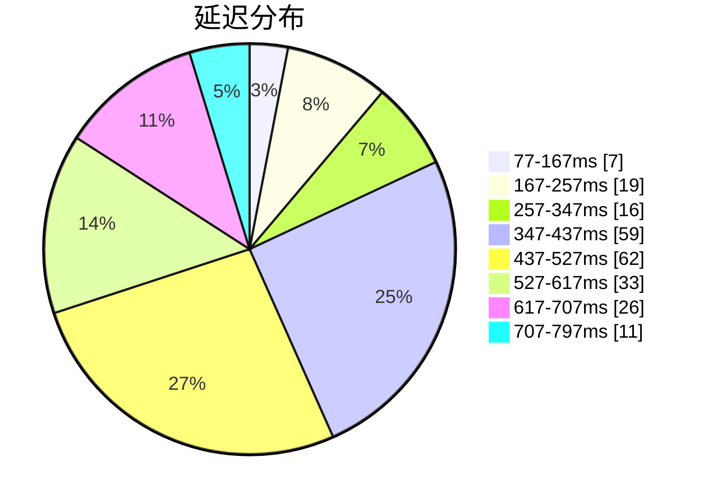
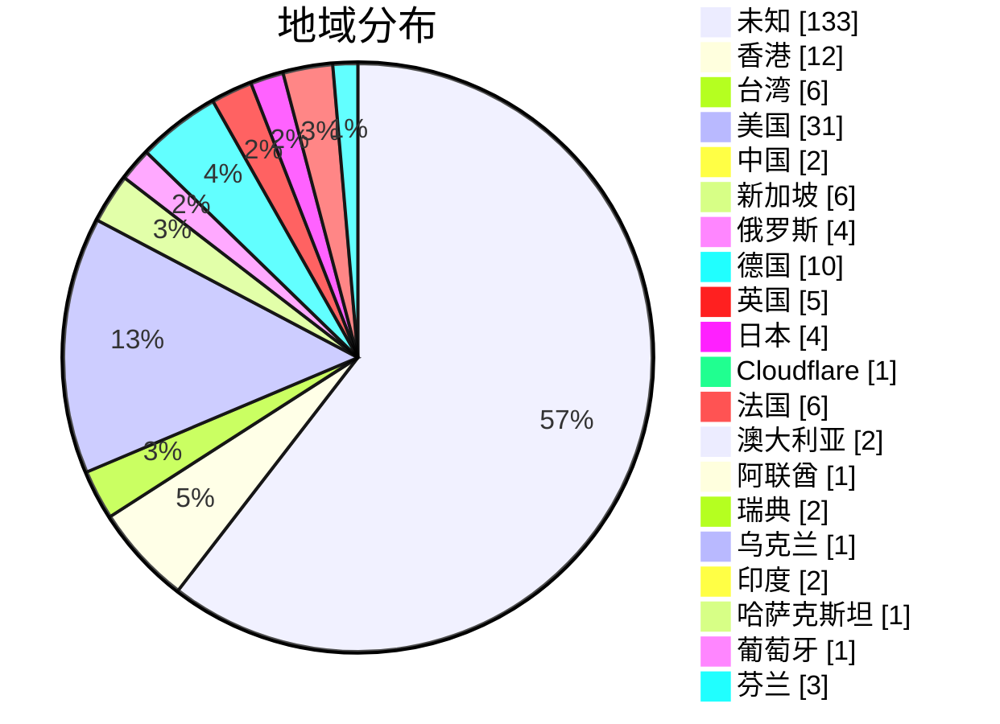
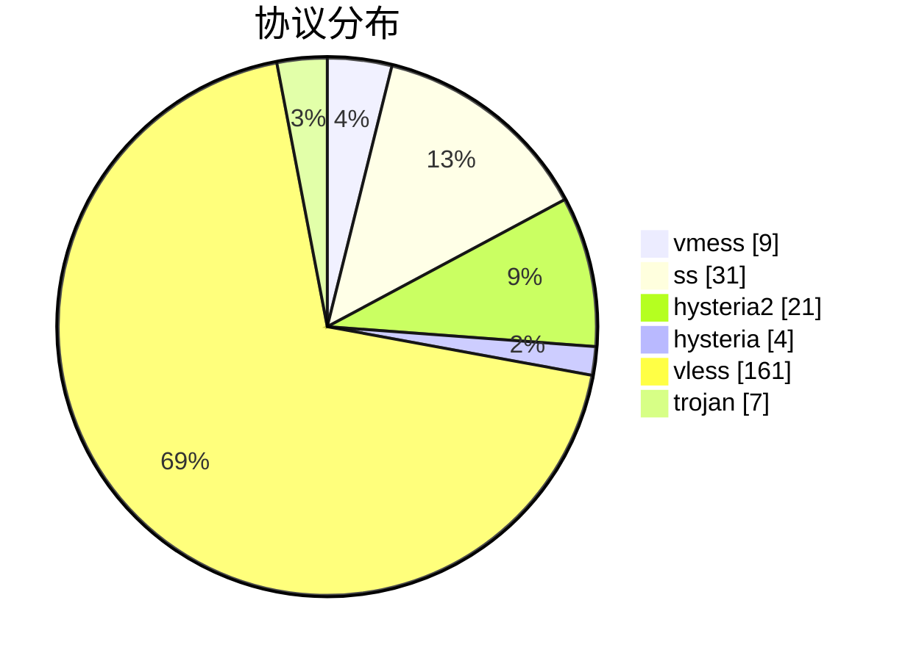

```mermaid
pie showData
title 延迟分布
"77-167ms" : 7
"167-257ms" : 19
"257-347ms" : 16
"347-437ms" : 59
"437-527ms" : 62
"527-617ms" : 33
"617-707ms" : 26
"707-797ms" : 11
```

```mermaid
pie showData
title 地域分布
"未知" : 133
"香港" : 12
"台湾" : 6
"美国" : 31
"中国" : 2
"新加坡" : 6
"俄罗斯" : 4
"德国" : 10
"英国" : 5
"日本" : 4
"Cloudflare" : 1
"法国" : 6
"澳大利亚" : 2
"阿联酋" : 1
"瑞典" : 2
"乌克兰" : 1
"印度" : 2
"哈萨克斯坦" : 1
"葡萄牙" : 1
"芬兰" : 3
```

```mermaid
pie showData
title 协议分布
"vmess" : 9
"ss" : 31
"hysteria2" : 21
"hysteria" : 4
"vless" : 161
"trojan" : 7
```