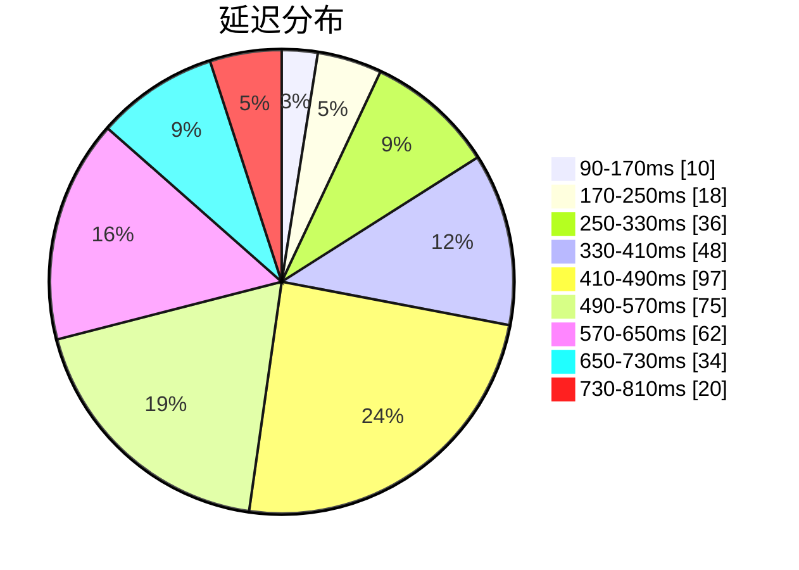
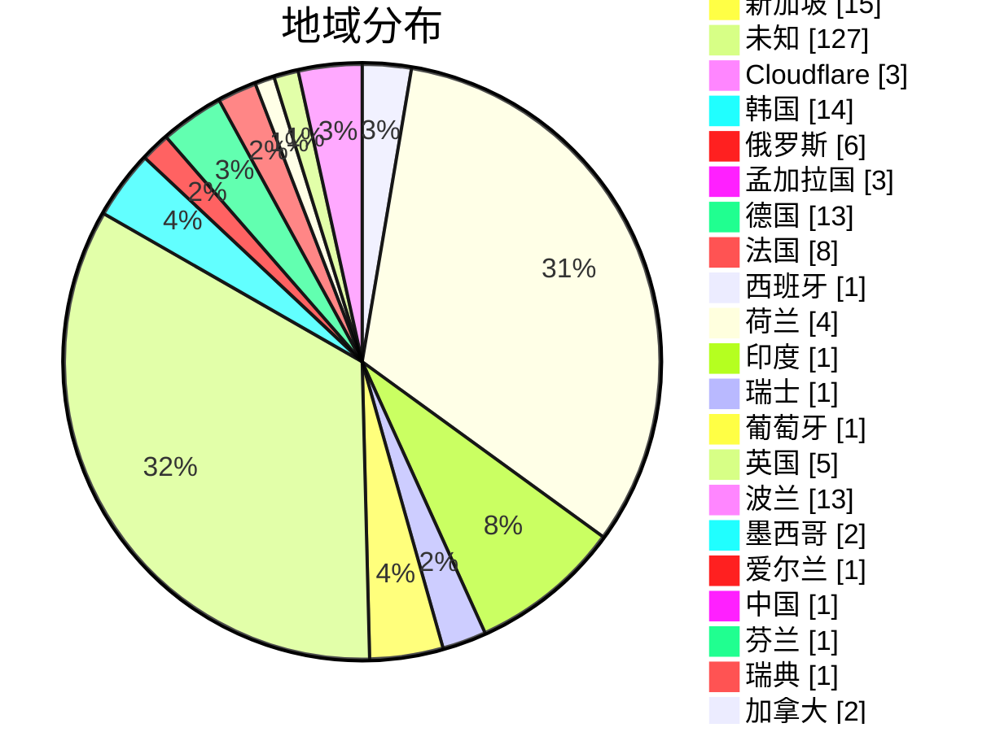
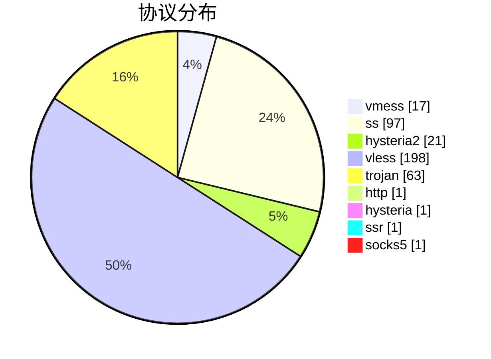

```mermaid
pie showData
title 延迟分布
"90-170ms" : 10
"170-250ms" : 18
"250-330ms" : 36
"330-410ms" : 48
"410-490ms" : 97
"490-570ms" : 75
"570-650ms" : 62
"650-730ms" : 34
"730-810ms" : 20
```

```mermaid
pie showData
title 地域分布
"香港" : 10
"美国" : 122
"台湾" : 31
"日本" : 9
"新加坡" : 15
"未知" : 127
"Cloudflare" : 3
"韩国" : 14
"俄罗斯" : 6
"孟加拉国" : 3
"德国" : 13
"法国" : 8
"西班牙" : 1
"荷兰" : 4
"印度" : 1
"瑞士" : 1
"葡萄牙" : 1
"英国" : 5
"波兰" : 13
"墨西哥" : 2
"爱尔兰" : 1
"中国" : 1
"芬兰" : 1
"瑞典" : 1
"加拿大" : 2
"捷克" : 2
"拉脱维亚" : 1
"以色列" : 1
"塞浦路斯" : 1
```

```mermaid
pie showData
title 协议分布
"vmess" : 17
"ss" : 97
"hysteria2" : 21
"vless" : 198
"trojan" : 63
"http" : 1
"hysteria" : 1
"ssr" : 1
"socks5" : 1
```