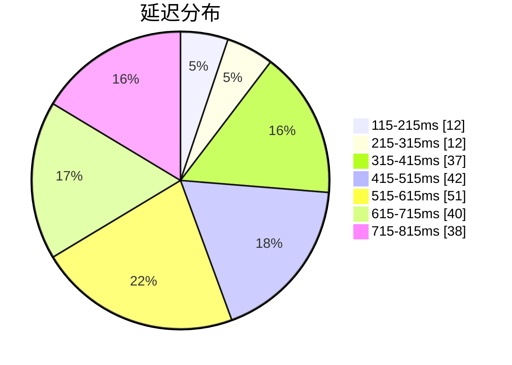
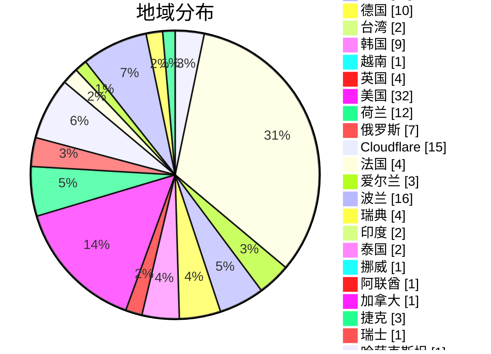
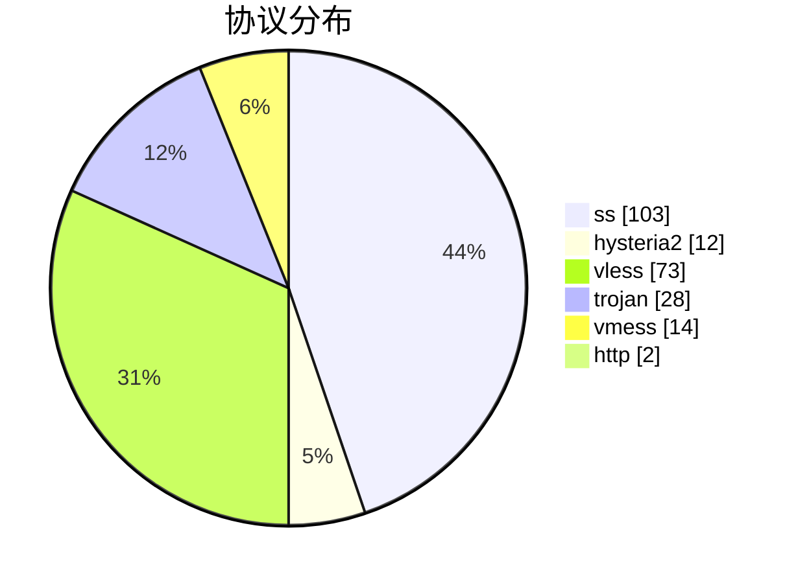

```mermaid
pie showData
title 延迟分布
"115-215ms" : 12
"215-315ms" : 12
"315-415ms" : 37
"415-515ms" : 42
"515-615ms" : 51
"615-715ms" : 40
"715-815ms" : 38
```

```mermaid
pie showData
title 地域分布
"日本" : 7
"未知" : 71
"新加坡" : 8
"香港" : 11
"德国" : 10
"台湾" : 2
"韩国" : 9
"越南" : 1
"英国" : 4
"美国" : 32
"荷兰" : 12
"俄罗斯" : 7
"Cloudflare" : 15
"法国" : 4
"爱尔兰" : 3
"波兰" : 16
"瑞典" : 4
"印度" : 2
"泰国" : 2
"挪威" : 1
"阿联酋" : 1
"加拿大" : 1
"捷克" : 3
"瑞士" : 1
"哈萨克斯坦" : 1
"丹麦" : 1
"卢森堡" : 2
"土耳其" : 1
```

```mermaid
pie showData
title 协议分布
"ss" : 103
"hysteria2" : 12
"vless" : 73
"trojan" : 28
"vmess" : 14
"http" : 2
```