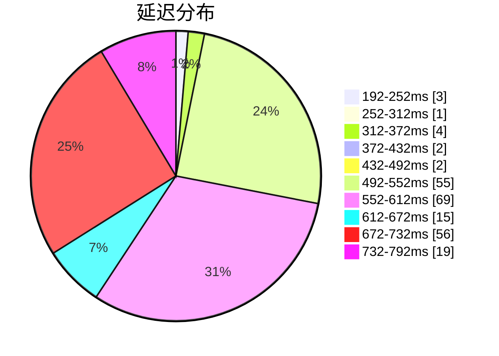
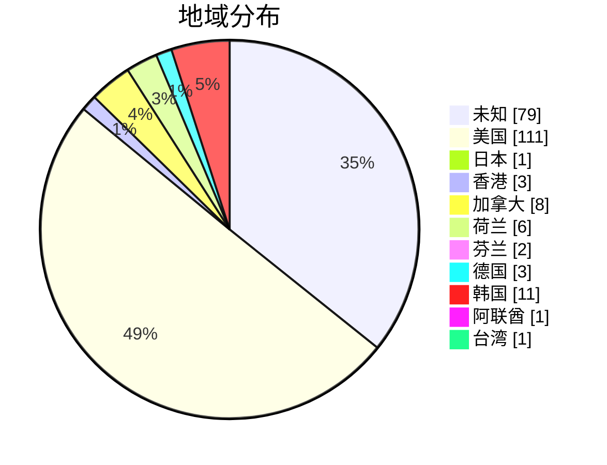
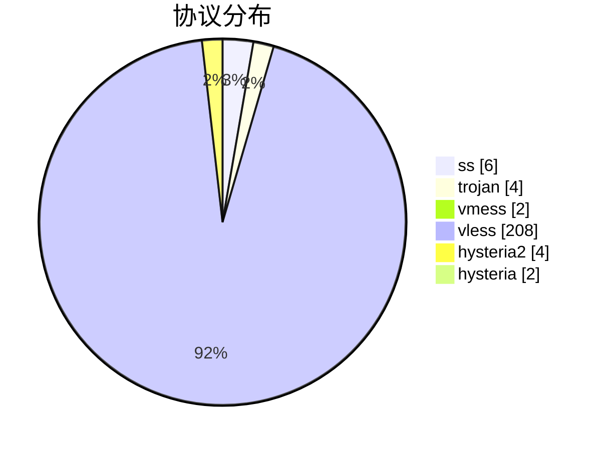

```mermaid
pie showData
title 延迟分布
"192-252ms" : 3
"252-312ms" : 1
"312-372ms" : 4
"372-432ms" : 2
"432-492ms" : 2
"492-552ms" : 55
"552-612ms" : 69
"612-672ms" : 15
"672-732ms" : 56
"732-792ms" : 19
```

```mermaid
pie showData
title 地域分布
"未知" : 79
"美国" : 111
"日本" : 1
"香港" : 3
"加拿大" : 8
"荷兰" : 6
"芬兰" : 2
"德国" : 3
"韩国" : 11
"阿联酋" : 1
"台湾" : 1
```

```mermaid
pie showData
title 协议分布
"ss" : 6
"trojan" : 4
"vmess" : 2
"vless" : 208
"hysteria2" : 4
"hysteria" : 2
```