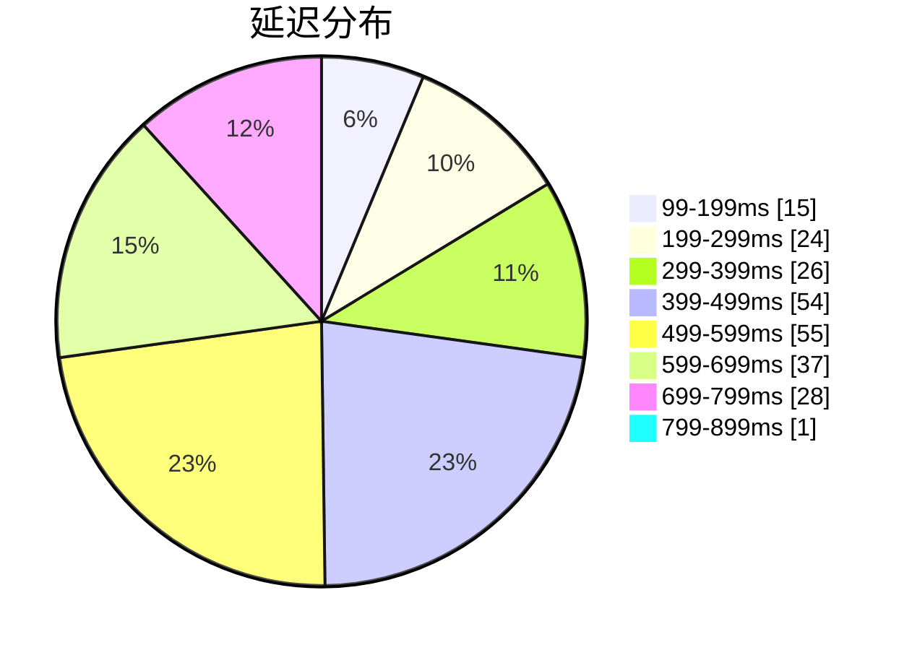
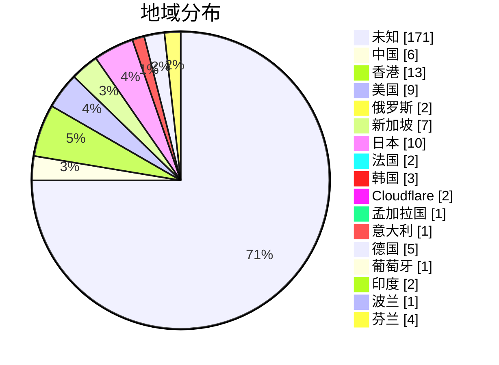
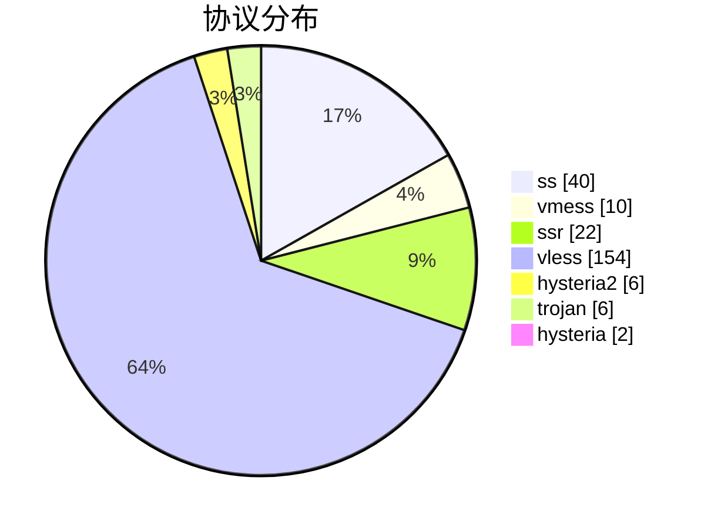

```mermaid
pie showData
title 延迟分布
"99-199ms" : 15
"199-299ms" : 24
"299-399ms" : 26
"399-499ms" : 54
"499-599ms" : 55
"599-699ms" : 37
"699-799ms" : 28
"799-899ms" : 1
```

```mermaid
pie showData
title 地域分布
"未知" : 171
"中国" : 6
"香港" : 13
"美国" : 9
"俄罗斯" : 2
"新加坡" : 7
"日本" : 10
"法国" : 2
"韩国" : 3
"Cloudflare" : 2
"孟加拉国" : 1
"意大利" : 1
"德国" : 5
"葡萄牙" : 1
"印度" : 2
"波兰" : 1
"芬兰" : 4
```

```mermaid
pie showData
title 协议分布
"ss" : 40
"vmess" : 10
"ssr" : 22
"vless" : 154
"hysteria2" : 6
"trojan" : 6
"hysteria" : 2
```