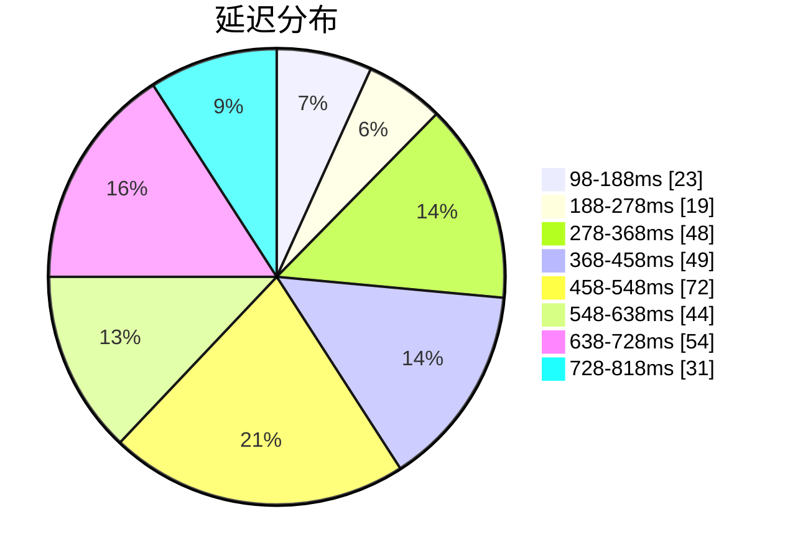
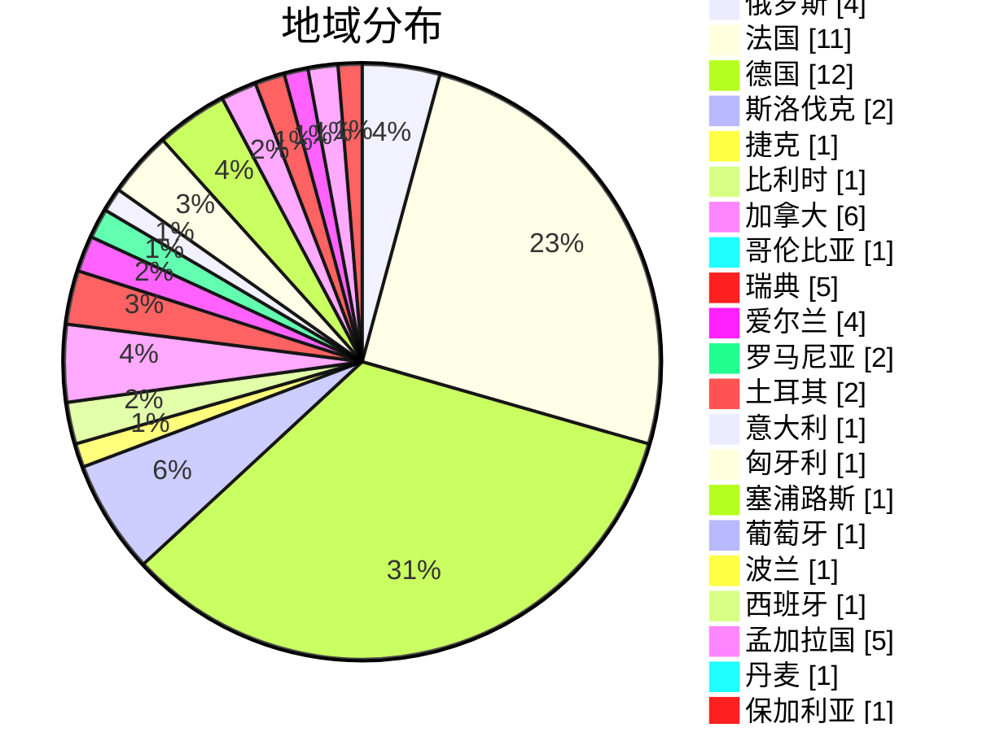
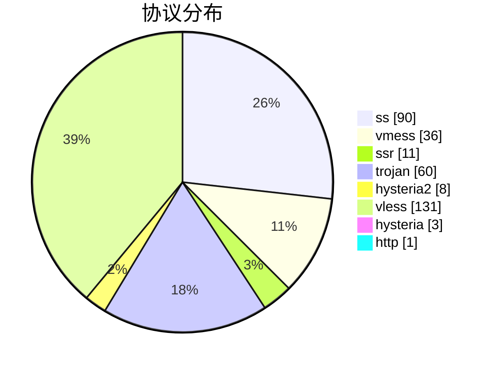

```mermaid
pie showData
title 延迟分布
"98-188ms" : 23
"188-278ms" : 19
"278-368ms" : 48
"368-458ms" : 49
"458-548ms" : 72
"548-638ms" : 44
"638-728ms" : 54
"728-818ms" : 31
```

```mermaid
pie showData
title 地域分布
"香港" : 13
"未知" : 78
"美国" : 104
"日本" : 19
"台湾" : 4
"英国" : 7
"新加坡" : 13
"中国" : 1
"韩国" : 9
"荷兰" : 6
"Cloudflare" : 5
"泰国" : 1
"俄罗斯" : 4
"法国" : 11
"德国" : 12
"斯洛伐克" : 2
"捷克" : 1
"比利时" : 1
"加拿大" : 6
"哥伦比亚" : 1
"瑞典" : 5
"爱尔兰" : 4
"罗马尼亚" : 2
"土耳其" : 2
"意大利" : 1
"匈牙利" : 1
"塞浦路斯" : 1
"葡萄牙" : 1
"波兰" : 1
"西班牙" : 1
"孟加拉国" : 5
"丹麦" : 1
"保加利亚" : 1
"越南" : 1
"墨西哥" : 1
"乌克兰" : 1
"冰岛" : 1
"爱沙尼亚" : 2
"智利" : 1
"希腊" : 1
"芬兰" : 1
"摩尔多瓦" : 1
"拉脱维亚" : 1
"立陶宛" : 1
"印度" : 4
```

```mermaid
pie showData
title 协议分布
"ss" : 90
"vmess" : 36
"ssr" : 11
"trojan" : 60
"hysteria2" : 8
"vless" : 131
"hysteria" : 3
"http" : 1
```