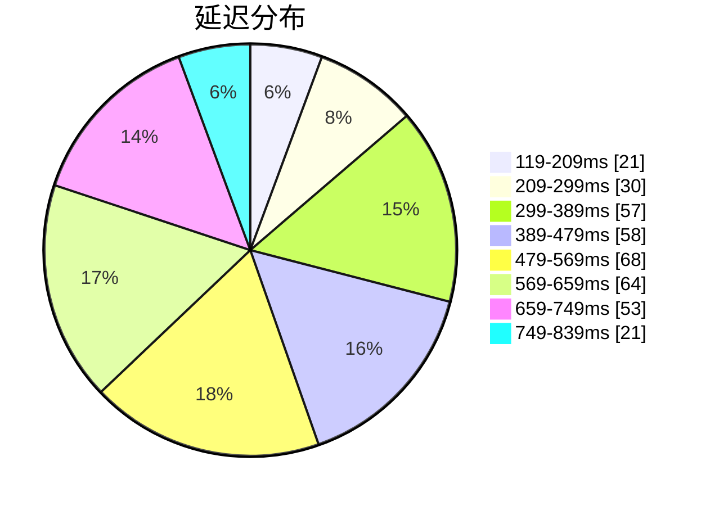
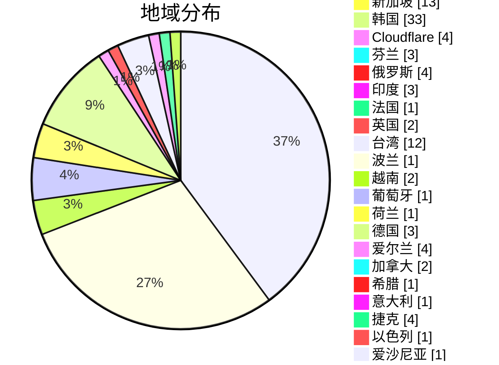
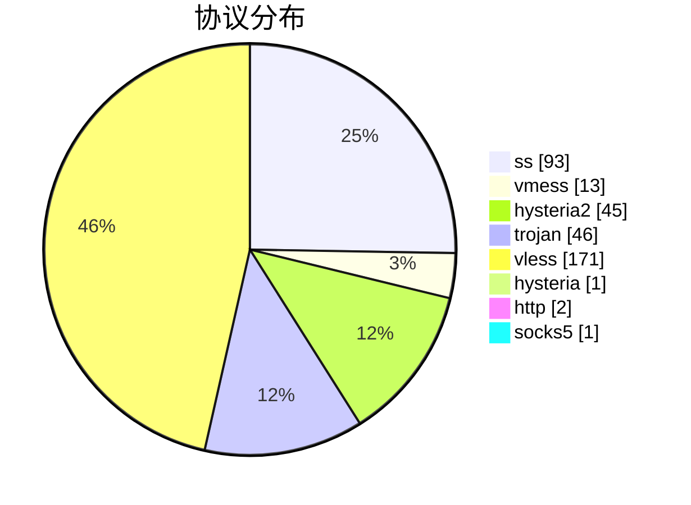

```mermaid
pie showData
title 延迟分布
"119-209ms" : 21
"209-299ms" : 30
"299-389ms" : 57
"389-479ms" : 58
"479-569ms" : 68
"569-659ms" : 64
"659-749ms" : 53
"749-839ms" : 21
```

```mermaid
pie showData
title 地域分布
"未知" : 138
"美国" : 101
"日本" : 13
"香港" : 16
"新加坡" : 13
"韩国" : 33
"Cloudflare" : 4
"芬兰" : 3
"俄罗斯" : 4
"印度" : 3
"法国" : 1
"英国" : 2
"台湾" : 12
"波兰" : 1
"越南" : 2
"葡萄牙" : 1
"荷兰" : 1
"德国" : 3
"爱尔兰" : 4
"加拿大" : 2
"希腊" : 1
"意大利" : 1
"捷克" : 4
"以色列" : 1
"爱沙尼亚" : 1
"冰岛" : 1
"孟加拉国" : 4
"阿塞拜疆" : 1
"澳大利亚" : 1
```

```mermaid
pie showData
title 协议分布
"ss" : 93
"vmess" : 13
"hysteria2" : 45
"trojan" : 46
"vless" : 171
"hysteria" : 1
"http" : 2
"socks5" : 1
```