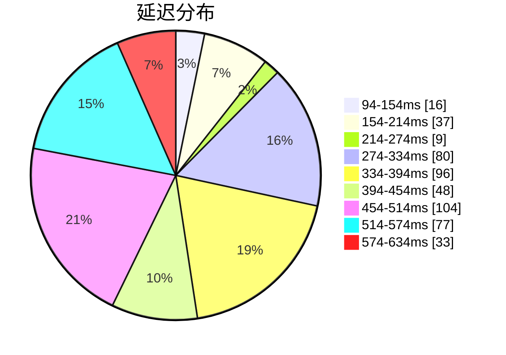
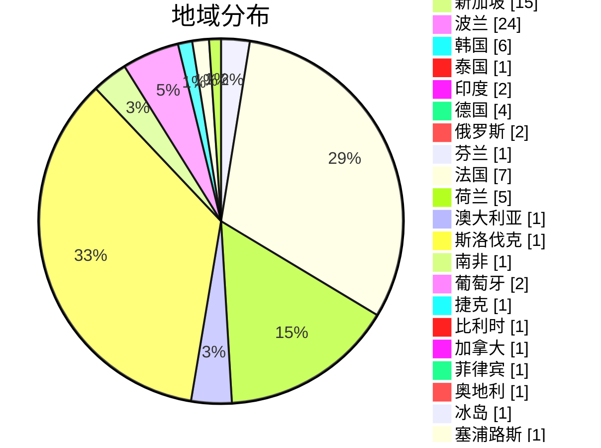
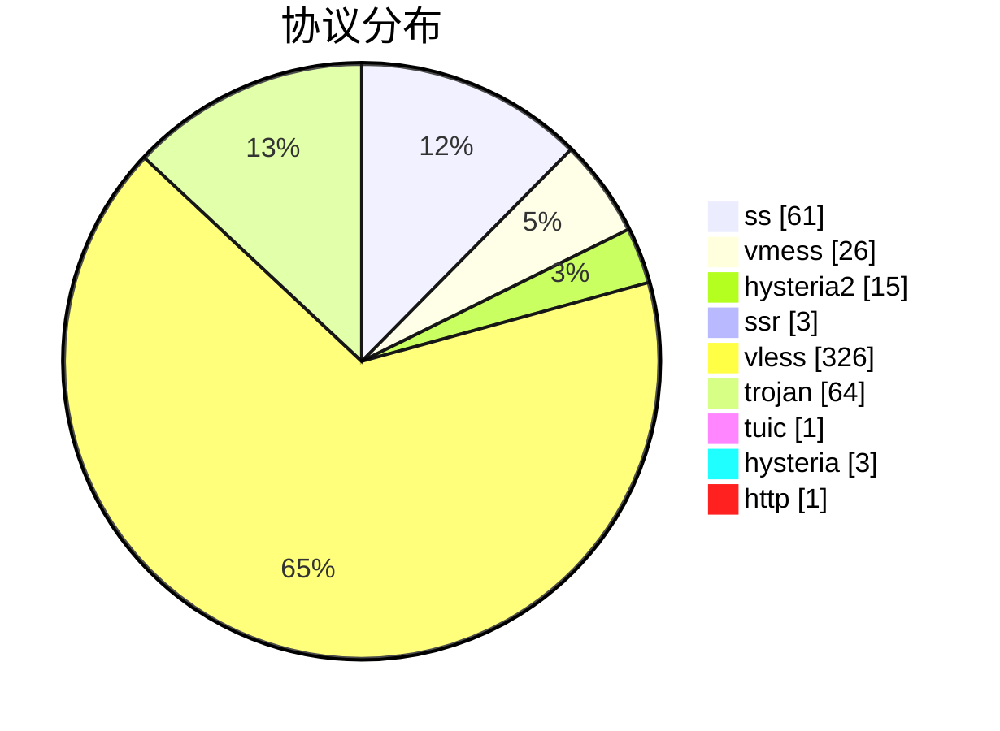

```mermaid
pie showData
title 延迟分布
"94-154ms" : 16
"154-214ms" : 37
"214-274ms" : 9
"274-334ms" : 80
"334-394ms" : 96
"394-454ms" : 48
"454-514ms" : 104
"514-574ms" : 77
"574-634ms" : 33
```

```mermaid
pie showData
title 地域分布
"香港" : 12
"未知" : 147
"台湾" : 73
"日本" : 17
"美国" : 167
"新加坡" : 15
"波兰" : 24
"韩国" : 6
"泰国" : 1
"印度" : 2
"德国" : 4
"俄罗斯" : 2
"芬兰" : 1
"法国" : 7
"荷兰" : 5
"澳大利亚" : 1
"斯洛伐克" : 1
"南非" : 1
"葡萄牙" : 2
"捷克" : 1
"比利时" : 1
"加拿大" : 1
"菲律宾" : 1
"奥地利" : 1
"冰岛" : 1
"塞浦路斯" : 1
"罗马尼亚" : 1
"马来西亚" : 1
"英国" : 1
"中国" : 1
"瑞士" : 1
```

```mermaid
pie showData
title 协议分布
"ss" : 61
"vmess" : 26
"hysteria2" : 15
"ssr" : 3
"vless" : 326
"trojan" : 64
"tuic" : 1
"hysteria" : 3
"http" : 1
```