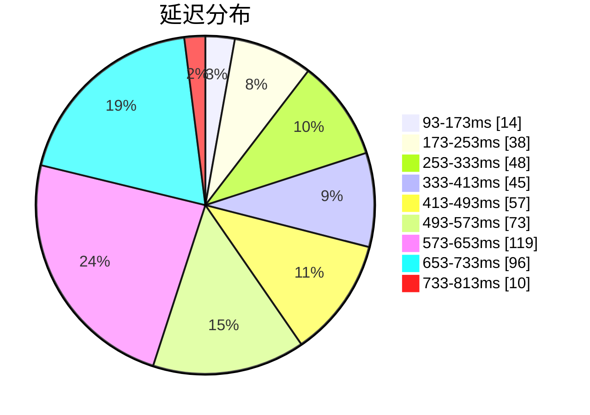
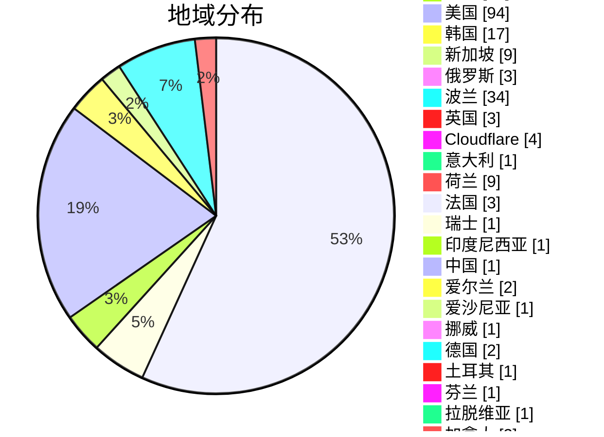
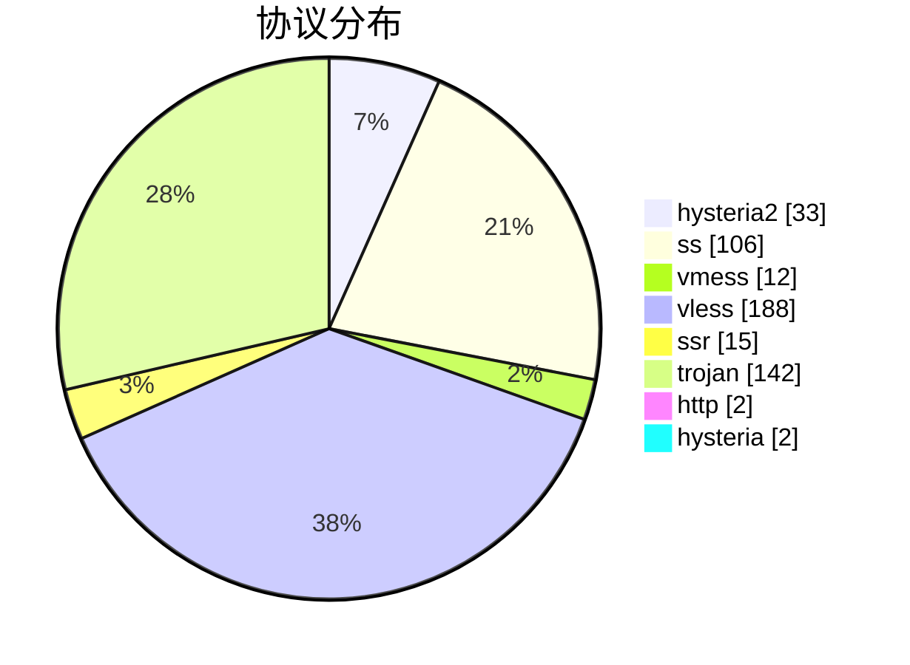

```mermaid
pie showData
title 延迟分布
"93-173ms" : 14
"173-253ms" : 38
"253-333ms" : 48
"333-413ms" : 45
"413-493ms" : 57
"493-573ms" : 73
"573-653ms" : 119
"653-733ms" : 96
"733-813ms" : 10
```

```mermaid
pie showData
title 地域分布
"未知" : 267
"日本" : 23
"香港" : 17
"美国" : 94
"韩国" : 17
"新加坡" : 9
"俄罗斯" : 3
"波兰" : 34
"英国" : 3
"Cloudflare" : 4
"意大利" : 1
"荷兰" : 9
"法国" : 3
"瑞士" : 1
"印度尼西亚" : 1
"中国" : 1
"爱尔兰" : 2
"爱沙尼亚" : 1
"挪威" : 1
"德国" : 2
"土耳其" : 1
"芬兰" : 1
"拉脱维亚" : 1
"加拿大" : 2
"澳大利亚" : 1
"冰岛" : 1
```

```mermaid
pie showData
title 协议分布
"hysteria2" : 33
"ss" : 106
"vmess" : 12
"vless" : 188
"ssr" : 15
"trojan" : 142
"http" : 2
"hysteria" : 2
```