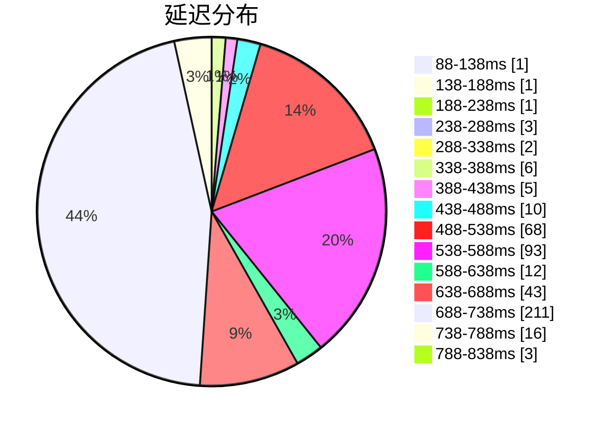
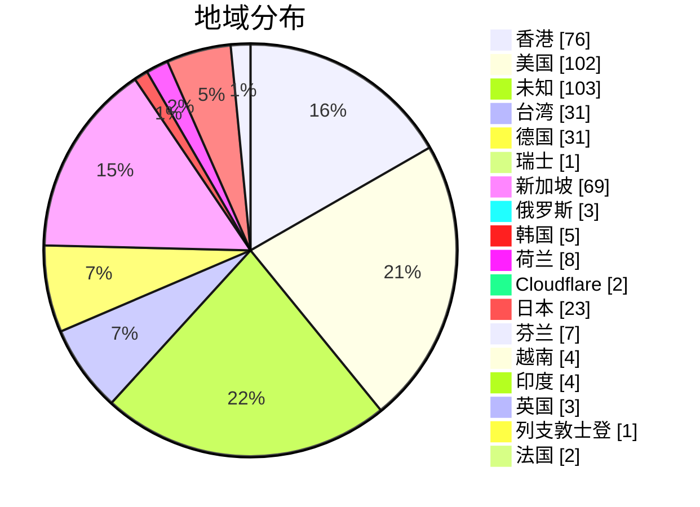
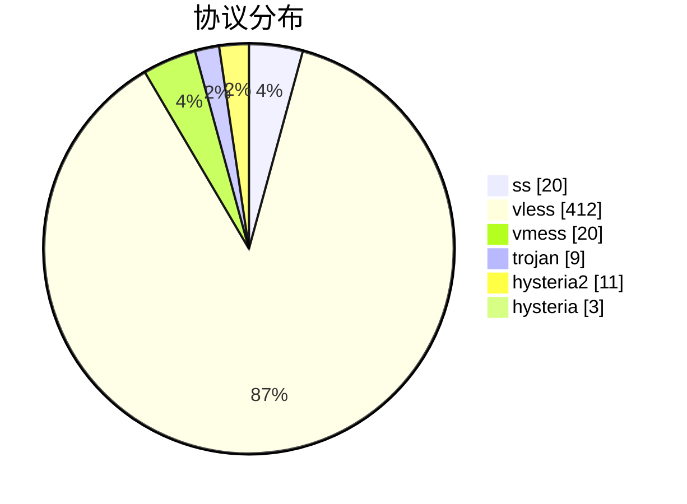

```mermaid
pie showData
title 延迟分布
"88-138ms" : 1
"138-188ms" : 1
"188-238ms" : 1
"238-288ms" : 3
"288-338ms" : 2
"338-388ms" : 6
"388-438ms" : 5
"438-488ms" : 10
"488-538ms" : 68
"538-588ms" : 93
"588-638ms" : 12
"638-688ms" : 43
"688-738ms" : 211
"738-788ms" : 16
"788-838ms" : 3
```

```mermaid
pie showData
title 地域分布
"香港" : 76
"美国" : 102
"未知" : 103
"台湾" : 31
"德国" : 31
"瑞士" : 1
"新加坡" : 69
"俄罗斯" : 3
"韩国" : 5
"荷兰" : 8
"Cloudflare" : 2
"日本" : 23
"芬兰" : 7
"越南" : 4
"印度" : 4
"英国" : 3
"列支敦士登" : 1
"法国" : 2
```

```mermaid
pie showData
title 协议分布
"ss" : 20
"vless" : 412
"vmess" : 20
"trojan" : 9
"hysteria2" : 11
"hysteria" : 3
```