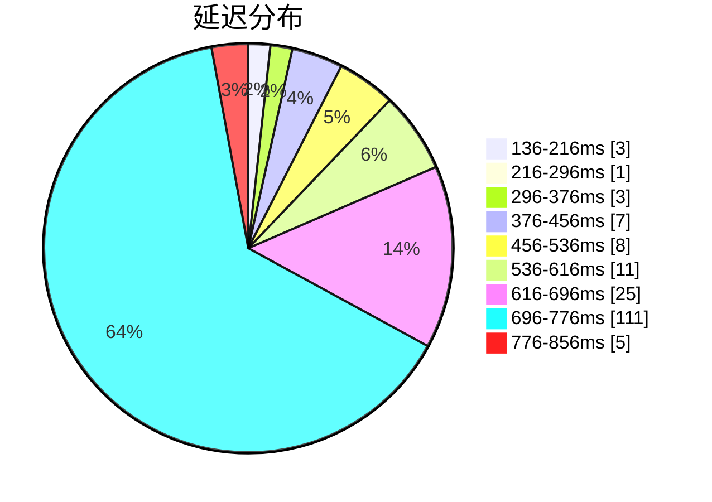
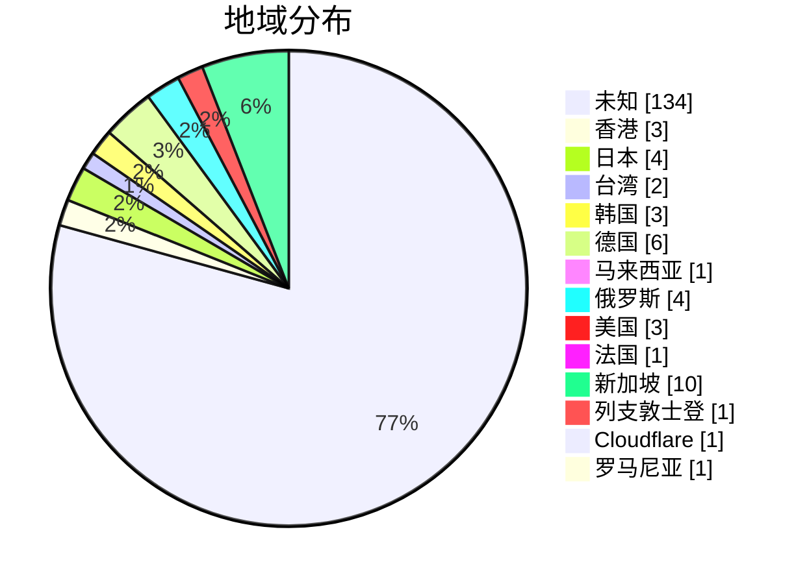
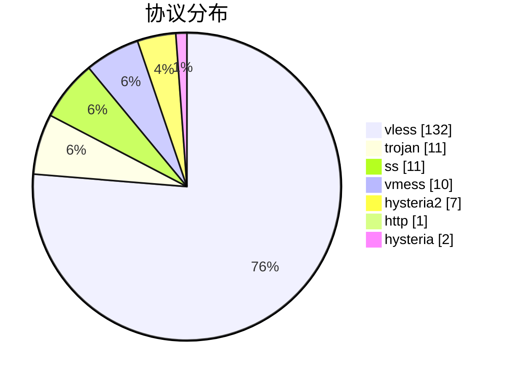

```mermaid
pie showData
title 延迟分布
"136-216ms" : 3
"216-296ms" : 1
"296-376ms" : 3
"376-456ms" : 7
"456-536ms" : 8
"536-616ms" : 11
"616-696ms" : 25
"696-776ms" : 111
"776-856ms" : 5
```

```mermaid
pie showData
title 地域分布
"未知" : 134
"香港" : 3
"日本" : 4
"台湾" : 2
"韩国" : 3
"德国" : 6
"马来西亚" : 1
"俄罗斯" : 4
"美国" : 3
"法国" : 1
"新加坡" : 10
"列支敦士登" : 1
"Cloudflare" : 1
"罗马尼亚" : 1
```

```mermaid
pie showData
title 协议分布
"vless" : 132
"trojan" : 11
"ss" : 11
"vmess" : 10
"hysteria2" : 7
"http" : 1
"hysteria" : 2
```