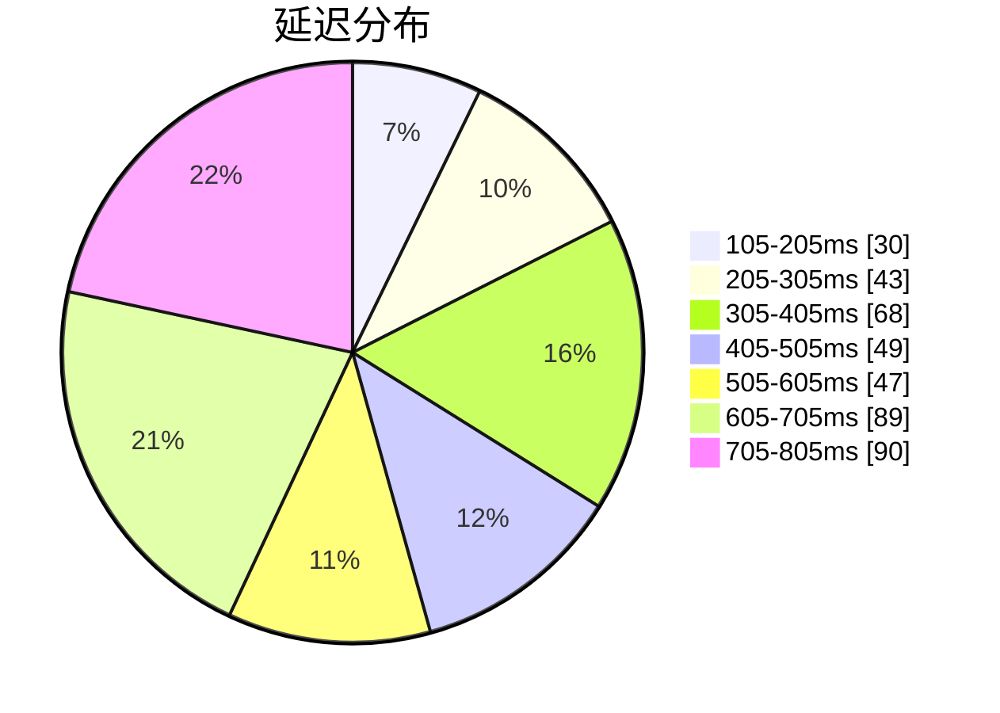
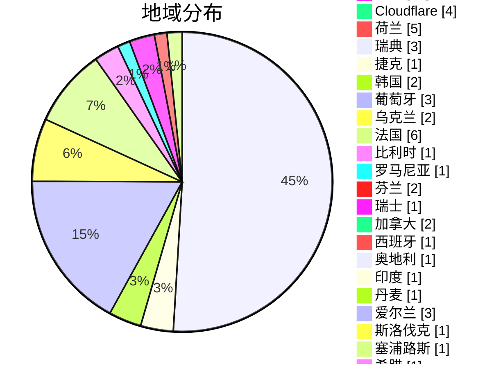
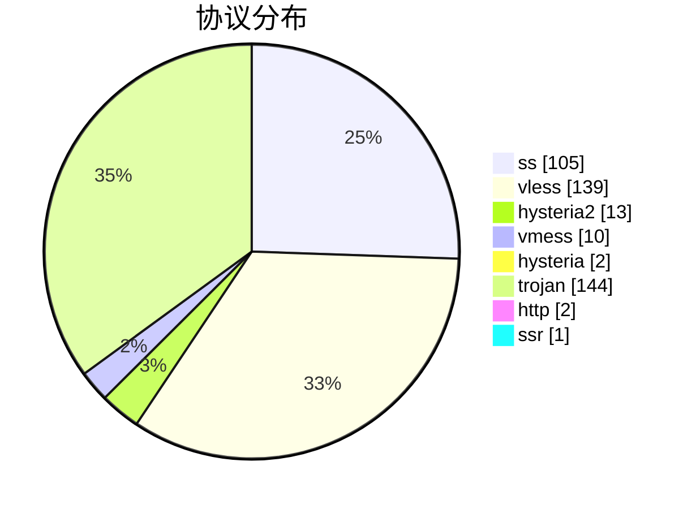

```mermaid
pie showData
title 延迟分布
"105-205ms" : 30
"205-305ms" : 43
"305-405ms" : 68
"405-505ms" : 49
"505-605ms" : 47
"605-705ms" : 89
"705-805ms" : 90
```

```mermaid
pie showData
title 地域分布
"未知" : 188
"香港" : 13
"日本" : 13
"台湾" : 63
"美国" : 25
"波兰" : 31
"新加坡" : 10
"英国" : 5
"俄罗斯" : 2
"德国" : 10
"Cloudflare" : 4
"荷兰" : 5
"瑞典" : 3
"捷克" : 1
"韩国" : 2
"葡萄牙" : 3
"乌克兰" : 2
"法国" : 6
"比利时" : 1
"罗马尼亚" : 1
"芬兰" : 2
"瑞士" : 1
"加拿大" : 2
"西班牙" : 1
"奥地利" : 1
"印度" : 1
"丹麦" : 1
"爱尔兰" : 3
"斯洛伐克" : 1
"塞浦路斯" : 1
"希腊" : 1
"爱沙尼亚" : 2
"保加利亚" : 1
"冰岛" : 1
"摩尔多瓦" : 1
"土耳其" : 1
"孟加拉国" : 4
"拉脱维亚" : 1
"立陶宛" : 1
"哥伦比亚" : 1
```

```mermaid
pie showData
title 协议分布
"ss" : 105
"vless" : 139
"hysteria2" : 13
"vmess" : 10
"hysteria" : 2
"trojan" : 144
"http" : 2
"ssr" : 1
```