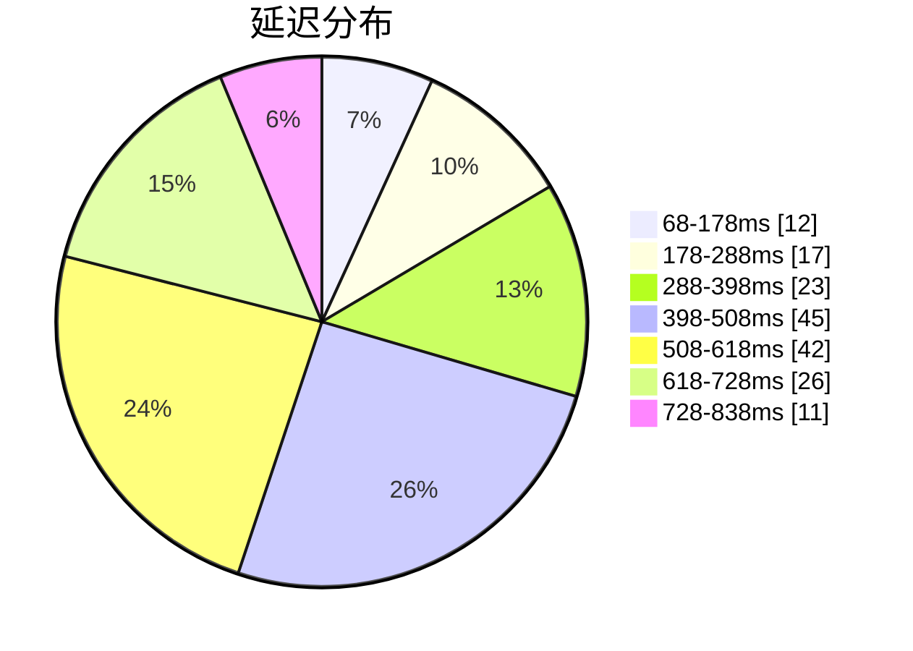
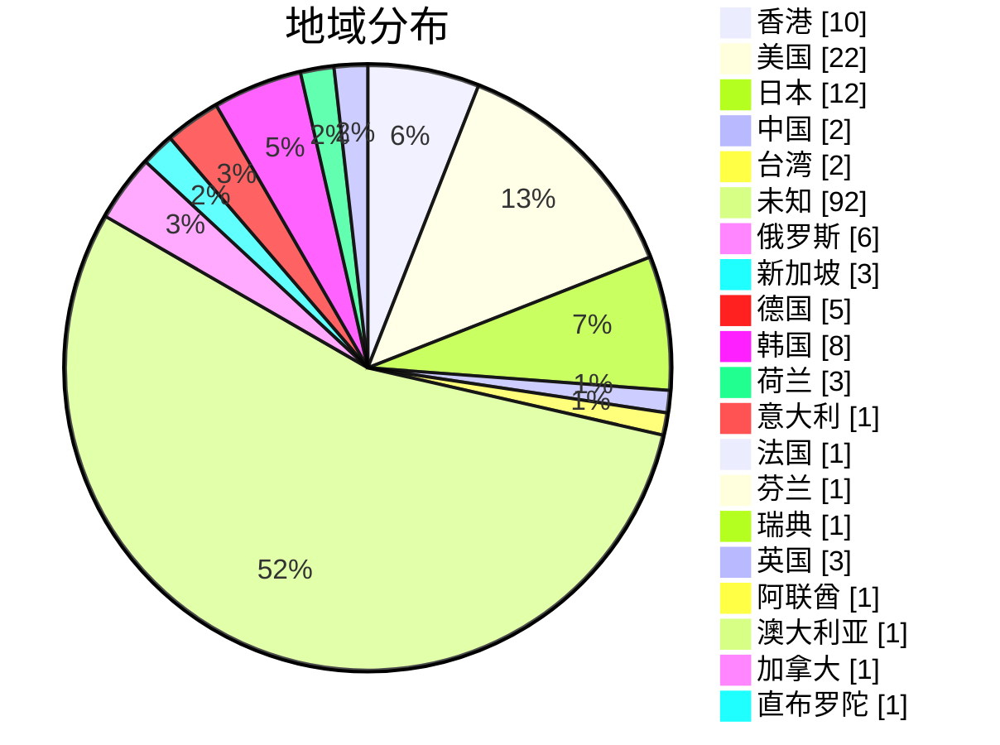
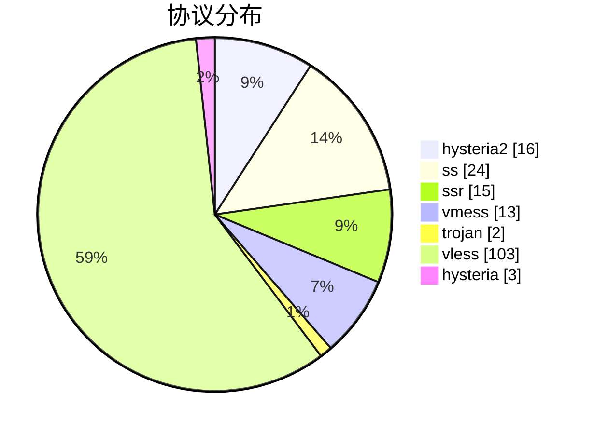

```mermaid
pie showData
title 延迟分布
"68-178ms" : 12
"178-288ms" : 17
"288-398ms" : 23
"398-508ms" : 45
"508-618ms" : 42
"618-728ms" : 26
"728-838ms" : 11
```

```mermaid
pie showData
title 地域分布
"香港" : 10
"美国" : 22
"日本" : 12
"中国" : 2
"台湾" : 2
"未知" : 92
"俄罗斯" : 6
"新加坡" : 3
"德国" : 5
"韩国" : 8
"荷兰" : 3
"意大利" : 1
"法国" : 1
"芬兰" : 1
"瑞典" : 1
"英国" : 3
"阿联酋" : 1
"澳大利亚" : 1
"加拿大" : 1
"直布罗陀" : 1
```

```mermaid
pie showData
title 协议分布
"hysteria2" : 16
"ss" : 24
"ssr" : 15
"vmess" : 13
"trojan" : 2
"vless" : 103
"hysteria" : 3
```