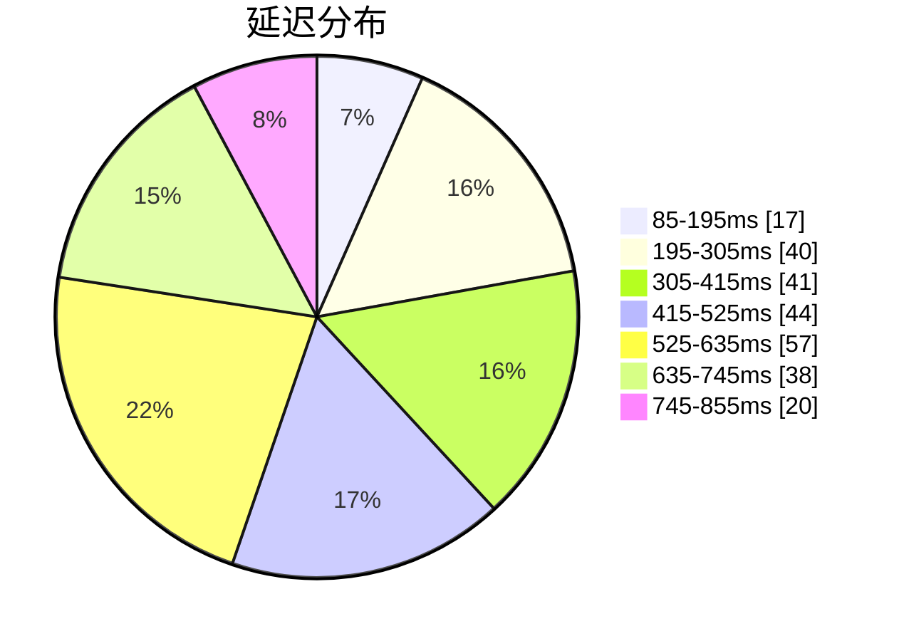
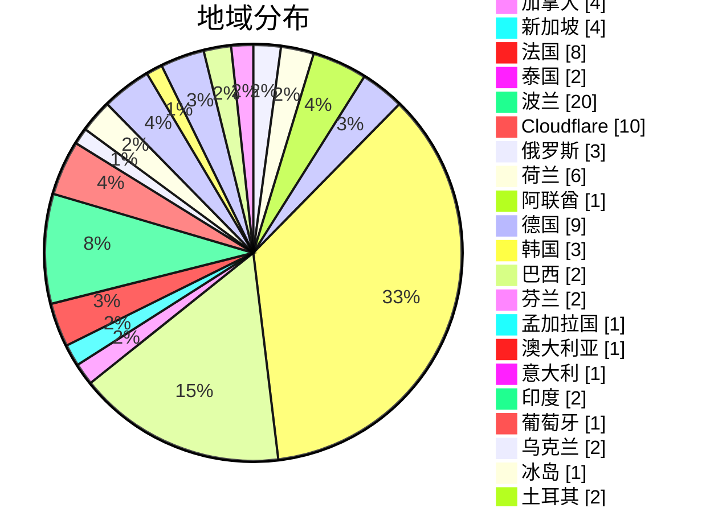
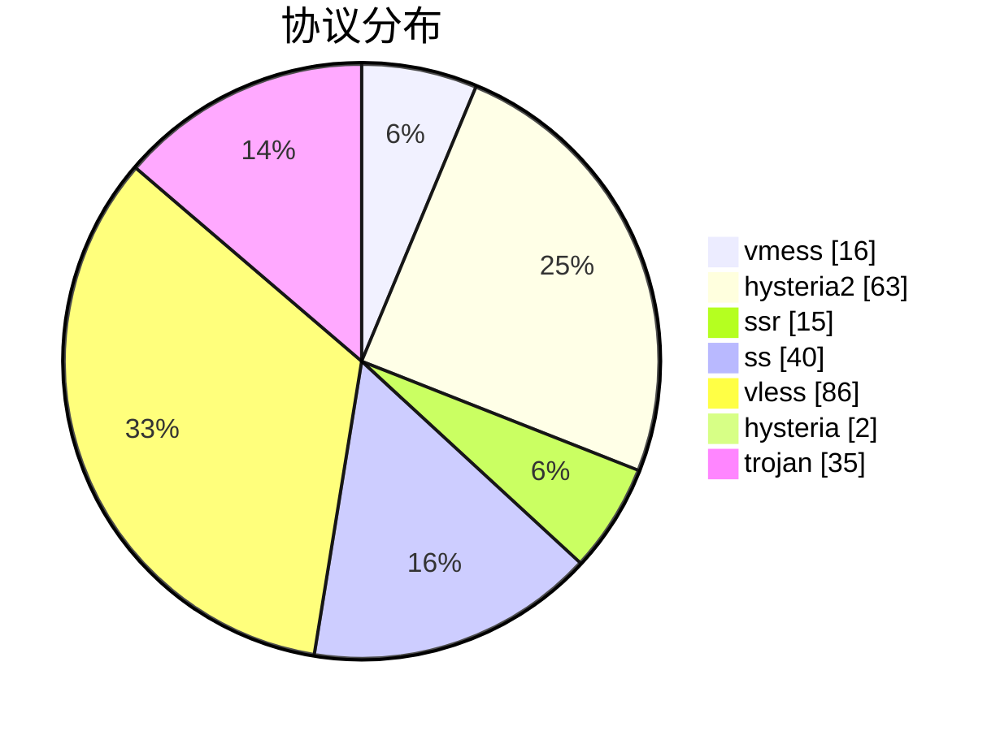

```mermaid
pie showData
title 延迟分布
"85-195ms" : 17
"195-305ms" : 40
"305-415ms" : 41
"415-525ms" : 44
"525-635ms" : 57
"635-745ms" : 38
"745-855ms" : 20
```

```mermaid
pie showData
title 地域分布
"中国" : 5
"台湾" : 6
"日本" : 10
"香港" : 8
"未知" : 84
"美国" : 38
"加拿大" : 4
"新加坡" : 4
"法国" : 8
"泰国" : 2
"波兰" : 20
"Cloudflare" : 10
"俄罗斯" : 3
"荷兰" : 6
"阿联酋" : 1
"德国" : 9
"韩国" : 3
"巴西" : 2
"芬兰" : 2
"孟加拉国" : 1
"澳大利亚" : 1
"意大利" : 1
"印度" : 2
"葡萄牙" : 1
"乌克兰" : 2
"冰岛" : 1
"土耳其" : 2
"英国" : 8
"瑞士" : 2
"瑞典" : 5
"爱尔兰" : 4
"哈萨克斯坦" : 1
"爱沙尼亚" : 1
```

```mermaid
pie showData
title 协议分布
"vmess" : 16
"hysteria2" : 63
"ssr" : 15
"ss" : 40
"vless" : 86
"hysteria" : 2
"trojan" : 35
```