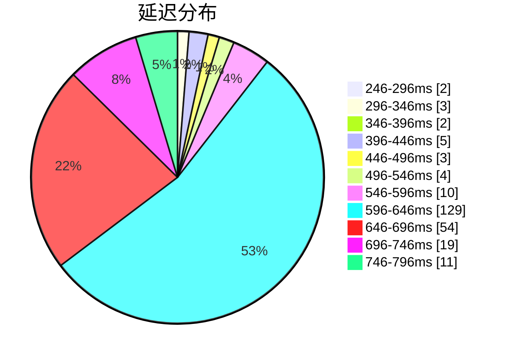
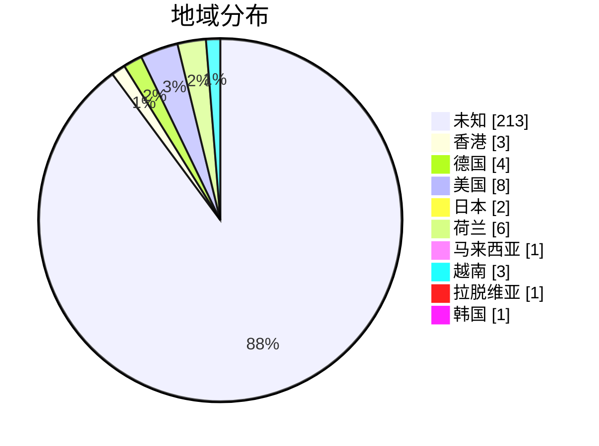
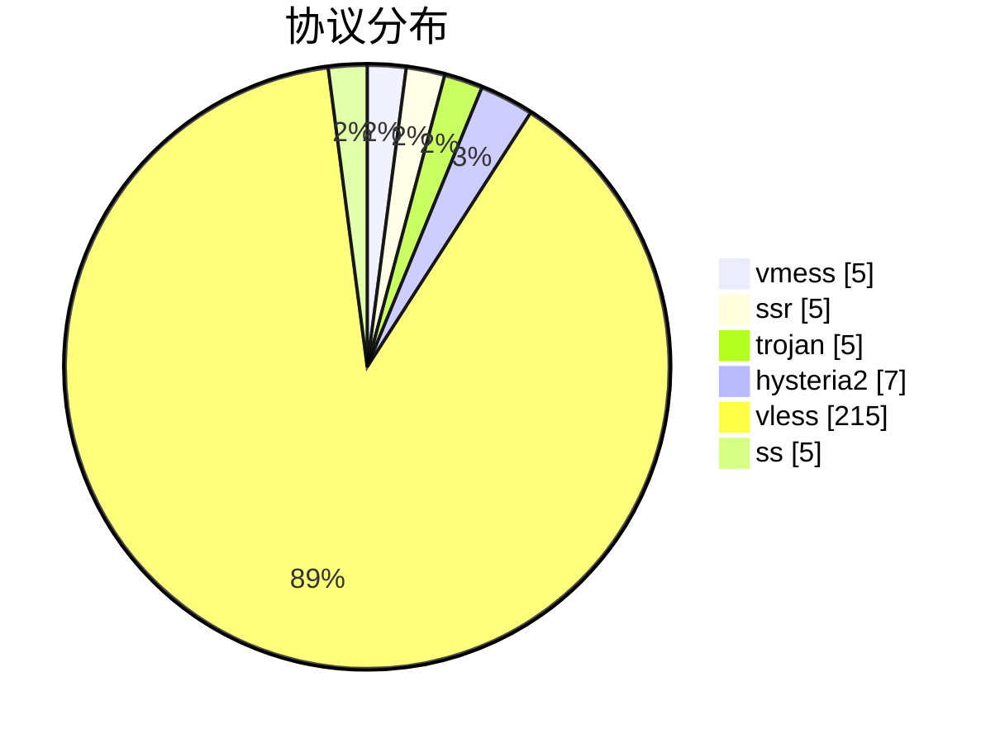

```mermaid
pie showData
title 延迟分布
"246-296ms" : 2
"296-346ms" : 3
"346-396ms" : 2
"396-446ms" : 5
"446-496ms" : 3
"496-546ms" : 4
"546-596ms" : 10
"596-646ms" : 129
"646-696ms" : 54
"696-746ms" : 19
"746-796ms" : 11
```

```mermaid
pie showData
title 地域分布
"未知" : 213
"香港" : 3
"德国" : 4
"美国" : 8
"日本" : 2
"荷兰" : 6
"马来西亚" : 1
"越南" : 3
"拉脱维亚" : 1
"韩国" : 1
```

```mermaid
pie showData
title 协议分布
"vmess" : 5
"ssr" : 5
"trojan" : 5
"hysteria2" : 7
"vless" : 215
"ss" : 5
```