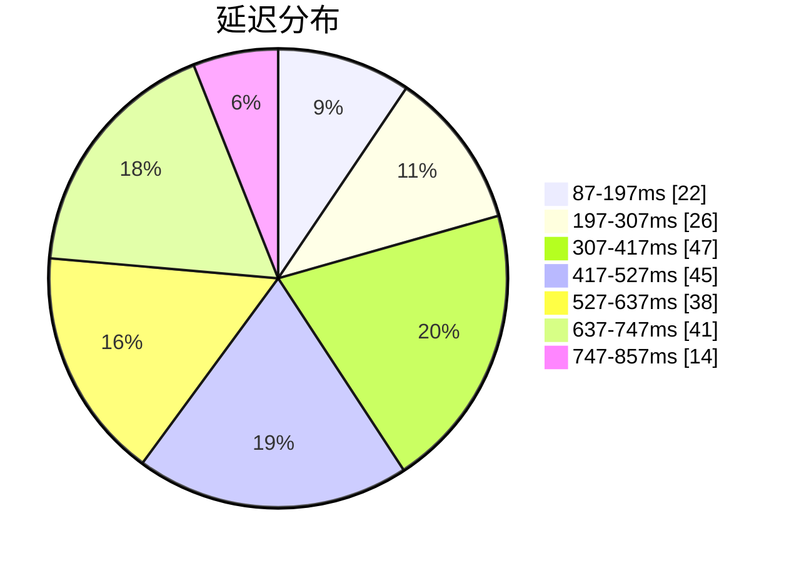
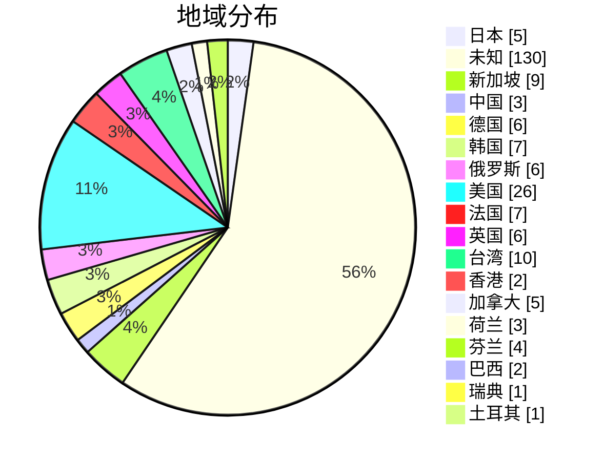
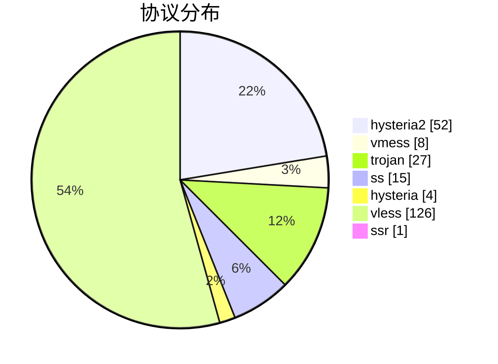

```mermaid
pie showData
title 延迟分布
"87-197ms" : 22
"197-307ms" : 26
"307-417ms" : 47
"417-527ms" : 45
"527-637ms" : 38
"637-747ms" : 41
"747-857ms" : 14
```

```mermaid
pie showData
title 地域分布
"日本" : 5
"未知" : 130
"新加坡" : 9
"中国" : 3
"德国" : 6
"韩国" : 7
"俄罗斯" : 6
"美国" : 26
"法国" : 7
"英国" : 6
"台湾" : 10
"香港" : 2
"加拿大" : 5
"荷兰" : 3
"芬兰" : 4
"巴西" : 2
"瑞典" : 1
"土耳其" : 1
```

```mermaid
pie showData
title 协议分布
"hysteria2" : 52
"vmess" : 8
"trojan" : 27
"ss" : 15
"hysteria" : 4
"vless" : 126
"ssr" : 1
```