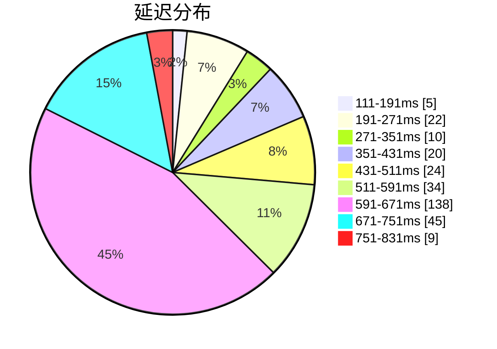
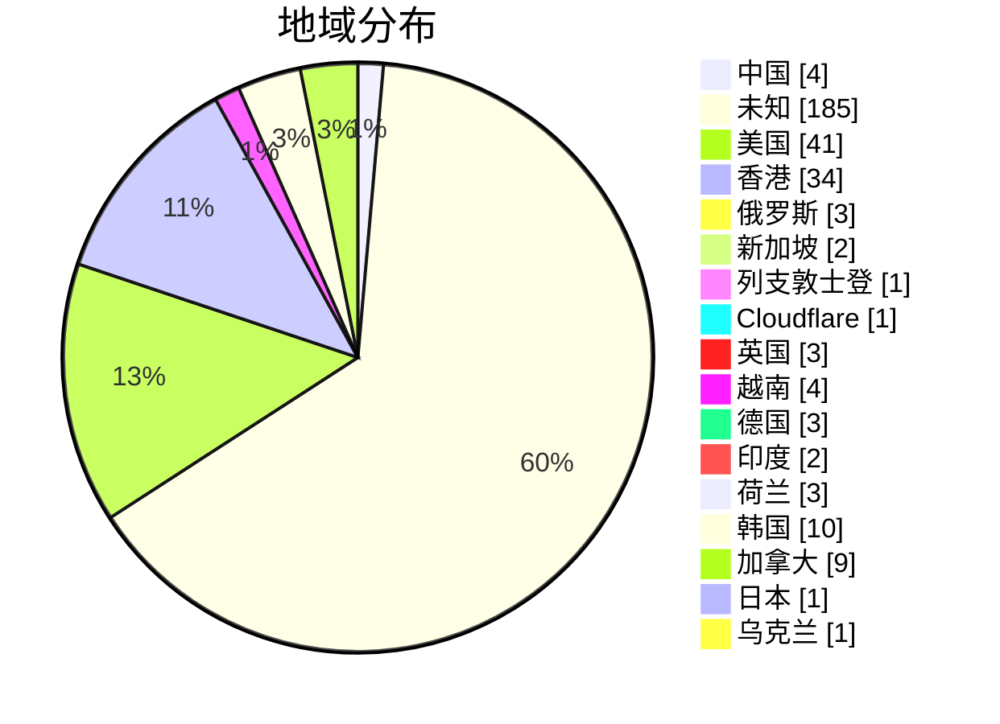
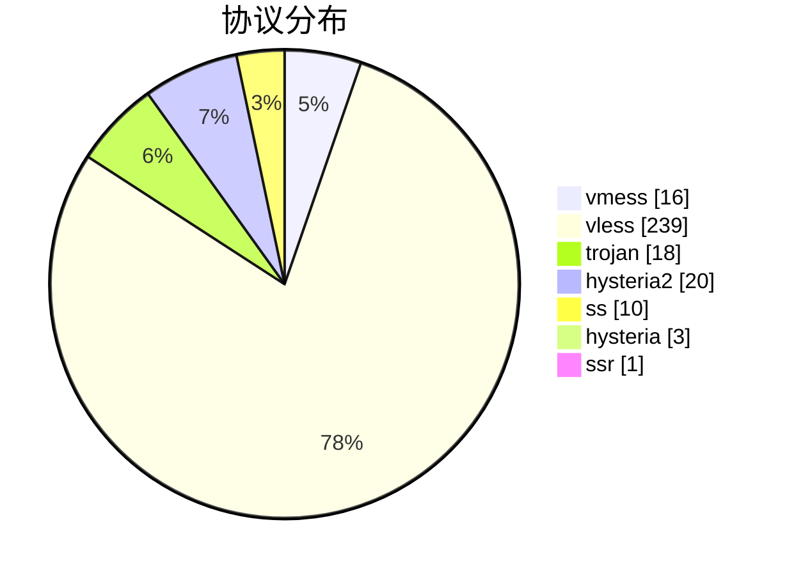

```mermaid
pie showData
title 延迟分布
"111-191ms" : 5
"191-271ms" : 22
"271-351ms" : 10
"351-431ms" : 20
"431-511ms" : 24
"511-591ms" : 34
"591-671ms" : 138
"671-751ms" : 45
"751-831ms" : 9
```

```mermaid
pie showData
title 地域分布
"中国" : 4
"未知" : 185
"美国" : 41
"香港" : 34
"俄罗斯" : 3
"新加坡" : 2
"列支敦士登" : 1
"Cloudflare" : 1
"英国" : 3
"越南" : 4
"德国" : 3
"印度" : 2
"荷兰" : 3
"韩国" : 10
"加拿大" : 9
"日本" : 1
"乌克兰" : 1
```

```mermaid
pie showData
title 协议分布
"vmess" : 16
"vless" : 239
"trojan" : 18
"hysteria2" : 20
"ss" : 10
"hysteria" : 3
"ssr" : 1
```