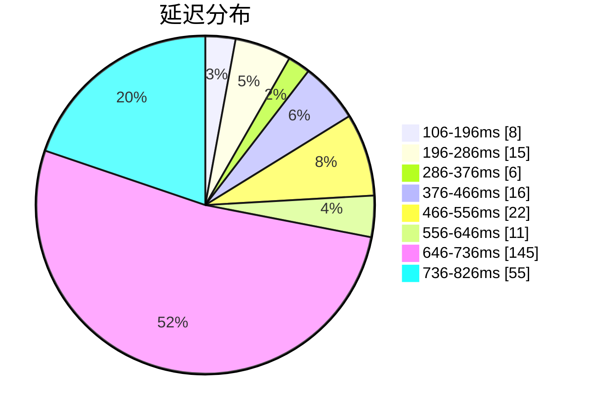
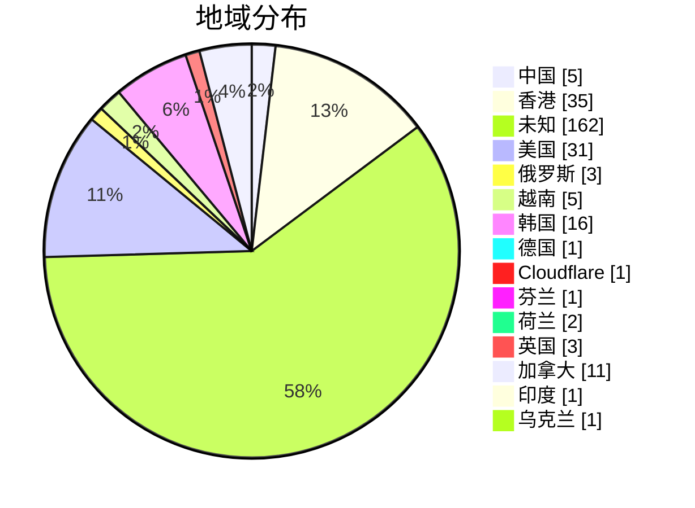
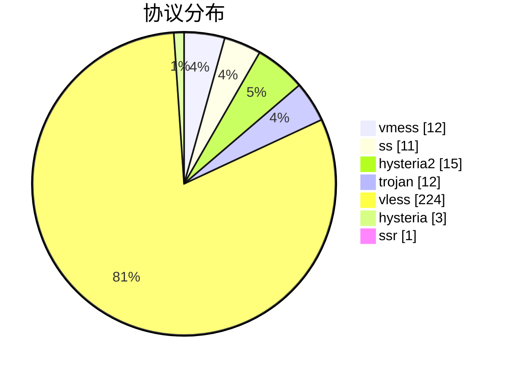

```mermaid
pie showData
title 延迟分布
"106-196ms" : 8
"196-286ms" : 15
"286-376ms" : 6
"376-466ms" : 16
"466-556ms" : 22
"556-646ms" : 11
"646-736ms" : 145
"736-826ms" : 55
```

```mermaid
pie showData
title 地域分布
"中国" : 5
"香港" : 35
"未知" : 162
"美国" : 31
"俄罗斯" : 3
"越南" : 5
"韩国" : 16
"德国" : 1
"Cloudflare" : 1
"芬兰" : 1
"荷兰" : 2
"英国" : 3
"加拿大" : 11
"印度" : 1
"乌克兰" : 1
```

```mermaid
pie showData
title 协议分布
"vmess" : 12
"ss" : 11
"hysteria2" : 15
"trojan" : 12
"vless" : 224
"hysteria" : 3
"ssr" : 1
```