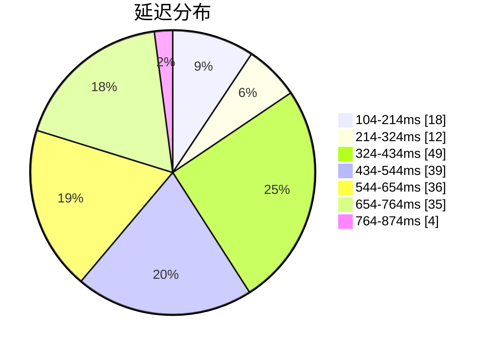
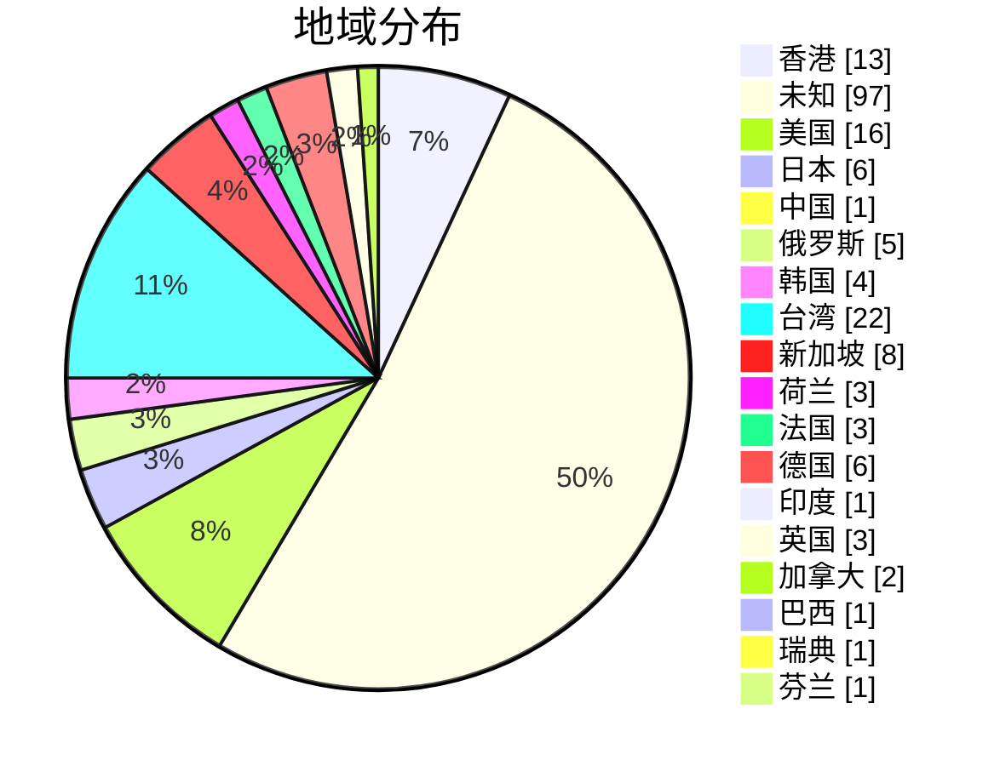
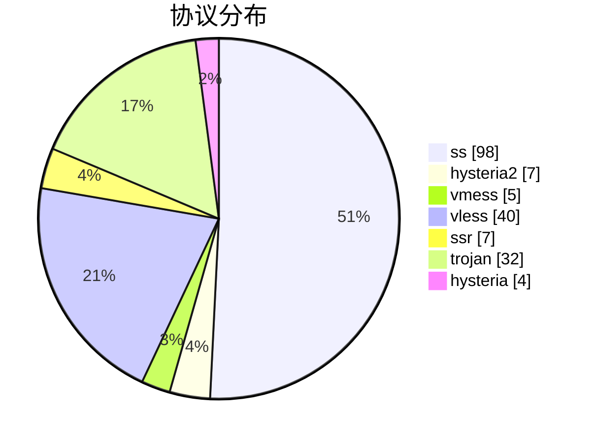

```mermaid
pie showData
title 延迟分布
"104-214ms" : 18
"214-324ms" : 12
"324-434ms" : 49
"434-544ms" : 39
"544-654ms" : 36
"654-764ms" : 35
"764-874ms" : 4
```

```mermaid
pie showData
title 地域分布
"香港" : 13
"未知" : 97
"美国" : 16
"日本" : 6
"中国" : 1
"俄罗斯" : 5
"韩国" : 4
"台湾" : 22
"新加坡" : 8
"荷兰" : 3
"法国" : 3
"德国" : 6
"印度" : 1
"英国" : 3
"加拿大" : 2
"巴西" : 1
"瑞典" : 1
"芬兰" : 1
```

```mermaid
pie showData
title 协议分布
"ss" : 98
"hysteria2" : 7
"vmess" : 5
"vless" : 40
"ssr" : 7
"trojan" : 32
"hysteria" : 4
```