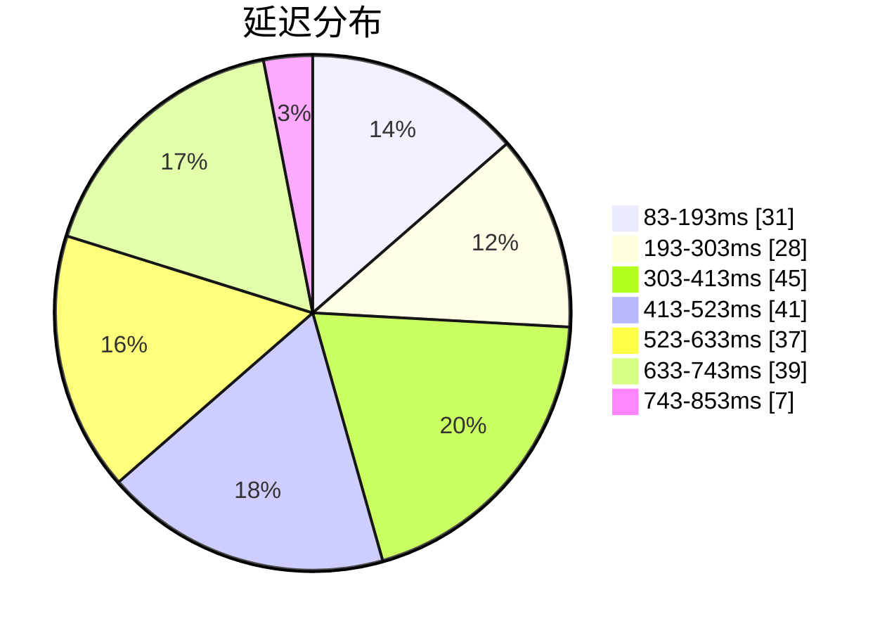
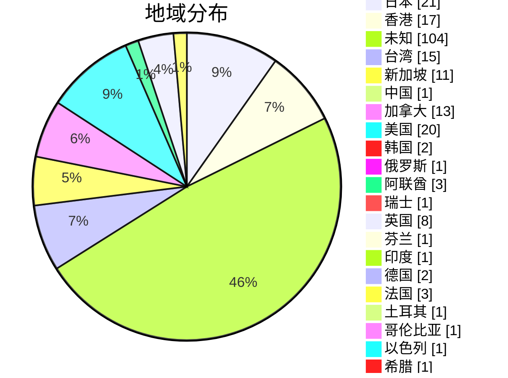
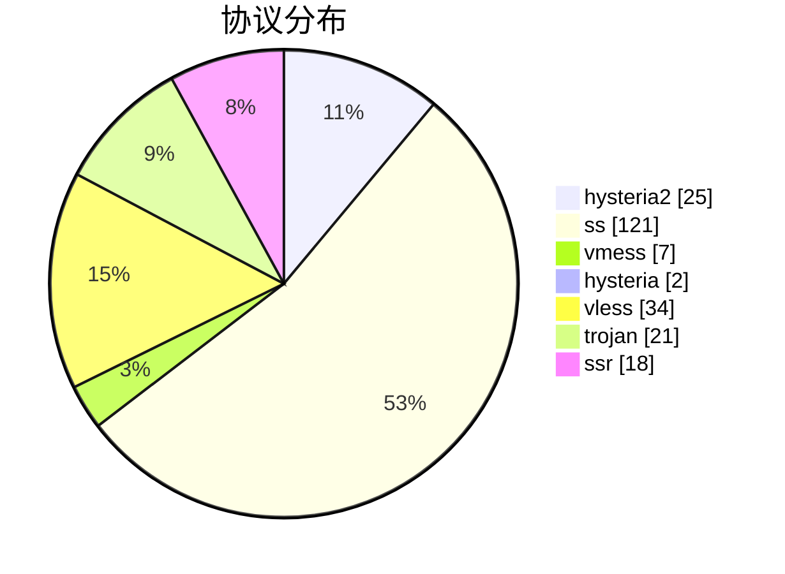

```mermaid
pie showData
title 延迟分布
"83-193ms" : 31
"193-303ms" : 28
"303-413ms" : 45
"413-523ms" : 41
"523-633ms" : 37
"633-743ms" : 39
"743-853ms" : 7
```

```mermaid
pie showData
title 地域分布
"日本" : 21
"香港" : 17
"未知" : 104
"台湾" : 15
"新加坡" : 11
"中国" : 1
"加拿大" : 13
"美国" : 20
"韩国" : 2
"俄罗斯" : 1
"阿联酋" : 3
"瑞士" : 1
"英国" : 8
"芬兰" : 1
"印度" : 1
"德国" : 2
"法国" : 3
"土耳其" : 1
"哥伦比亚" : 1
"以色列" : 1
"希腊" : 1
```

```mermaid
pie showData
title 协议分布
"hysteria2" : 25
"ss" : 121
"vmess" : 7
"hysteria" : 2
"vless" : 34
"trojan" : 21
"ssr" : 18
```