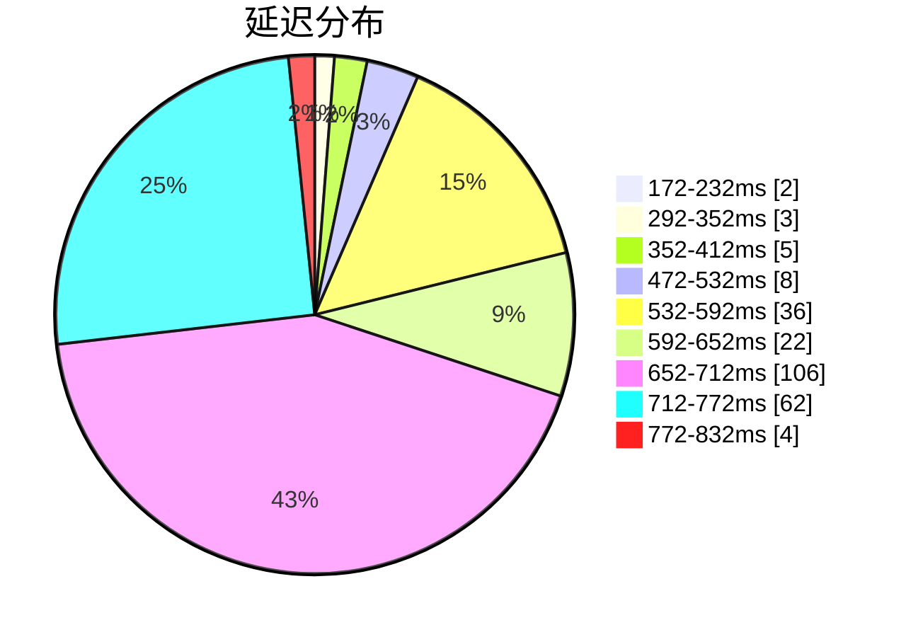
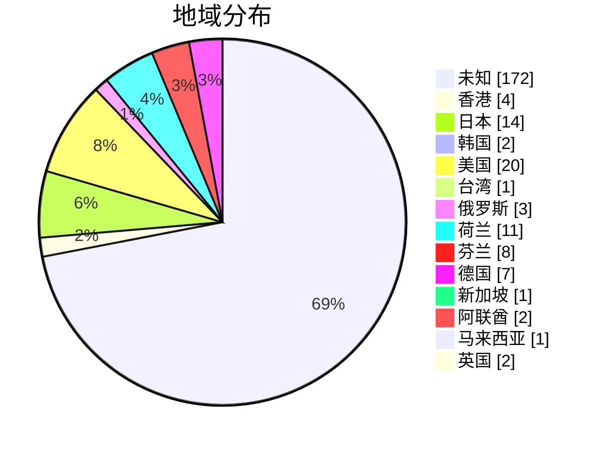
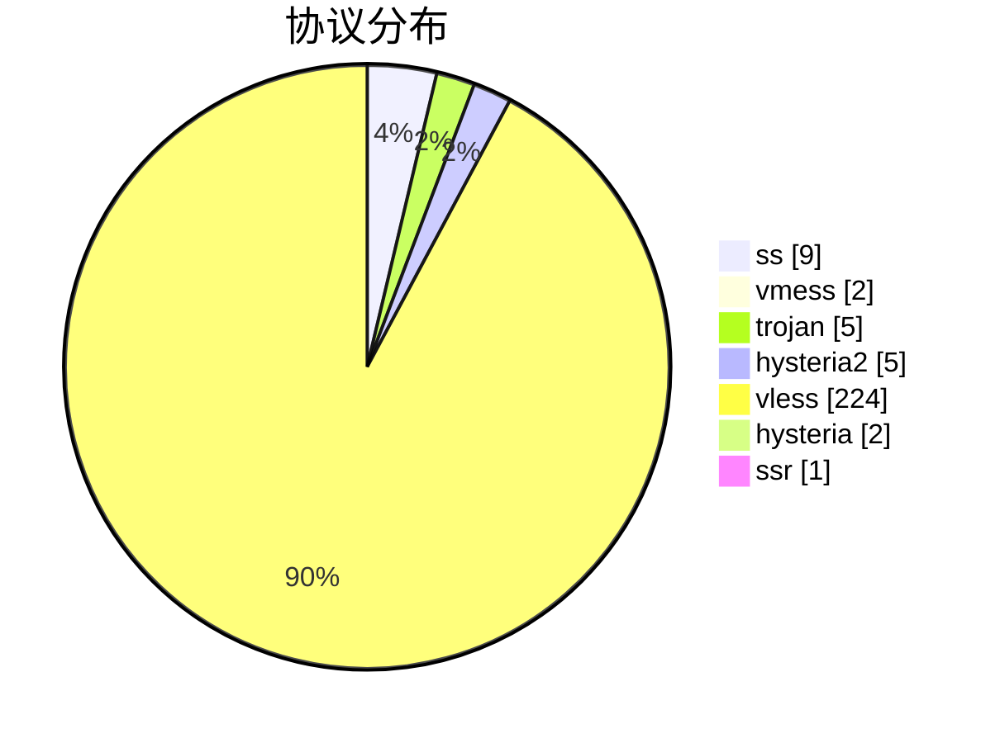

```mermaid
pie showData
title 延迟分布
"172-232ms" : 2
"292-352ms" : 3
"352-412ms" : 5
"472-532ms" : 8
"532-592ms" : 36
"592-652ms" : 22
"652-712ms" : 106
"712-772ms" : 62
"772-832ms" : 4
```

```mermaid
pie showData
title 地域分布
"未知" : 172
"香港" : 4
"日本" : 14
"韩国" : 2
"美国" : 20
"台湾" : 1
"俄罗斯" : 3
"荷兰" : 11
"芬兰" : 8
"德国" : 7
"新加坡" : 1
"阿联酋" : 2
"马来西亚" : 1
"英国" : 2
```

```mermaid
pie showData
title 协议分布
"ss" : 9
"vmess" : 2
"trojan" : 5
"hysteria2" : 5
"vless" : 224
"hysteria" : 2
"ssr" : 1
```