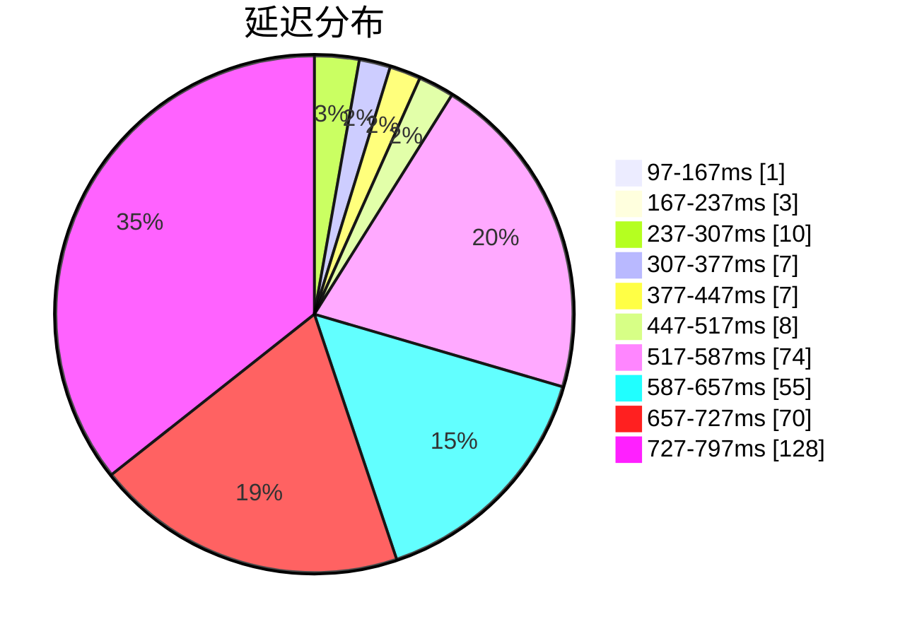
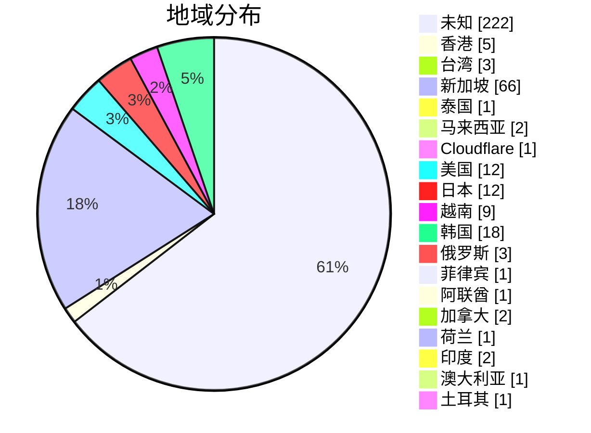
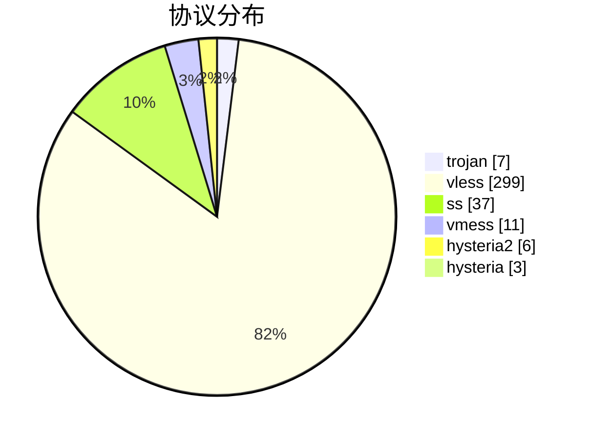

```mermaid
pie showData
title 延迟分布
"97-167ms" : 1
"167-237ms" : 3
"237-307ms" : 10
"307-377ms" : 7
"377-447ms" : 7
"447-517ms" : 8
"517-587ms" : 74
"587-657ms" : 55
"657-727ms" : 70
"727-797ms" : 128
```

```mermaid
pie showData
title 地域分布
"未知" : 222
"香港" : 5
"台湾" : 3
"新加坡" : 66
"泰国" : 1
"马来西亚" : 2
"Cloudflare" : 1
"美国" : 12
"日本" : 12
"越南" : 9
"韩国" : 18
"俄罗斯" : 3
"菲律宾" : 1
"阿联酋" : 1
"加拿大" : 2
"荷兰" : 1
"印度" : 2
"澳大利亚" : 1
"土耳其" : 1
```

```mermaid
pie showData
title 协议分布
"trojan" : 7
"vless" : 299
"ss" : 37
"vmess" : 11
"hysteria2" : 6
"hysteria" : 3
```