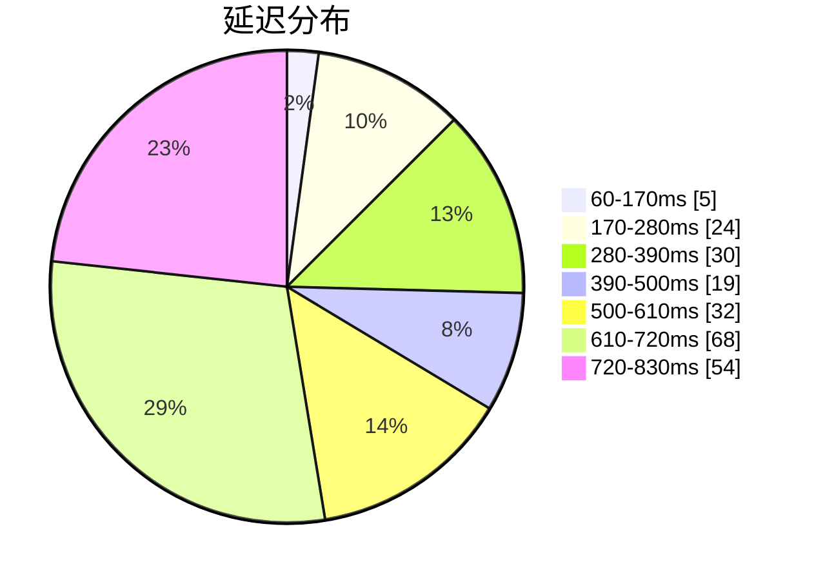
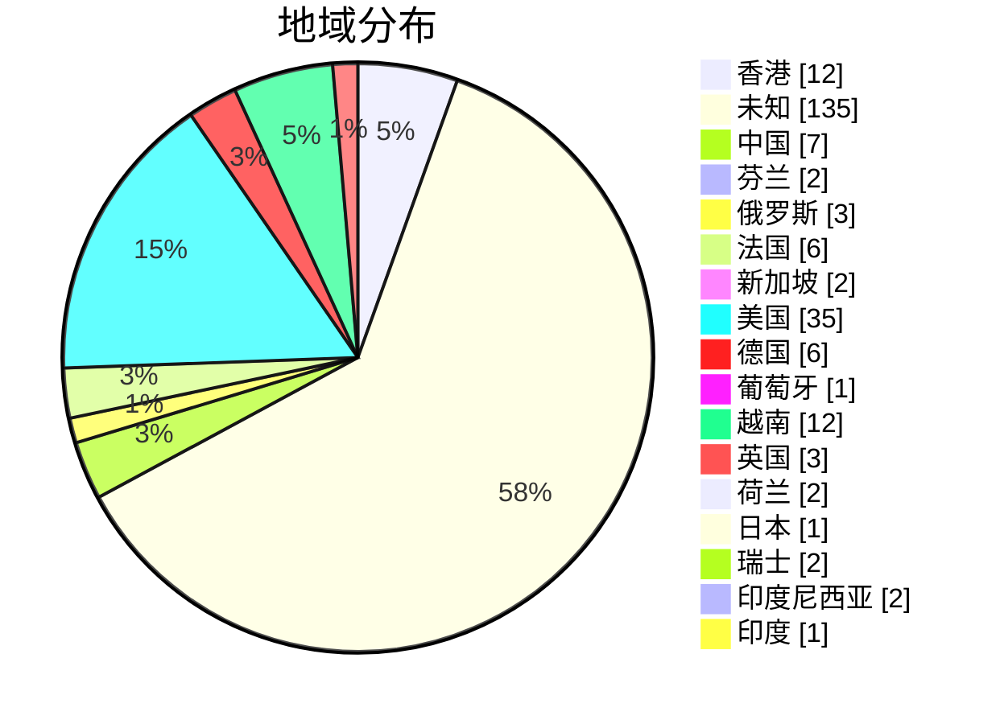
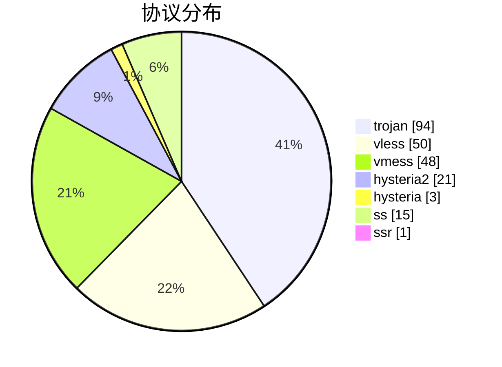

```mermaid
pie showData
title 延迟分布
"60-170ms" : 5
"170-280ms" : 24
"280-390ms" : 30
"390-500ms" : 19
"500-610ms" : 32
"610-720ms" : 68
"720-830ms" : 54
```

```mermaid
pie showData
title 地域分布
"香港" : 12
"未知" : 135
"中国" : 7
"芬兰" : 2
"俄罗斯" : 3
"法国" : 6
"新加坡" : 2
"美国" : 35
"德国" : 6
"葡萄牙" : 1
"越南" : 12
"英国" : 3
"荷兰" : 2
"日本" : 1
"瑞士" : 2
"印度尼西亚" : 2
"印度" : 1
```

```mermaid
pie showData
title 协议分布
"trojan" : 94
"vless" : 50
"vmess" : 48
"hysteria2" : 21
"hysteria" : 3
"ss" : 15
"ssr" : 1
```