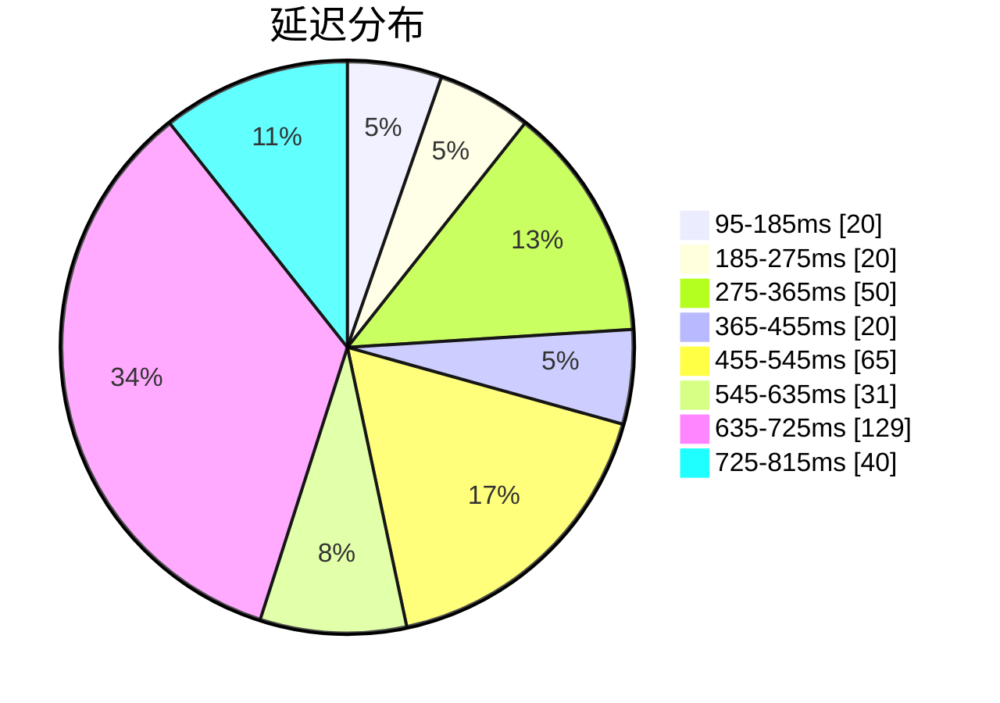
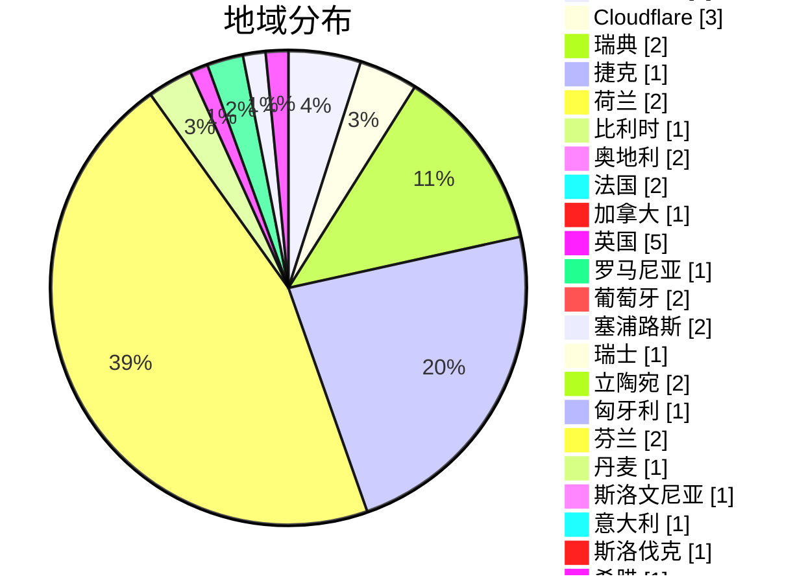
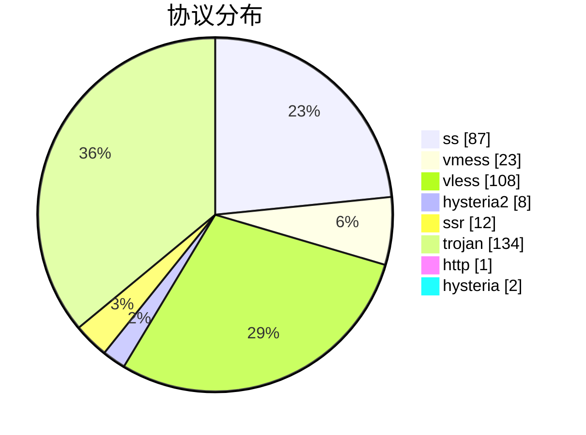

```mermaid
pie showData
title 延迟分布
"95-185ms" : 20
"185-275ms" : 20
"275-365ms" : 50
"365-455ms" : 20
"455-545ms" : 65
"545-635ms" : 31
"635-725ms" : 129
"725-815ms" : 40
```

```mermaid
pie showData
title 地域分布
"香港" : 16
"日本" : 13
"美国" : 41
"台湾" : 75
"未知" : 148
"新加坡" : 10
"俄罗斯" : 2
"中国" : 1
"泰国" : 1
"波兰" : 4
"韩国" : 8
"德国" : 3
"孟加拉国" : 5
"Cloudflare" : 3
"瑞典" : 2
"捷克" : 1
"荷兰" : 2
"比利时" : 1
"奥地利" : 2
"法国" : 2
"加拿大" : 1
"英国" : 5
"罗马尼亚" : 1
"葡萄牙" : 2
"塞浦路斯" : 2
"瑞士" : 1
"立陶宛" : 2
"匈牙利" : 1
"芬兰" : 2
"丹麦" : 1
"斯洛文尼亚" : 1
"意大利" : 1
"斯洛伐克" : 1
"希腊" : 1
"越南" : 1
"冰岛" : 2
"哈萨克斯坦" : 1
"爱沙尼亚" : 1
"保加利亚" : 1
"摩尔多瓦" : 1
"爱尔兰" : 1
"乌克兰" : 1
"土耳其" : 1
"拉脱维亚" : 1
"挪威" : 1
"西班牙" : 1
```

```mermaid
pie showData
title 协议分布
"ss" : 87
"vmess" : 23
"vless" : 108
"hysteria2" : 8
"ssr" : 12
"trojan" : 134
"http" : 1
"hysteria" : 2
```