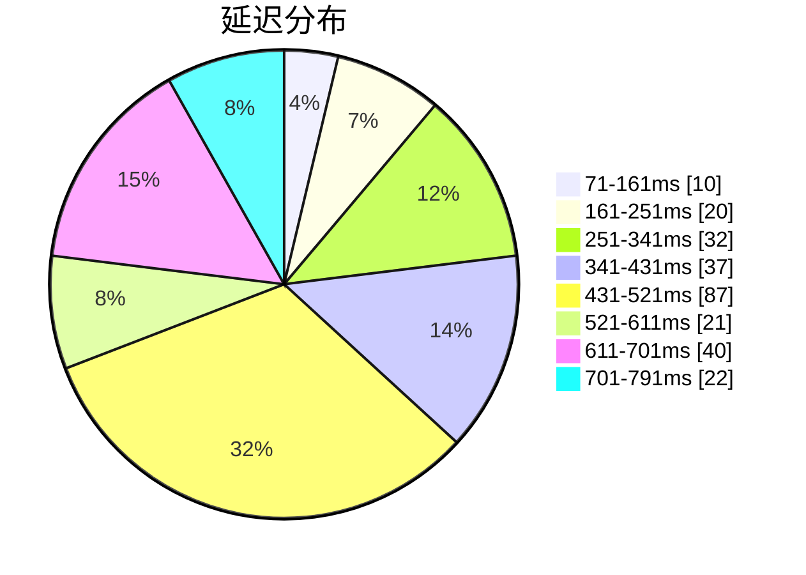
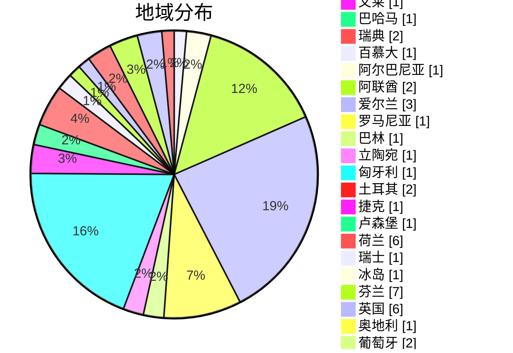
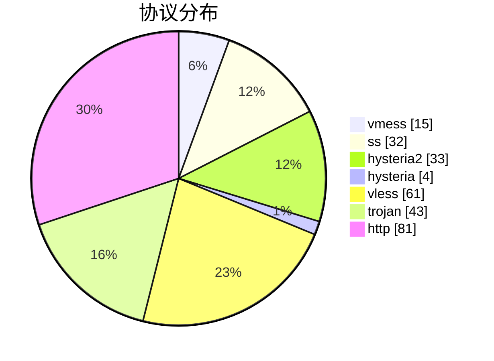

```mermaid
pie showData
title 延迟分布
"71-161ms" : 10
"161-251ms" : 20
"251-341ms" : 32
"341-431ms" : 37
"431-521ms" : 87
"521-611ms" : 21
"611-701ms" : 40
"701-791ms" : 22
```

```mermaid
pie showData
title 地域分布
"中国" : 3
"日本" : 6
"台湾" : 31
"未知" : 52
"香港" : 19
"新加坡" : 5
"俄罗斯" : 5
"美国" : 42
"韩国" : 2
"澳大利亚" : 7
"印度" : 5
"德国" : 10
"法国" : 4
"波兰" : 2
"孟加拉国" : 3
"Cloudflare" : 1
"乌克兰" : 1
"阿尔及利亚" : 1
"安哥拉" : 1
"塞尔维亚" : 1
"巴巴多斯" : 1
"文莱" : 1
"巴哈马" : 1
"瑞典" : 2
"百慕大" : 1
"阿尔巴尼亚" : 1
"阿联酋" : 2
"爱尔兰" : 3
"罗马尼亚" : 1
"巴林" : 1
"立陶宛" : 1
"匈牙利" : 1
"土耳其" : 2
"捷克" : 1
"卢森堡" : 1
"荷兰" : 6
"瑞士" : 1
"冰岛" : 1
"芬兰" : 7
"英国" : 6
"奥地利" : 1
"葡萄牙" : 2
"斯洛伐克" : 1
"保加利亚" : 1
"摩尔多瓦" : 1
"希腊" : 1
"越南" : 1
"波多黎各" : 1
"尼日利亚" : 1
"阿曼" : 1
"摩纳哥" : 1
"西班牙" : 1
"巴拿马" : 1
"塞舌尔" : 1
"英属维尔京群岛" : 1
"埃及" : 1
"爱沙尼亚" : 1
"哈萨克斯坦" : 1
"阿鲁巴" : 1
"加拿大" : 3
"阿根廷" : 2
"智利" : 1
"意大利" : 1
```

```mermaid
pie showData
title 协议分布
"vmess" : 15
"ss" : 32
"hysteria2" : 33
"hysteria" : 4
"vless" : 61
"trojan" : 43
"http" : 81
```