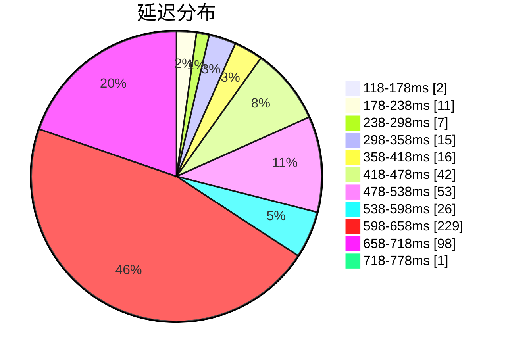
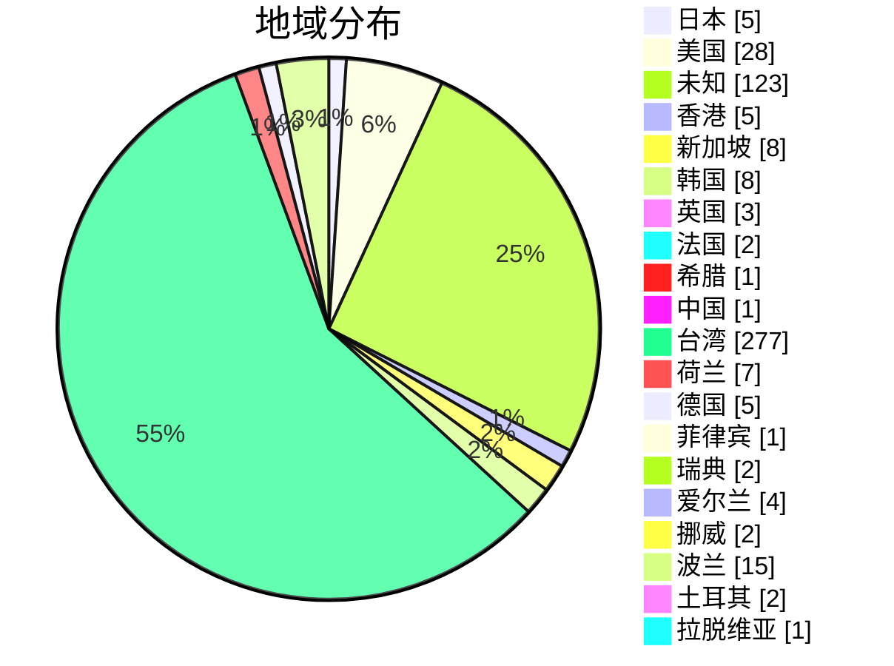
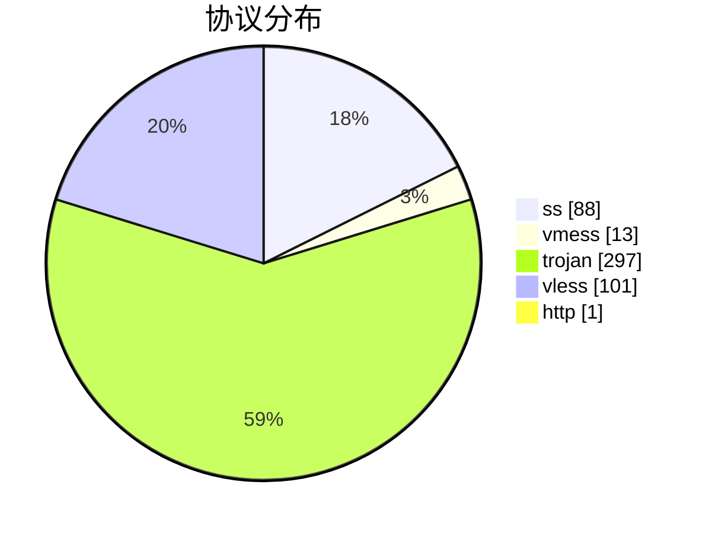

```mermaid
pie showData
title 延迟分布
"118-178ms" : 2
"178-238ms" : 11
"238-298ms" : 7
"298-358ms" : 15
"358-418ms" : 16
"418-478ms" : 42
"478-538ms" : 53
"538-598ms" : 26
"598-658ms" : 229
"658-718ms" : 98
"718-778ms" : 1
```

```mermaid
pie showData
title 地域分布
"日本" : 5
"美国" : 28
"未知" : 123
"香港" : 5
"新加坡" : 8
"韩国" : 8
"英国" : 3
"法国" : 2
"希腊" : 1
"中国" : 1
"台湾" : 277
"荷兰" : 7
"德国" : 5
"菲律宾" : 1
"瑞典" : 2
"爱尔兰" : 4
"挪威" : 2
"波兰" : 15
"土耳其" : 2
"拉脱维亚" : 1
```

```mermaid
pie showData
title 协议分布
"ss" : 88
"vmess" : 13
"trojan" : 297
"vless" : 101
"http" : 1
```