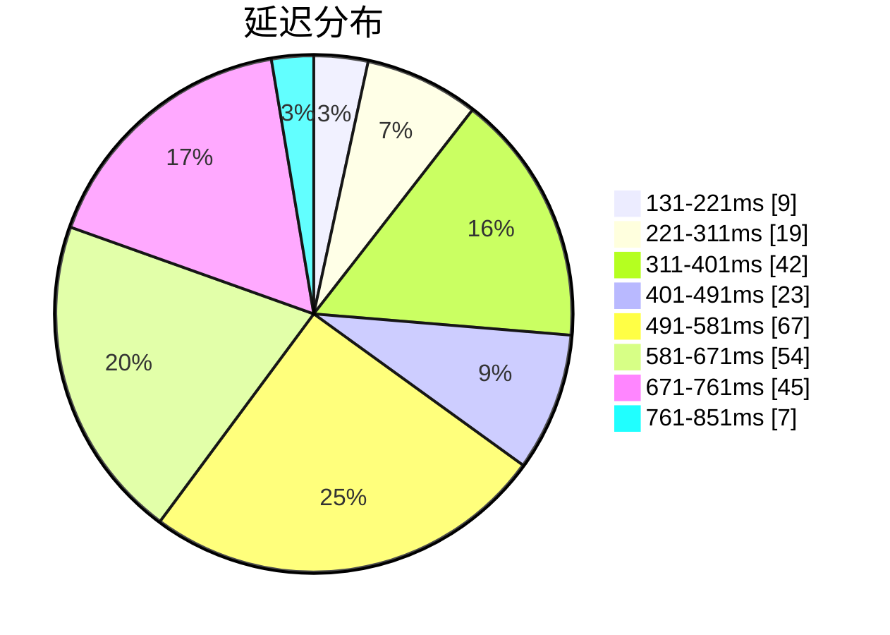
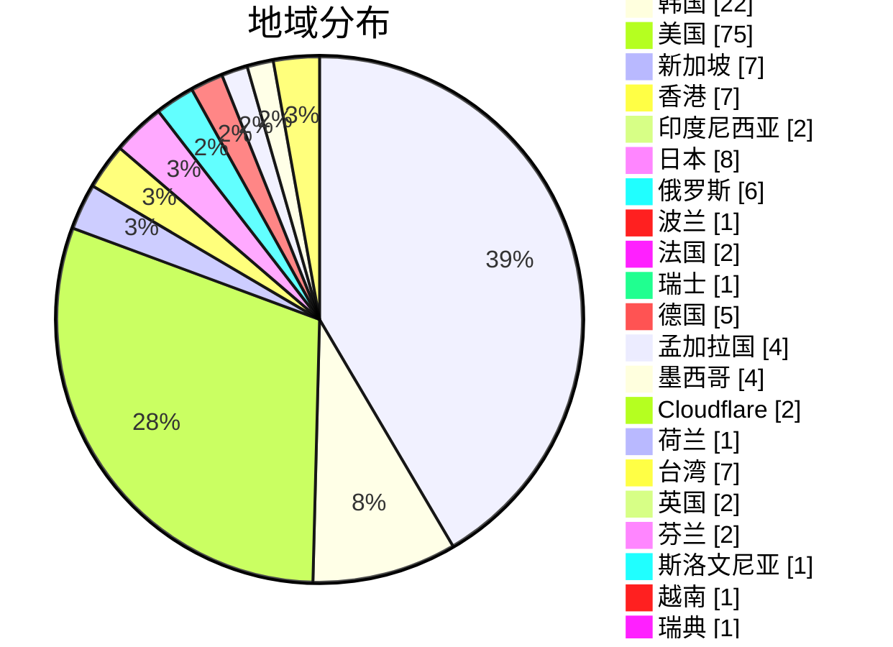
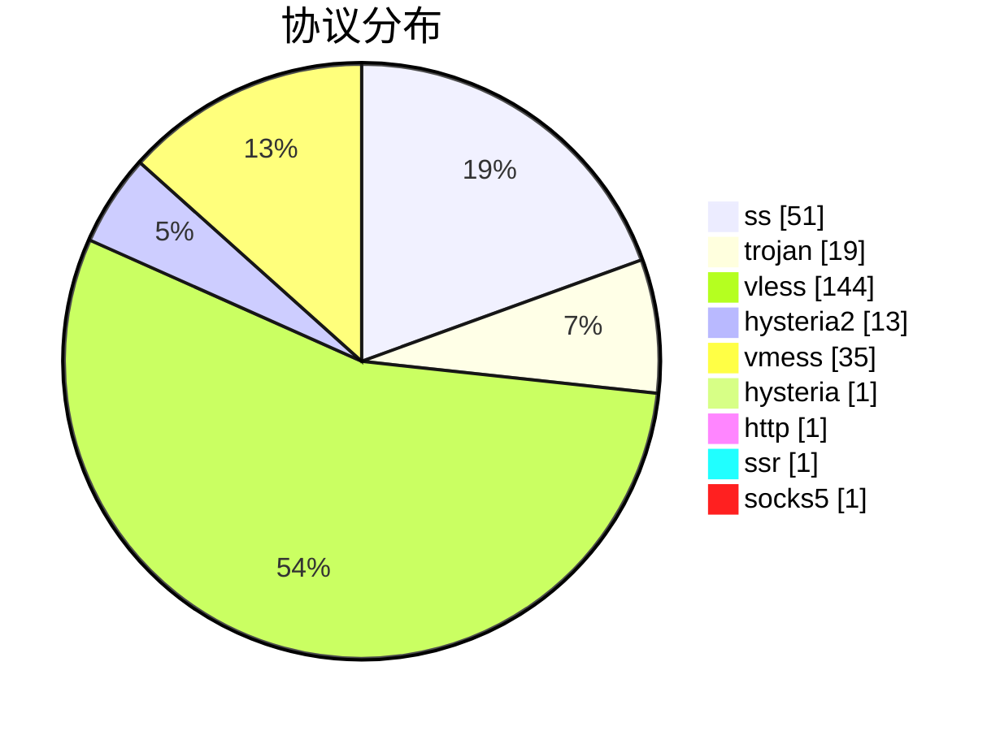

```mermaid
pie showData
title 延迟分布
"131-221ms" : 9
"221-311ms" : 19
"311-401ms" : 42
"401-491ms" : 23
"491-581ms" : 67
"581-671ms" : 54
"671-761ms" : 45
"761-851ms" : 7
```

```mermaid
pie showData
title 地域分布
"未知" : 103
"韩国" : 22
"美国" : 75
"新加坡" : 7
"香港" : 7
"印度尼西亚" : 2
"日本" : 8
"俄罗斯" : 6
"波兰" : 1
"法国" : 2
"瑞士" : 1
"德国" : 5
"孟加拉国" : 4
"墨西哥" : 4
"Cloudflare" : 2
"荷兰" : 1
"台湾" : 7
"英国" : 2
"芬兰" : 2
"斯洛文尼亚" : 1
"越南" : 1
"瑞典" : 1
"印度" : 2
```

```mermaid
pie showData
title 协议分布
"ss" : 51
"trojan" : 19
"vless" : 144
"hysteria2" : 13
"vmess" : 35
"hysteria" : 1
"http" : 1
"ssr" : 1
"socks5" : 1
```