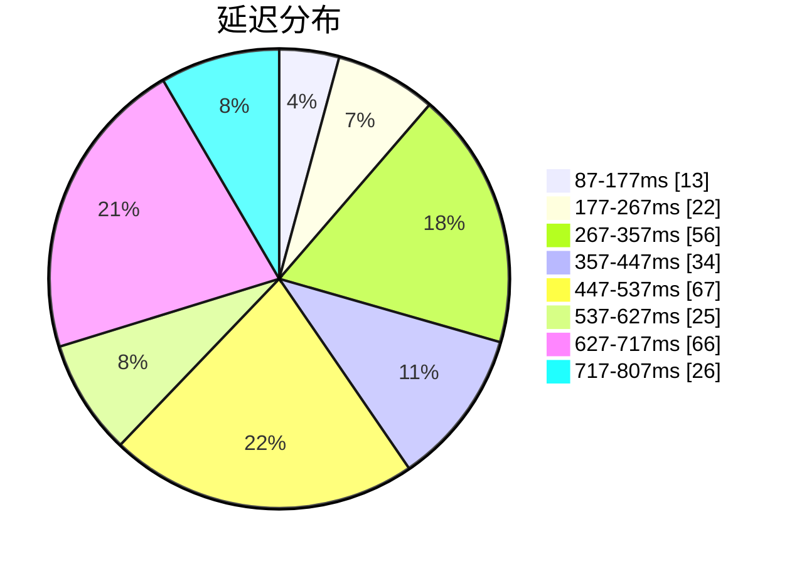
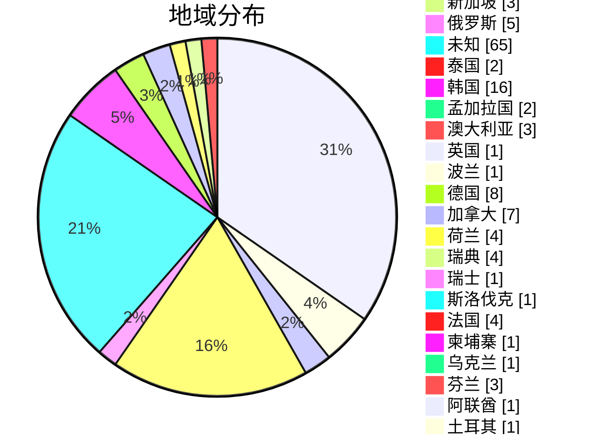
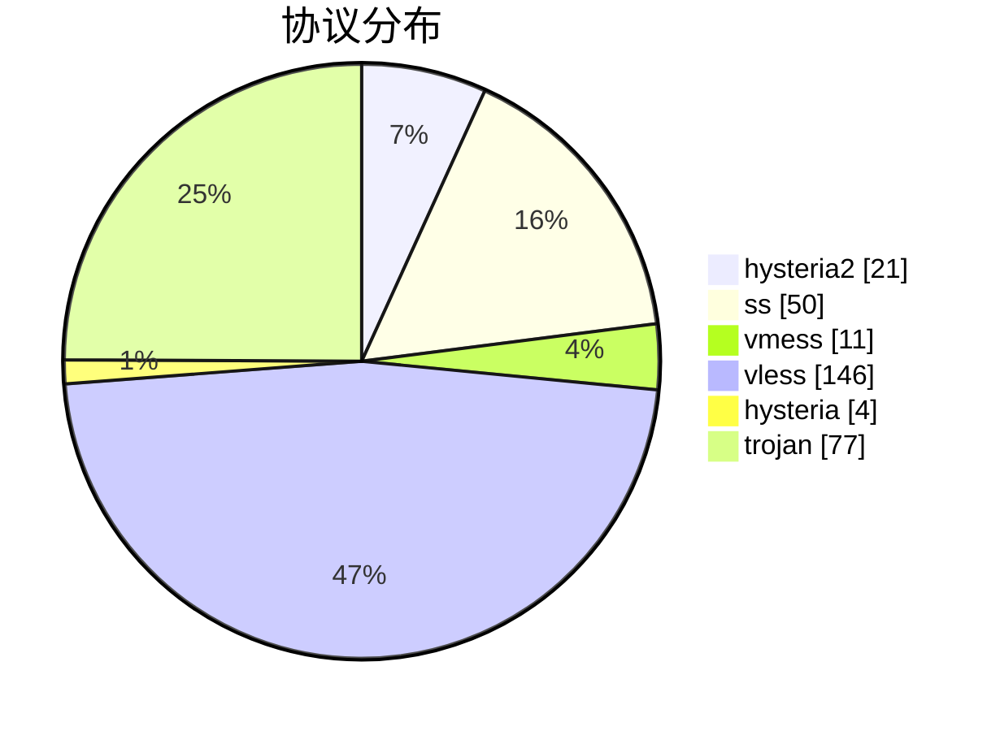

```mermaid
pie showData
title 延迟分布
"87-177ms" : 13
"177-267ms" : 22
"267-357ms" : 56
"357-447ms" : 34
"447-537ms" : 67
"537-627ms" : 25
"627-717ms" : 66
"717-807ms" : 26
```

```mermaid
pie showData
title 地域分布
"台湾" : 97
"日本" : 13
"中国" : 3
"香港" : 7
"美国" : 50
"新加坡" : 3
"俄罗斯" : 5
"未知" : 65
"泰国" : 2
"韩国" : 16
"孟加拉国" : 2
"澳大利亚" : 3
"英国" : 1
"波兰" : 1
"德国" : 8
"加拿大" : 7
"荷兰" : 4
"瑞典" : 4
"瑞士" : 1
"斯洛伐克" : 1
"法国" : 4
"柬埔寨" : 1
"乌克兰" : 1
"芬兰" : 3
"阿联酋" : 1
"土耳其" : 1
"葡萄牙" : 1
"印度" : 1
"冰岛" : 1
"意大利" : 1
"多哥" : 1
```

```mermaid
pie showData
title 协议分布
"hysteria2" : 21
"ss" : 50
"vmess" : 11
"vless" : 146
"hysteria" : 4
"trojan" : 77
```