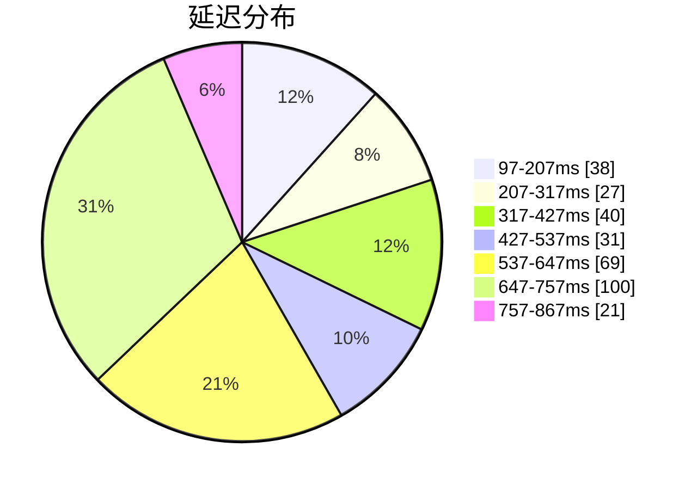
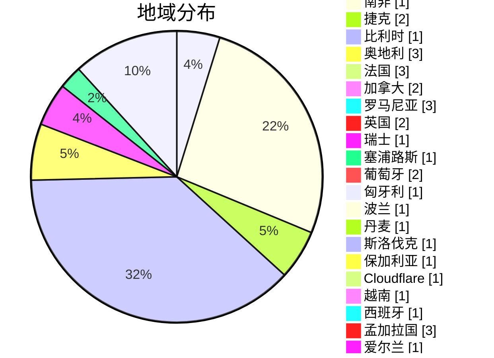
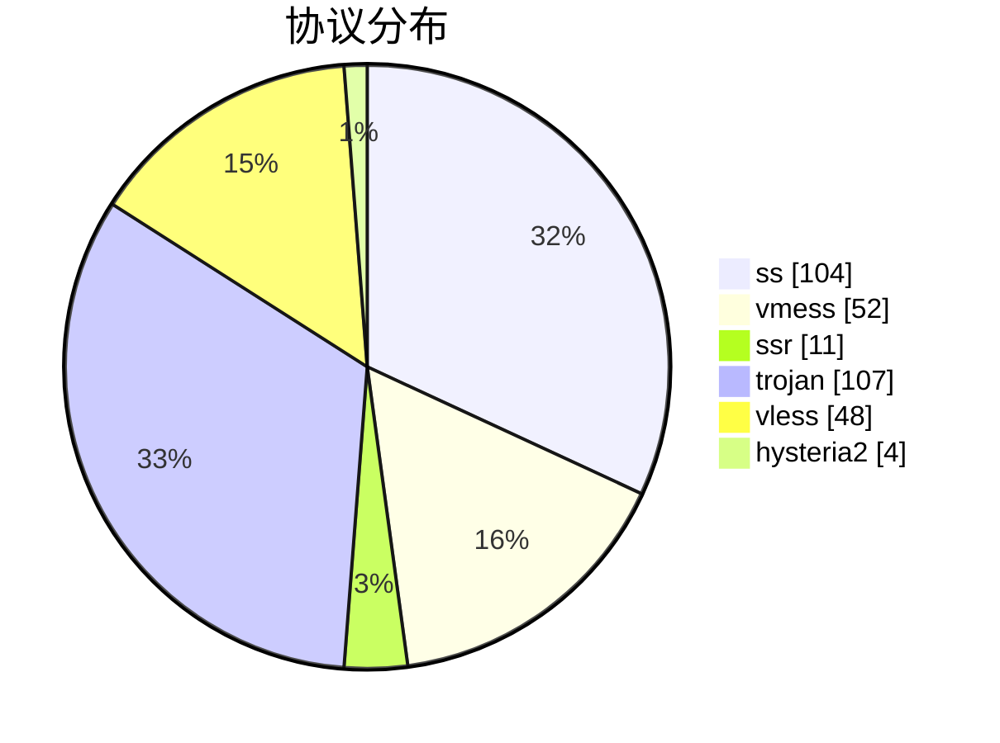

```mermaid
pie showData
title 延迟分布
"97-207ms" : 38
"207-317ms" : 27
"317-427ms" : 40
"427-537ms" : 31
"537-647ms" : 69
"647-757ms" : 100
"757-867ms" : 21
```

```mermaid
pie showData
title 地域分布
"香港" : 13
"台湾" : 72
"日本" : 15
"未知" : 103
"新加坡" : 17
"中国" : 2
"韩国" : 2
"泰国" : 1
"印度" : 2
"德国" : 13
"荷兰" : 7
"澳大利亚" : 1
"美国" : 32
"南非" : 1
"捷克" : 2
"比利时" : 1
"奥地利" : 3
"法国" : 3
"加拿大" : 2
"罗马尼亚" : 3
"英国" : 2
"瑞士" : 1
"塞浦路斯" : 1
"葡萄牙" : 2
"匈牙利" : 1
"波兰" : 1
"丹麦" : 1
"斯洛伐克" : 1
"保加利亚" : 1
"Cloudflare" : 1
"越南" : 1
"西班牙" : 1
"孟加拉国" : 3
"爱尔兰" : 1
"冰岛" : 1
"乌克兰" : 1
"智利" : 1
"土耳其" : 1
"哈萨克斯坦" : 1
"希腊" : 1
"摩尔多瓦" : 1
"爱沙尼亚" : 1
"拉脱维亚" : 1
"立陶宛" : 1
"芬兰" : 1
"挪威" : 1
"俄罗斯" : 1
```

```mermaid
pie showData
title 协议分布
"ss" : 104
"vmess" : 52
"ssr" : 11
"trojan" : 107
"vless" : 48
"hysteria2" : 4
```