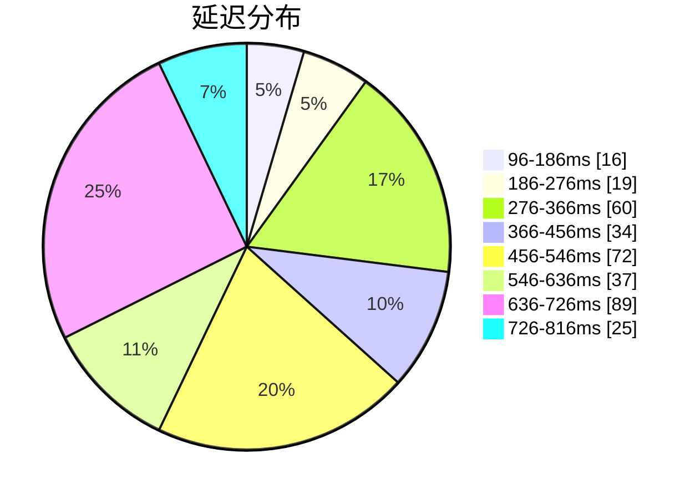
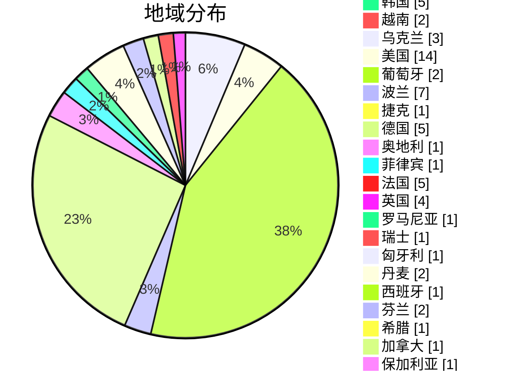
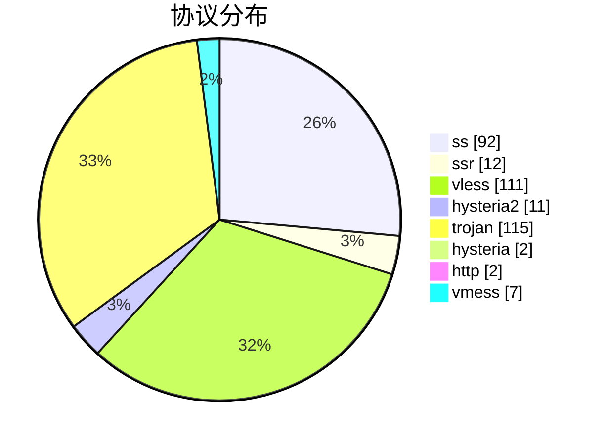

```mermaid
pie showData
title 延迟分布
"96-186ms" : 16
"186-276ms" : 19
"276-366ms" : 60
"366-456ms" : 34
"456-546ms" : 72
"546-636ms" : 37
"636-726ms" : 89
"726-816ms" : 25
```

```mermaid
pie showData
title 地域分布
"香港" : 20
"日本" : 14
"未知" : 135
"新加坡" : 9
"印度" : 2
"台湾" : 82
"Cloudflare" : 9
"荷兰" : 6
"俄罗斯" : 2
"瑞典" : 1
"韩国" : 5
"越南" : 2
"乌克兰" : 3
"美国" : 14
"葡萄牙" : 2
"波兰" : 7
"捷克" : 1
"德国" : 5
"奥地利" : 1
"菲律宾" : 1
"法国" : 5
"英国" : 4
"罗马尼亚" : 1
"瑞士" : 1
"匈牙利" : 1
"丹麦" : 2
"西班牙" : 1
"芬兰" : 2
"希腊" : 1
"加拿大" : 1
"保加利亚" : 1
"爱尔兰" : 1
"冰岛" : 1
"土耳其" : 2
"摩尔多瓦" : 1
"爱沙尼亚" : 1
"挪威" : 1
"拉脱维亚" : 1
"孟加拉国" : 1
"立陶宛" : 1
"秘鲁" : 1
```

```mermaid
pie showData
title 协议分布
"ss" : 92
"ssr" : 12
"vless" : 111
"hysteria2" : 11
"trojan" : 115
"hysteria" : 2
"http" : 2
"vmess" : 7
```