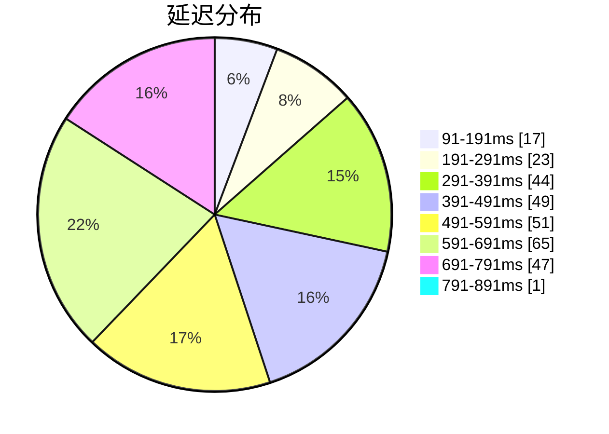
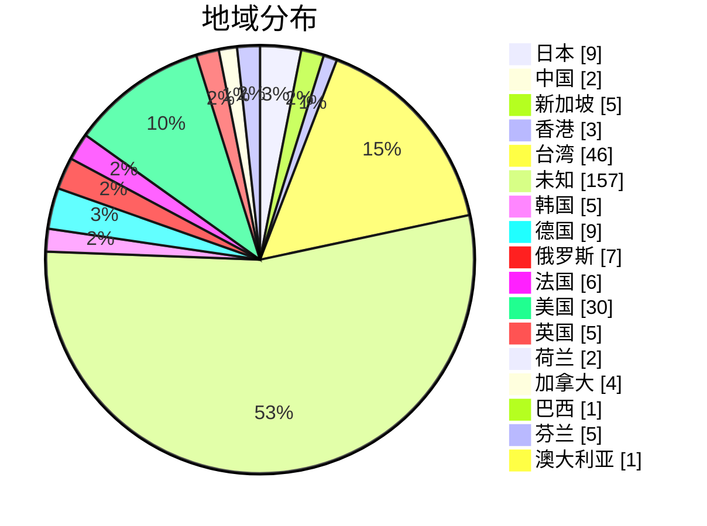
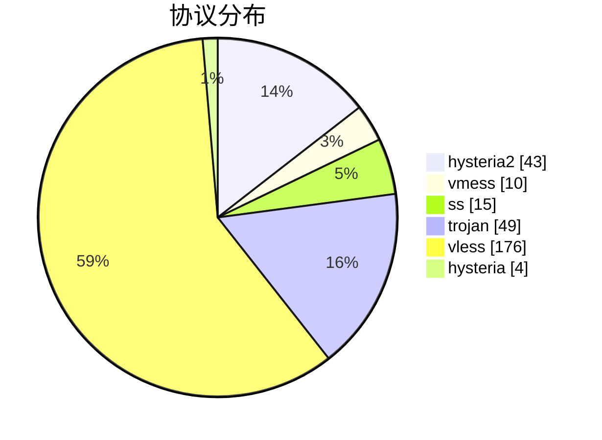

```mermaid
pie showData
title 延迟分布
"91-191ms" : 17
"191-291ms" : 23
"291-391ms" : 44
"391-491ms" : 49
"491-591ms" : 51
"591-691ms" : 65
"691-791ms" : 47
"791-891ms" : 1
```

```mermaid
pie showData
title 地域分布
"日本" : 9
"中国" : 2
"新加坡" : 5
"香港" : 3
"台湾" : 46
"未知" : 157
"韩国" : 5
"德国" : 9
"俄罗斯" : 7
"法国" : 6
"美国" : 30
"英国" : 5
"荷兰" : 2
"加拿大" : 4
"巴西" : 1
"芬兰" : 5
"澳大利亚" : 1
```

```mermaid
pie showData
title 协议分布
"hysteria2" : 43
"vmess" : 10
"ss" : 15
"trojan" : 49
"vless" : 176
"hysteria" : 4
```