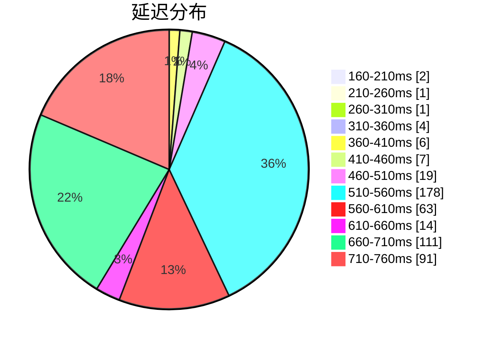
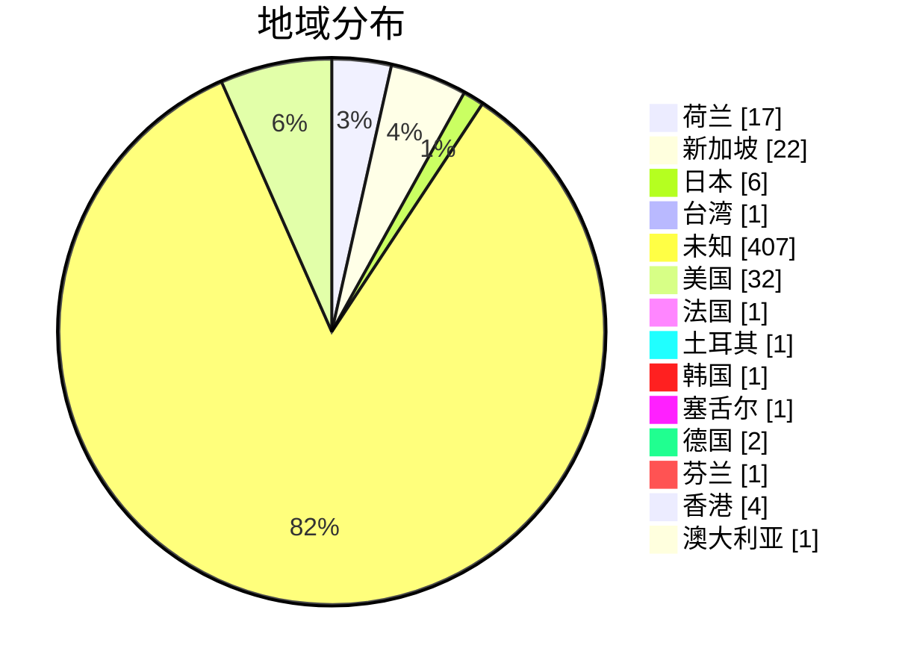
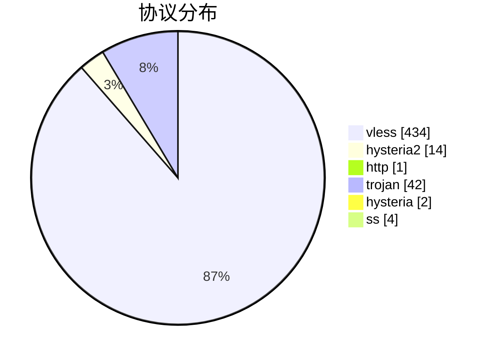

```mermaid
pie showData
title 延迟分布
"160-210ms" : 2
"210-260ms" : 1
"260-310ms" : 1
"310-360ms" : 4
"360-410ms" : 6
"410-460ms" : 7
"460-510ms" : 19
"510-560ms" : 178
"560-610ms" : 63
"610-660ms" : 14
"660-710ms" : 111
"710-760ms" : 91
```

```mermaid
pie showData
title 地域分布
"荷兰" : 17
"新加坡" : 22
"日本" : 6
"台湾" : 1
"未知" : 407
"美国" : 32
"法国" : 1
"土耳其" : 1
"韩国" : 1
"塞舌尔" : 1
"德国" : 2
"芬兰" : 1
"香港" : 4
"澳大利亚" : 1
```

```mermaid
pie showData
title 协议分布
"vless" : 434
"hysteria2" : 14
"http" : 1
"trojan" : 42
"hysteria" : 2
"ss" : 4
```