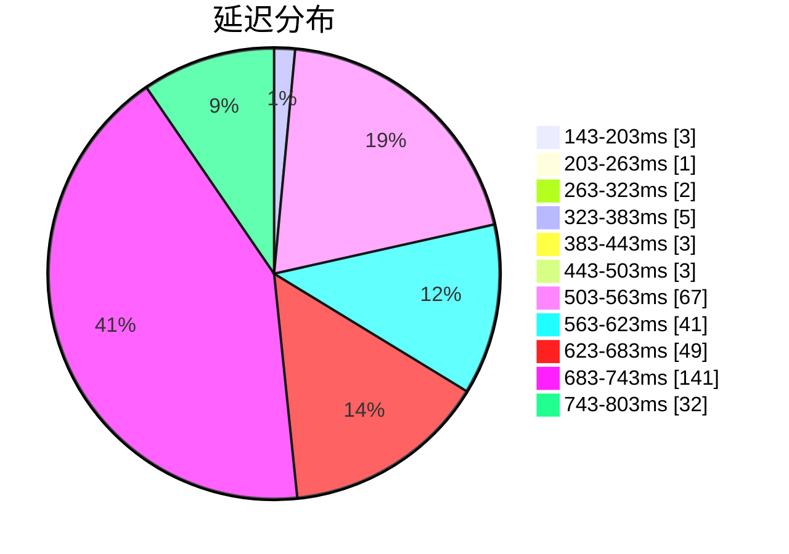
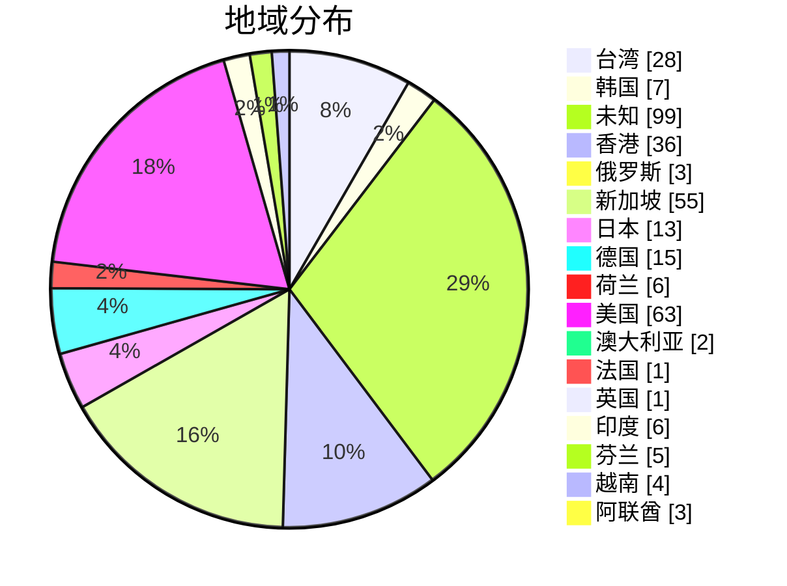
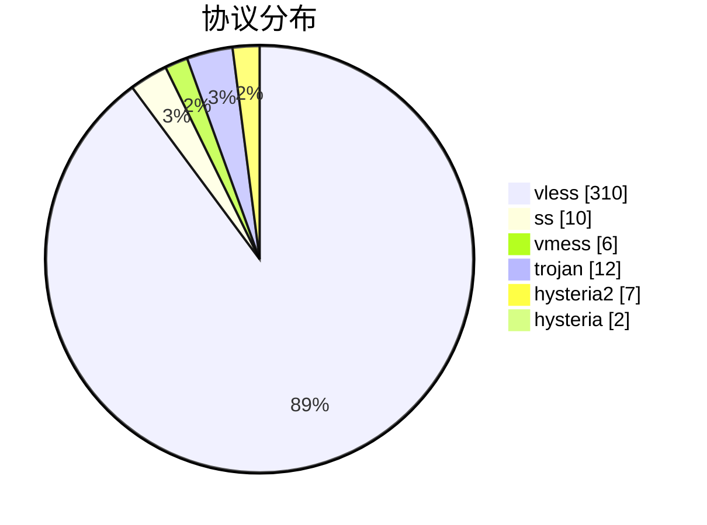

```mermaid
pie showData
title 延迟分布
"143-203ms" : 3
"203-263ms" : 1
"263-323ms" : 2
"323-383ms" : 5
"383-443ms" : 3
"443-503ms" : 3
"503-563ms" : 67
"563-623ms" : 41
"623-683ms" : 49
"683-743ms" : 141
"743-803ms" : 32
```

```mermaid
pie showData
title 地域分布
"台湾" : 28
"韩国" : 7
"未知" : 99
"香港" : 36
"俄罗斯" : 3
"新加坡" : 55
"日本" : 13
"德国" : 15
"荷兰" : 6
"美国" : 63
"澳大利亚" : 2
"法国" : 1
"英国" : 1
"印度" : 6
"芬兰" : 5
"越南" : 4
"阿联酋" : 3
```

```mermaid
pie showData
title 协议分布
"vless" : 310
"ss" : 10
"vmess" : 6
"trojan" : 12
"hysteria2" : 7
"hysteria" : 2
```