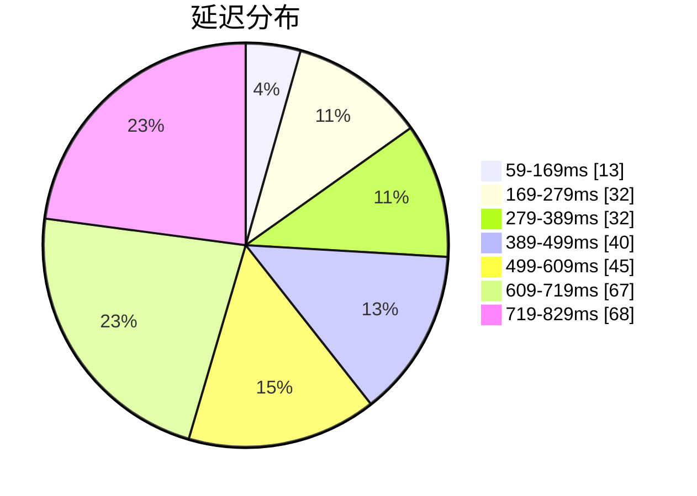
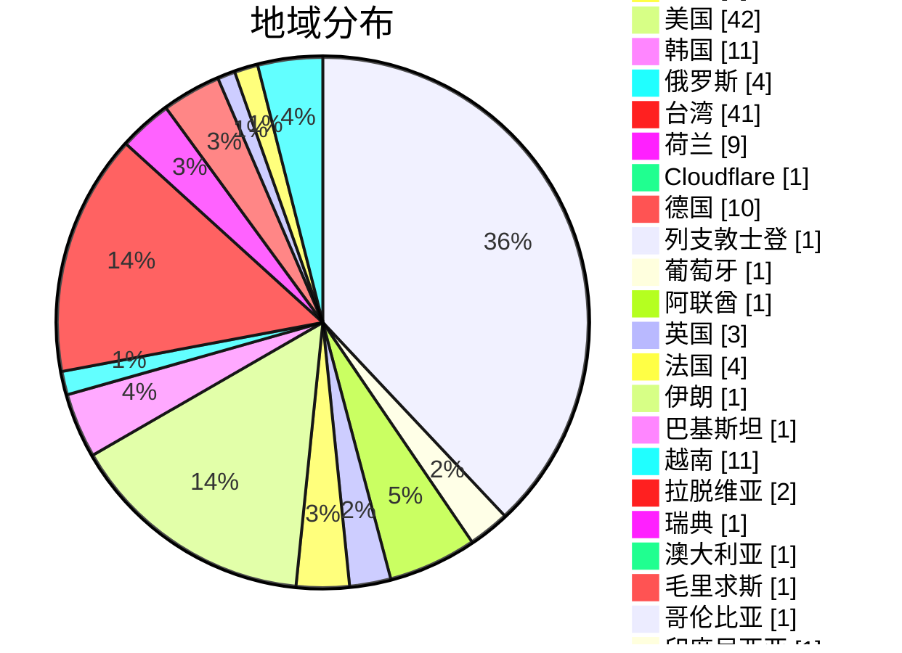
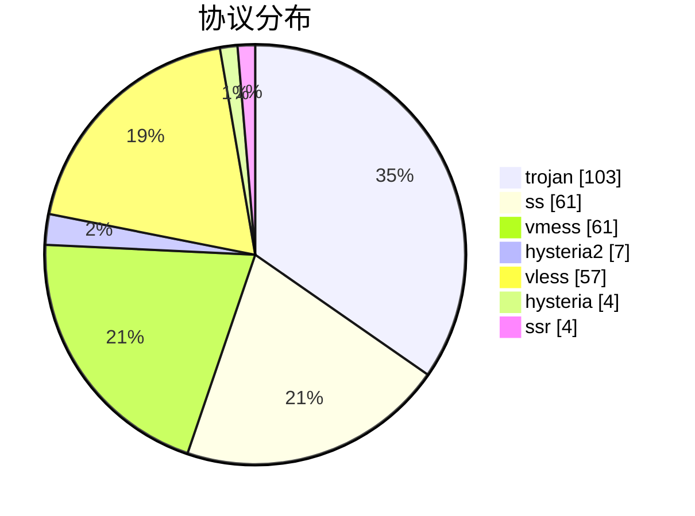

```mermaid
pie showData
title 延迟分布
"59-169ms" : 13
"169-279ms" : 32
"279-389ms" : 32
"389-499ms" : 40
"499-609ms" : 45
"609-719ms" : 67
"719-829ms" : 68
```

```mermaid
pie showData
title 地域分布
"未知" : 106
"新加坡" : 7
"香港" : 15
"日本" : 7
"中国" : 9
"美国" : 42
"韩国" : 11
"俄罗斯" : 4
"台湾" : 41
"荷兰" : 9
"Cloudflare" : 1
"德国" : 10
"列支敦士登" : 1
"葡萄牙" : 1
"阿联酋" : 1
"英国" : 3
"法国" : 4
"伊朗" : 1
"巴基斯坦" : 1
"越南" : 11
"拉脱维亚" : 2
"瑞典" : 1
"澳大利亚" : 1
"毛里求斯" : 1
"哥伦比亚" : 1
"印度尼西亚" : 1
"瑞士" : 1
"巴西" : 1
"塞浦路斯" : 1
"芬兰" : 2
```

```mermaid
pie showData
title 协议分布
"trojan" : 103
"ss" : 61
"vmess" : 61
"hysteria2" : 7
"vless" : 57
"hysteria" : 4
"ssr" : 4
```