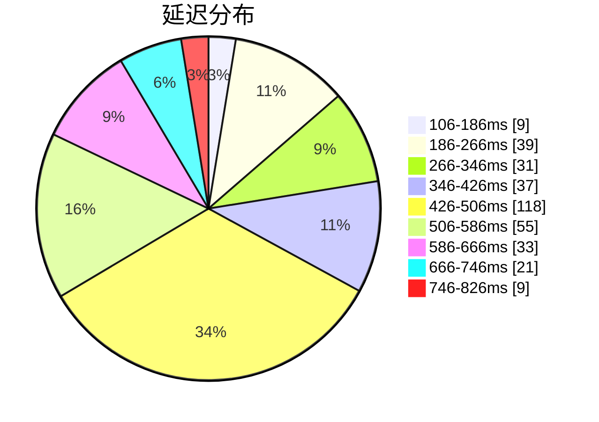
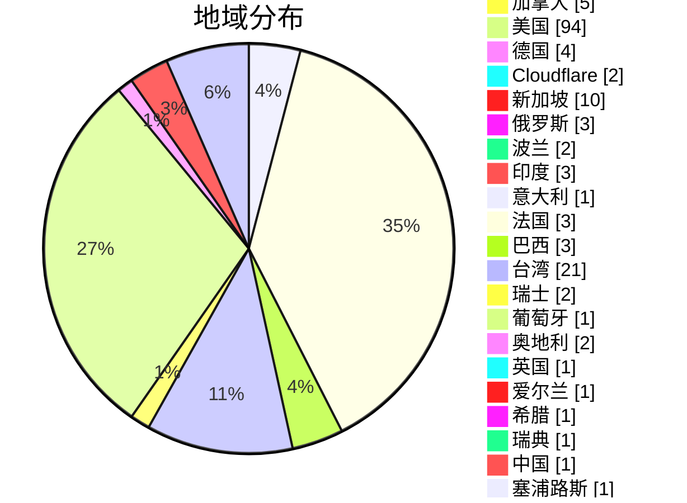
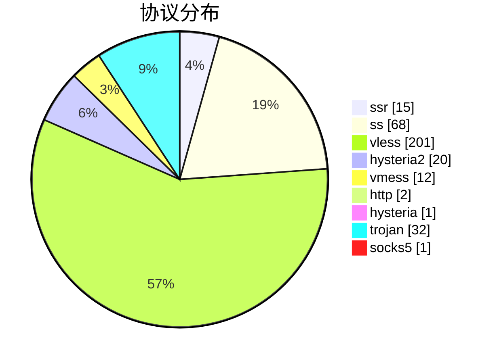

```mermaid
pie showData
title 延迟分布
"106-186ms" : 9
"186-266ms" : 39
"266-346ms" : 31
"346-426ms" : 37
"426-506ms" : 118
"506-586ms" : 55
"586-666ms" : 33
"666-746ms" : 21
"746-826ms" : 9
```

```mermaid
pie showData
title 地域分布
"日本" : 13
"未知" : 123
"香港" : 13
"韩国" : 37
"加拿大" : 5
"美国" : 94
"德国" : 4
"Cloudflare" : 2
"新加坡" : 10
"俄罗斯" : 3
"波兰" : 2
"印度" : 3
"意大利" : 1
"法国" : 3
"巴西" : 3
"台湾" : 21
"瑞士" : 2
"葡萄牙" : 1
"奥地利" : 2
"英国" : 1
"爱尔兰" : 1
"希腊" : 1
"瑞典" : 1
"中国" : 1
"塞浦路斯" : 1
"芬兰" : 1
"冰岛" : 1
"摩尔多瓦" : 1
"荷兰" : 1
```

```mermaid
pie showData
title 协议分布
"ssr" : 15
"ss" : 68
"vless" : 201
"hysteria2" : 20
"vmess" : 12
"http" : 2
"hysteria" : 1
"trojan" : 32
"socks5" : 1
```