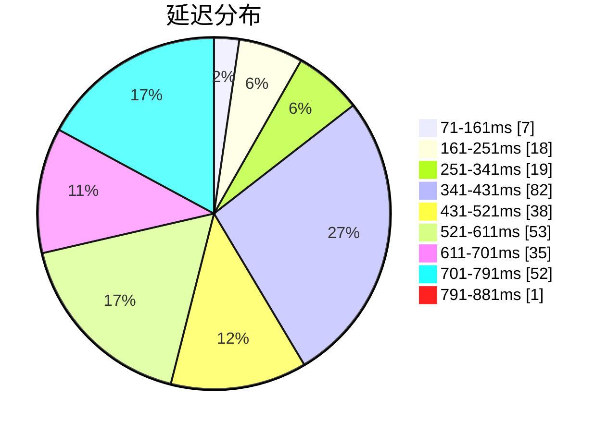
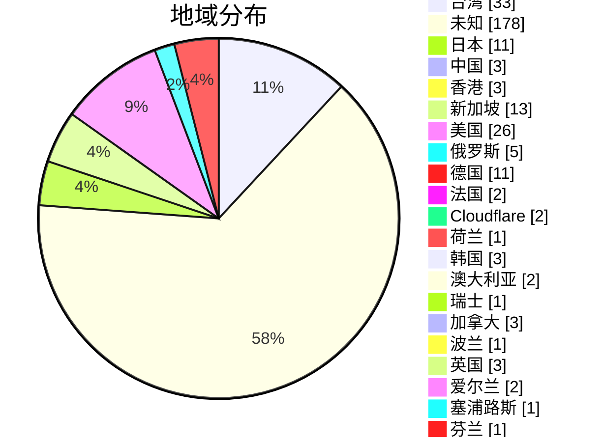
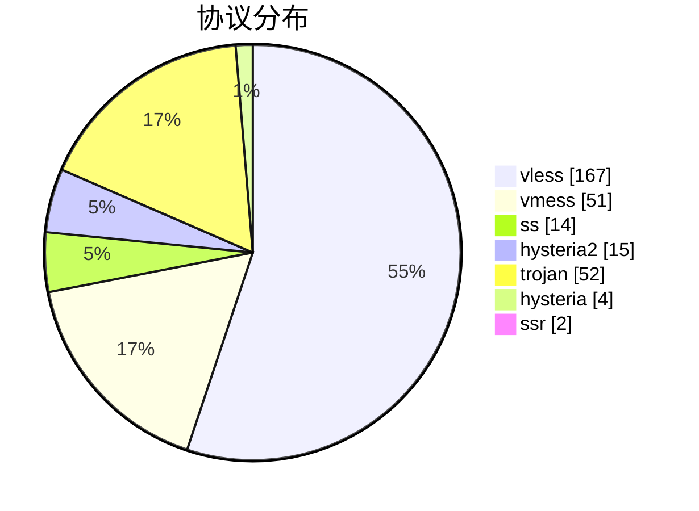

```mermaid
pie showData
title 延迟分布
"71-161ms" : 7
"161-251ms" : 18
"251-341ms" : 19
"341-431ms" : 82
"431-521ms" : 38
"521-611ms" : 53
"611-701ms" : 35
"701-791ms" : 52
"791-881ms" : 1
```

```mermaid
pie showData
title 地域分布
"台湾" : 33
"未知" : 178
"日本" : 11
"中国" : 3
"香港" : 3
"新加坡" : 13
"美国" : 26
"俄罗斯" : 5
"德国" : 11
"法国" : 2
"Cloudflare" : 2
"荷兰" : 1
"韩国" : 3
"澳大利亚" : 2
"瑞士" : 1
"加拿大" : 3
"波兰" : 1
"英国" : 3
"爱尔兰" : 2
"塞浦路斯" : 1
"芬兰" : 1
```

```mermaid
pie showData
title 协议分布
"vless" : 167
"vmess" : 51
"ss" : 14
"hysteria2" : 15
"trojan" : 52
"hysteria" : 4
"ssr" : 2
```