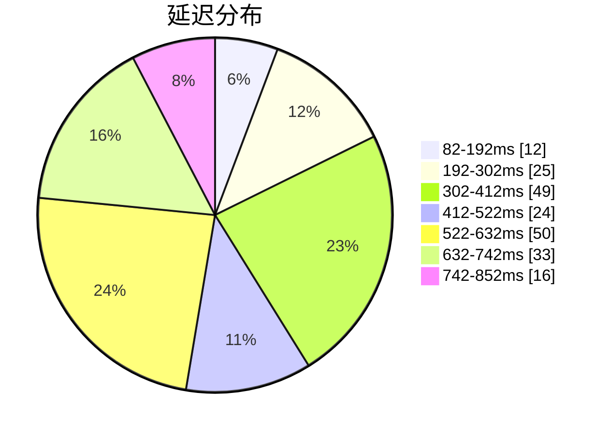
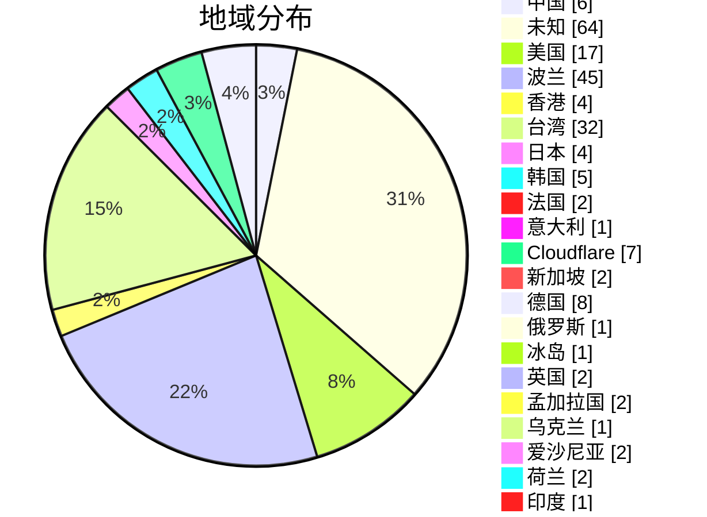
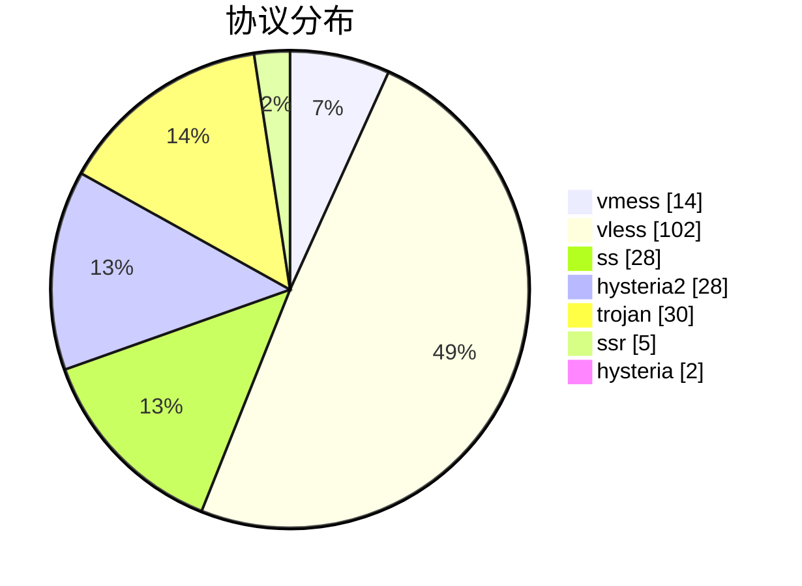

```mermaid
pie showData
title 延迟分布
"82-192ms" : 12
"192-302ms" : 25
"302-412ms" : 49
"412-522ms" : 24
"522-632ms" : 50
"632-742ms" : 33
"742-852ms" : 16
```

```mermaid
pie showData
title 地域分布
"中国" : 6
"未知" : 64
"美国" : 17
"波兰" : 45
"香港" : 4
"台湾" : 32
"日本" : 4
"韩国" : 5
"法国" : 2
"意大利" : 1
"Cloudflare" : 7
"新加坡" : 2
"德国" : 8
"俄罗斯" : 1
"冰岛" : 1
"英国" : 2
"孟加拉国" : 2
"乌克兰" : 1
"爱沙尼亚" : 2
"荷兰" : 2
"印度" : 1
```

```mermaid
pie showData
title 协议分布
"vmess" : 14
"vless" : 102
"ss" : 28
"hysteria2" : 28
"trojan" : 30
"ssr" : 5
"hysteria" : 2
```