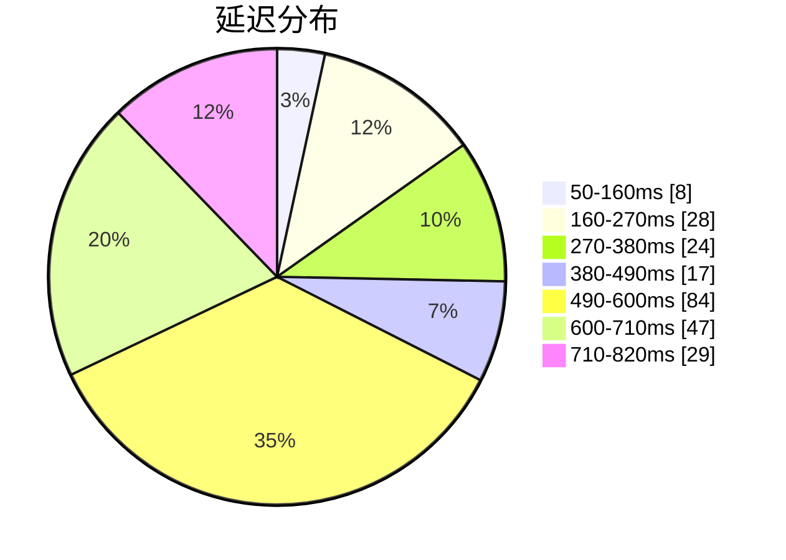
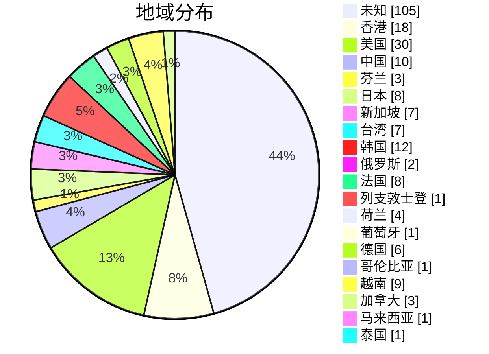
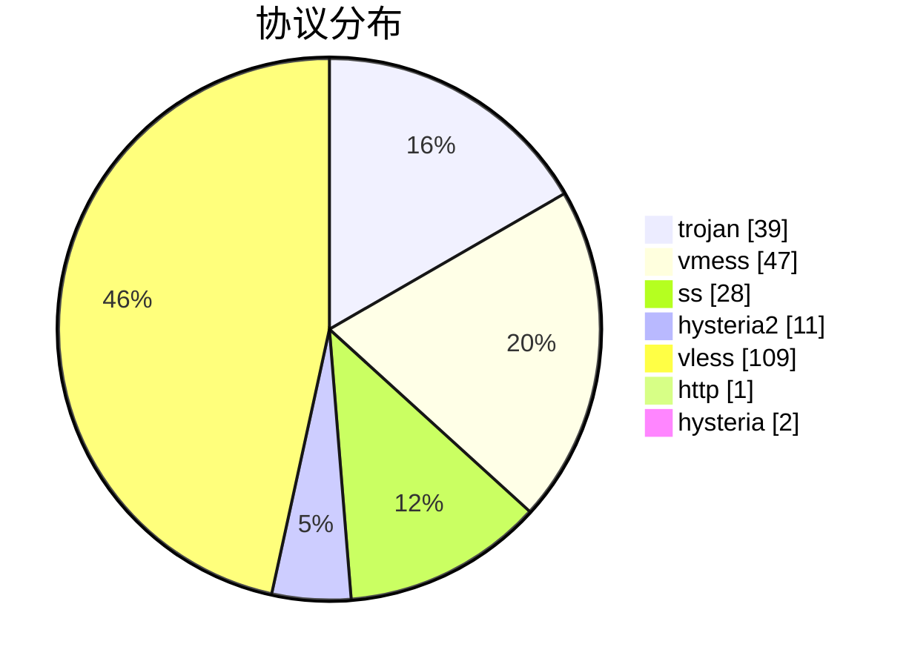

```mermaid
pie showData
title 延迟分布
"50-160ms" : 8
"160-270ms" : 28
"270-380ms" : 24
"380-490ms" : 17
"490-600ms" : 84
"600-710ms" : 47
"710-820ms" : 29
```

```mermaid
pie showData
title 地域分布
"未知" : 105
"香港" : 18
"美国" : 30
"中国" : 10
"芬兰" : 3
"日本" : 8
"新加坡" : 7
"台湾" : 7
"韩国" : 12
"俄罗斯" : 2
"法国" : 8
"列支敦士登" : 1
"荷兰" : 4
"葡萄牙" : 1
"德国" : 6
"哥伦比亚" : 1
"越南" : 9
"加拿大" : 3
"马来西亚" : 1
"泰国" : 1
```

```mermaid
pie showData
title 协议分布
"trojan" : 39
"vmess" : 47
"ss" : 28
"hysteria2" : 11
"vless" : 109
"http" : 1
"hysteria" : 2
```