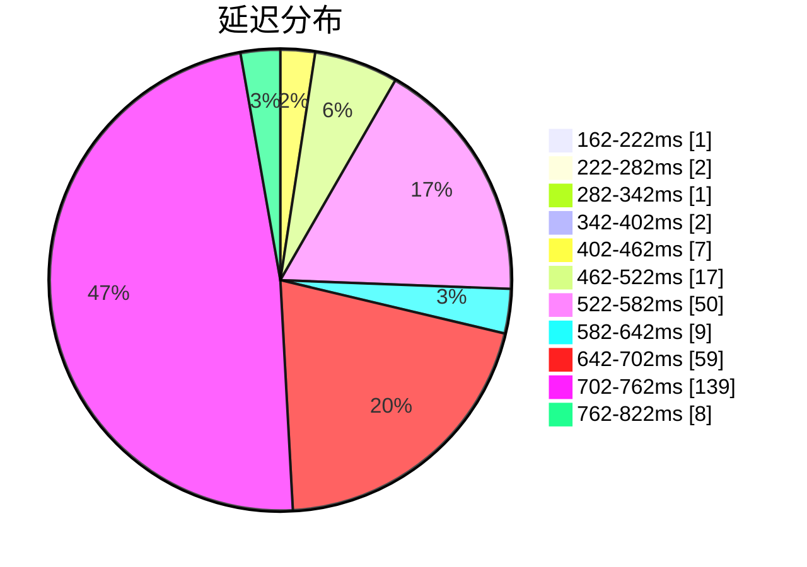
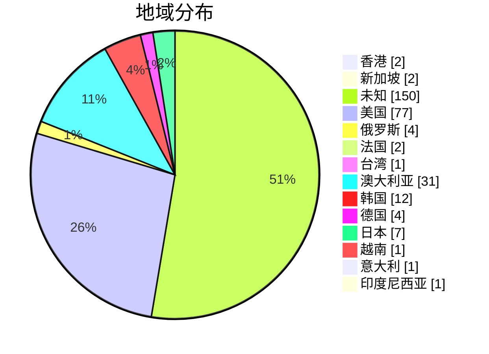
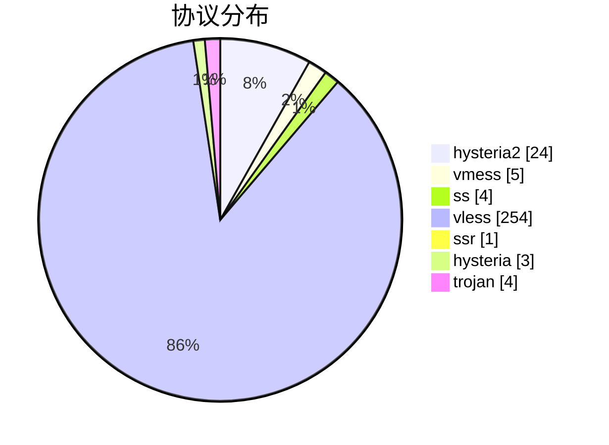

```mermaid
pie showData
title 延迟分布
"162-222ms" : 1
"222-282ms" : 2
"282-342ms" : 1
"342-402ms" : 2
"402-462ms" : 7
"462-522ms" : 17
"522-582ms" : 50
"582-642ms" : 9
"642-702ms" : 59
"702-762ms" : 139
"762-822ms" : 8
```

```mermaid
pie showData
title 地域分布
"香港" : 2
"新加坡" : 2
"未知" : 150
"美国" : 77
"俄罗斯" : 4
"法国" : 2
"台湾" : 1
"澳大利亚" : 31
"韩国" : 12
"德国" : 4
"日本" : 7
"越南" : 1
"意大利" : 1
"印度尼西亚" : 1
```

```mermaid
pie showData
title 协议分布
"hysteria2" : 24
"vmess" : 5
"ss" : 4
"vless" : 254
"ssr" : 1
"hysteria" : 3
"trojan" : 4
```