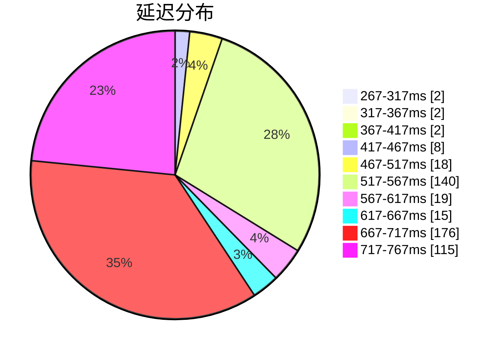
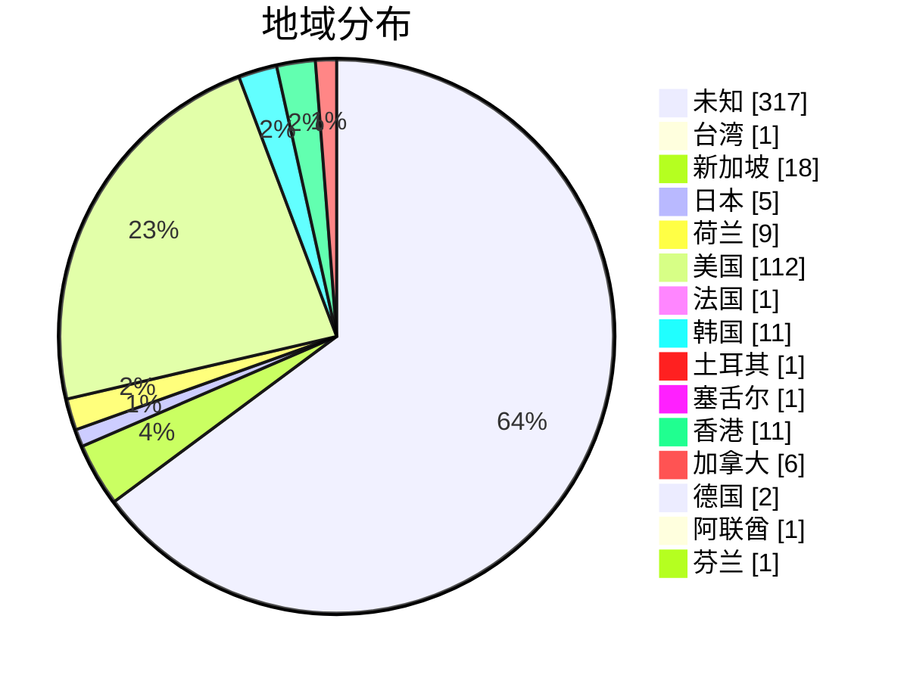
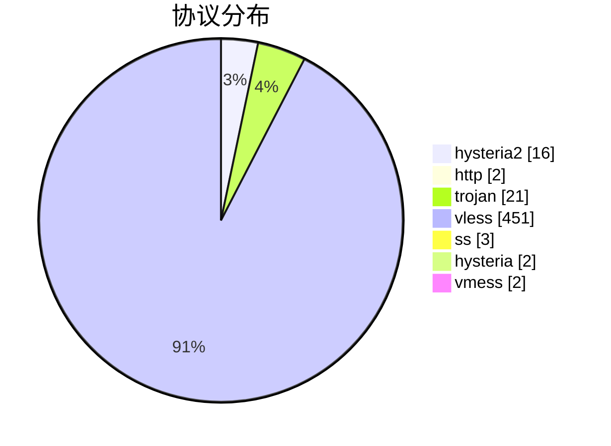

```mermaid
pie showData
title 延迟分布
"267-317ms" : 2
"317-367ms" : 2
"367-417ms" : 2
"417-467ms" : 8
"467-517ms" : 18
"517-567ms" : 140
"567-617ms" : 19
"617-667ms" : 15
"667-717ms" : 176
"717-767ms" : 115
```

```mermaid
pie showData
title 地域分布
"未知" : 317
"台湾" : 1
"新加坡" : 18
"日本" : 5
"荷兰" : 9
"美国" : 112
"法国" : 1
"韩国" : 11
"土耳其" : 1
"塞舌尔" : 1
"香港" : 11
"加拿大" : 6
"德国" : 2
"阿联酋" : 1
"芬兰" : 1
```

```mermaid
pie showData
title 协议分布
"hysteria2" : 16
"http" : 2
"trojan" : 21
"vless" : 451
"ss" : 3
"hysteria" : 2
"vmess" : 2
```