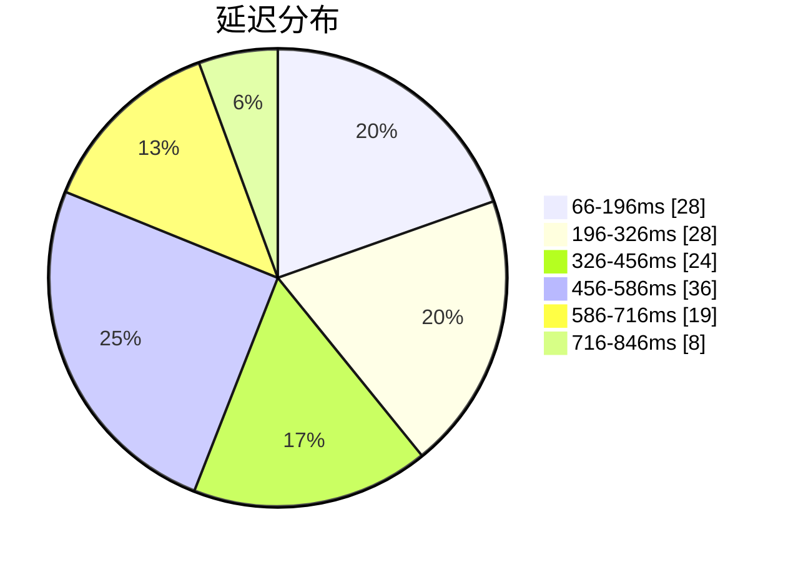
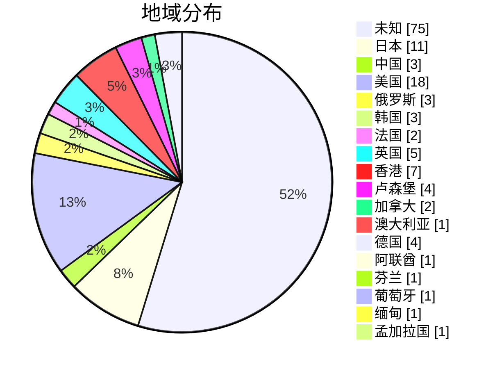
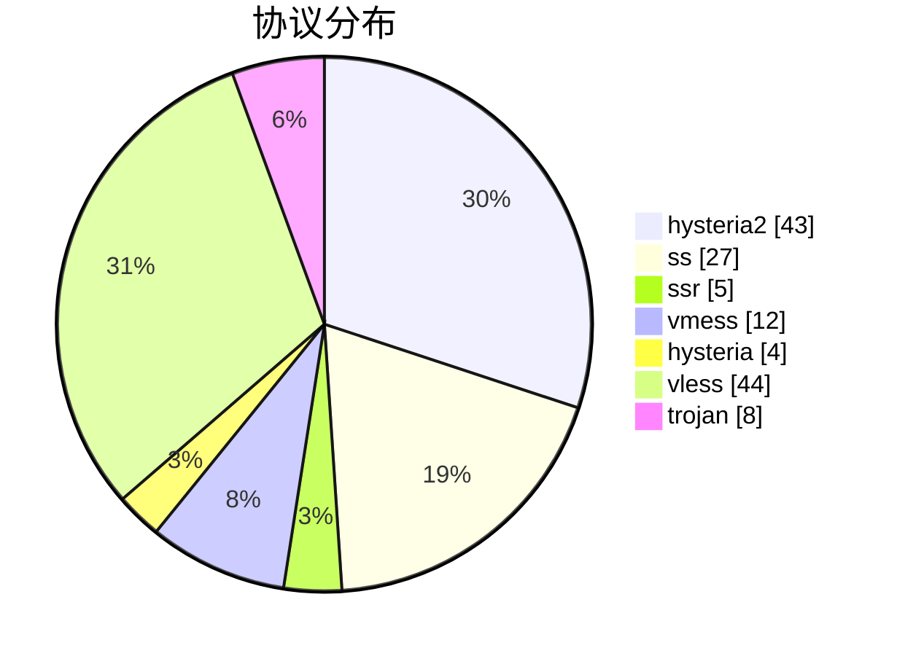

```mermaid
pie showData
title 延迟分布
"66-196ms" : 28
"196-326ms" : 28
"326-456ms" : 24
"456-586ms" : 36
"586-716ms" : 19
"716-846ms" : 8
```

```mermaid
pie showData
title 地域分布
"未知" : 75
"日本" : 11
"中国" : 3
"美国" : 18
"俄罗斯" : 3
"韩国" : 3
"法国" : 2
"英国" : 5
"香港" : 7
"卢森堡" : 4
"加拿大" : 2
"澳大利亚" : 1
"德国" : 4
"阿联酋" : 1
"芬兰" : 1
"葡萄牙" : 1
"缅甸" : 1
"孟加拉国" : 1
```

```mermaid
pie showData
title 协议分布
"hysteria2" : 43
"ss" : 27
"ssr" : 5
"vmess" : 12
"hysteria" : 4
"vless" : 44
"trojan" : 8
```